3CX add-on
========

*3CX* is the add-on module designed for the integration your Splynx with [3CX service](https://www.3cx.com/call-center/crm-integration/) via the server-side CRM integration engine and its own API. 3CX add-on simplifies the calls management in Splynx, as a result, we have a complete call history in relation to the specific customer, it's possible to listen, download the recorded files, add the comment to the call, to link/unlink call to the ticket etc.


<icon class="image-icon"></icon> **IMPORTANT:** **To use the CRM Integration module, you should have the** [**3CX Professional license level**](https://www.3cx.com/phone-system/download-phone-system?resellerId=214267).

<icon class="image-icon"></icon> **NOTE:** **3CX server is required to be installed on separate/cloud server.**

<icon class="image-icon"></icon> For more information about 3CX installation on the server, see [link](https://www.3cx.com/3cxacademy/videos/basic/installing/).


## Add-on installation

To install the add-on use one of the two methods: via **CLI** on the Splynx server or via the Splynx **Web UI**.

To install the add-on via **CLI**, the following commands can be used:

```bash
apt-get update  
apt-get install splynx-3cx
```

To install the add-on from the **Web UI**:

Navigate to `Config → Integrations → Add-ons`:


Find there the `splynx-3cx` add-on and click on the install icon in the *Actions* column of the table


Then, click on the **OK, confirm** button to begin the installation process


Once the installation process has completed, all configurations for the add-on can be found in `Config → Modules → List`, simply click on the necessary icon of the `splynx_3cx_addon` module and you will be able to change settings of the add-on


In the add-on configuration you can set the absolute **path to the record's folder**, by default it's `/var/lib/3cxpbx/Instance1/Data/Recordings/`.


### 3CX Module Overview

After installing the add-on, the [API key and its secret](administration/main/api_keys/api_keys.md) will be created in Splynx (the `Unsecure access` option is enabled by default) with the following permissions:

|Customers|
|:-----------:|
|**Customer:** Add, View; **Customer notes:** Add|

|CRM|
|:-----------:|
|**Leads:** Add, View; **Leads notes:** Add|


### XML Configuration File

In `Config → Integrations`, you can find the **3CX** section with the link to download the **generated XML configuration file** - `splynx.xml`.

<icon class="image-icon"></icon> Suggested read: [CRM Template XML Description](https://www.3cx.com/docs/server-side-crm-template-xml-description/#h.ydml7w97b24x).


Save the output XML file on your local machine and **do not edit it**, it will be used for the CRM integration procedure. Note, **to use the CRM integration module on 3CX server, you need to purchase the [3CX Professional level license](https://www.3cx.com/phone-system/download-phone-system?resellerId=214267)**.


### 3CX System Configuration

Let's perform the first time configuration of the 3CX system:

1. [Sign up](https://www.3cx.com/ordering/pricing/) on the 3CX web page with preferred price choice

2. Choose the location for the 3CX system, write down your license key and follow the required installation steps. Open the IP of the machine 3CX is installed on followed by port `5015` in a browser, e.g. ```https://<IP_address>:5015```. The *3CX Web Configuration Tool* guides you through important network and security settings.

Check the following links for more details:

- [Installing 3CX using ISO (Debian)](https://www.3cx.com/docs/manual/configuring-your-pbx/)
- [Installing 3CX on Windows](https://www.3cx.com/docs/manual/phone-system-installation-windows/)
- [Using Hyper-V to host your 3CX](https://www.3cx.com/docs/installing-microsoft-hyper-v/)
- [Hosting 3CX on Google Cloud](https://www.3cx.com/docs/hosted-pbx-google-cloud/)
- [Hosting 3CX on Amazon AWS](https://www.3cx.com/docs/cloud-pbx-amazon-aws/)
- [Hosting 3CX on Amazon Lightsail](https://www.3cx.com/docs/hosted-pbx-amazon-lightsail/)
- [Hosting 3CX on Microsoft Azure](https://www.3cx.com/docs/hosting-pbx-phone-system-microsoft-azure/)
- [How to access for Self Hosted Instances via SSH](https://www.3cx.com/docs/self-hosted-instances-ssh/)


3. Once the 3CX system installation has finished, open the *3CX Management console* via ```https://<domain/IP>:5001```

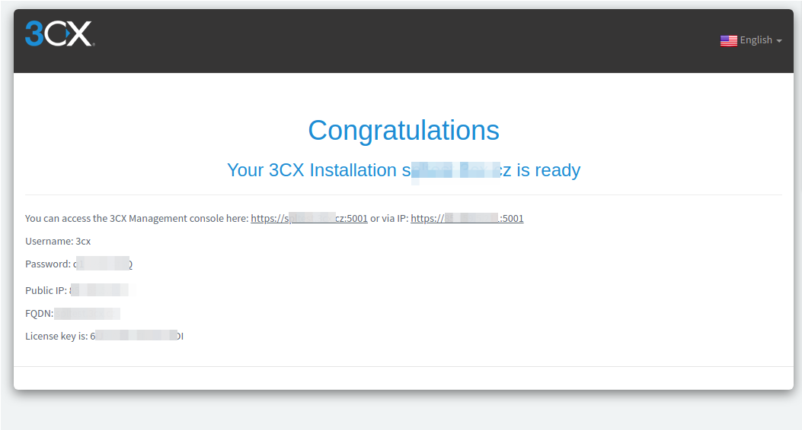

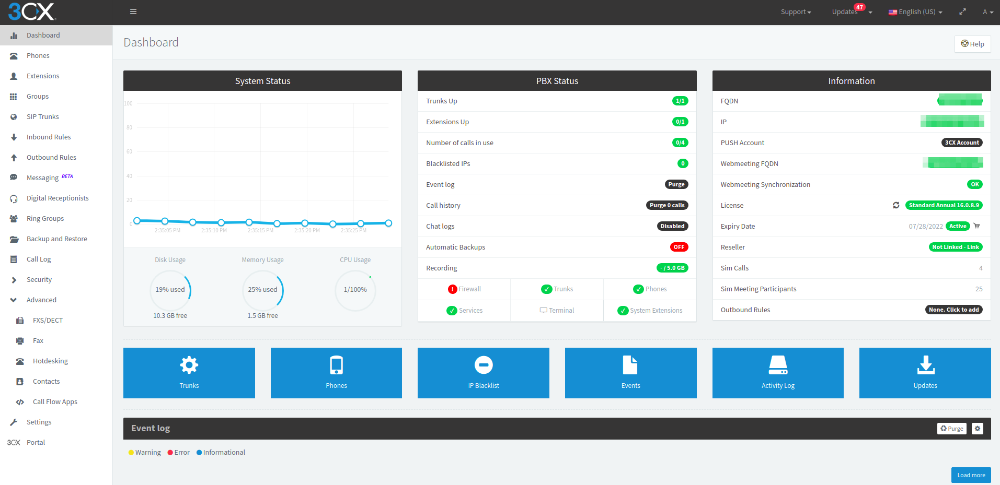

4. In order to connect Splynx to the **3CX** server, please execute one by one the commands which are listed in `Config → Integration → 3CX`on the the server with **3CX** system.


<details style="font-size: 15px; margin-bottom: 5px;">
<summary><b>Example of commands</b></summary>
<div markdown="1">


```
sudo su
adduser splynx
cd ~splynx
mkdir .ssh && cd .ssh
touch authorized_keys
echo "ssh-rsa rsa_key_value= splynx@base" >> "authorized_keys"
```

</div>
</details>

The permission and owner to **.ssh** folder should be the next `drwxr-xr-x  2 root   root   4096 Sep 15 08:40 .ssh`.

Type the IP address or domain name of your **3CX** system in **Domain or IP** field and press the **Test Connection** button to check the connection. Press **Save** button in order to save the entered IP address or domain name.


5. To upload your XML file to 3CX system, click on `Settings → CRM Integration` and follow the required CRM integration steps as shown on the screenshots.

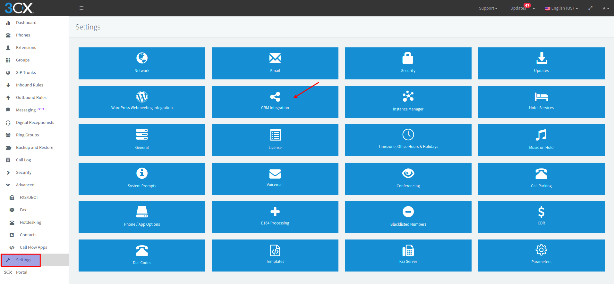

- Click the **Add** button to upload the XML file:


- After that, fill in the **API Key/Secret/URL** values in the required fields:

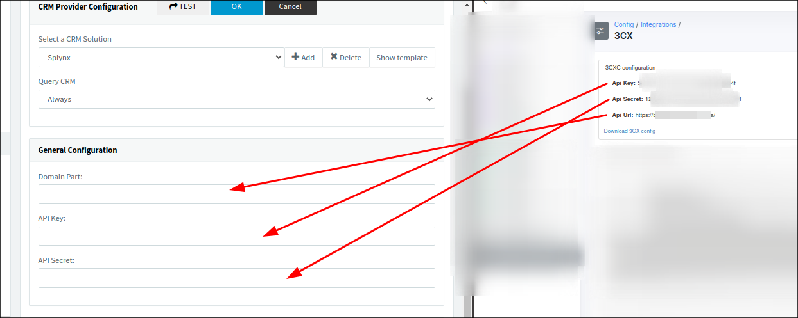

- Then, scroll down and enable the **Call Journaling** and **Contract Creation** option blocks:


- And press the **Test** button to check the CRM configuration.

- To **check the creation of contacts**, try dialing a number and click on the **Contacts** item on the sidebar and enter the phone number to search in CRM:

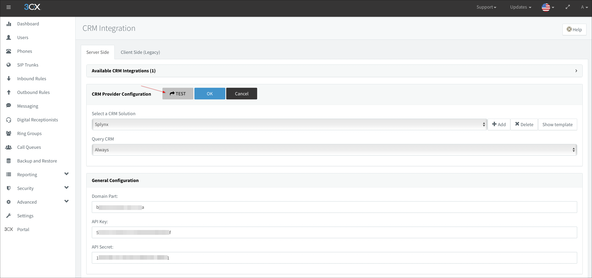

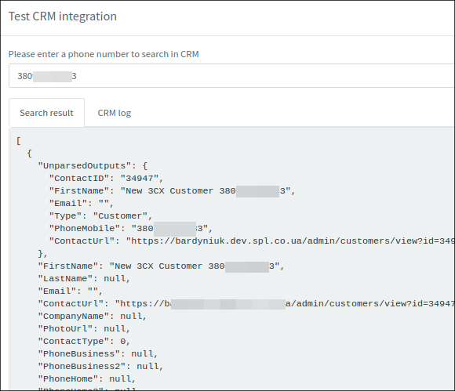

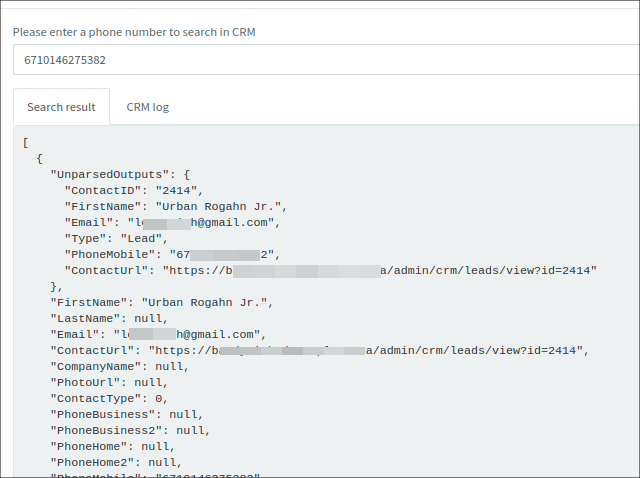

<icon class="image-icon"></icon> More information about the integration process can be found at the following [link](https://www.3cx.com/docs/crm-integration/).

6. Install [iOS](https://apps.apple.com/us/app/3cx-communications-system/id992045982), [Android](https://play.google.com/store/apps/details?id=com.tcx.sipphone14) or [Windows](https://www.3cx.com/user-manual/installation-windows/) app, navigate to your [3CX Web Client](https://www.3cx.com/user-manual/web-client/) via ```https://<domain/IP>/webclient```, log in using the extension number and password from your email letter and click on *Activate your 3CX Browser Extension*, in the top left-hand corner of the Web Client click *Allow Notifications* to enable desktop notifications, you will see the blue phone icon in the extensions bar in your browser. Click on the icon to open the Browser Extension pop out window.
Now you can quickly and easily make and receive calls from your desktop without needing to open the full Web Client. Moreover, you can call to customers directly from Splynx.

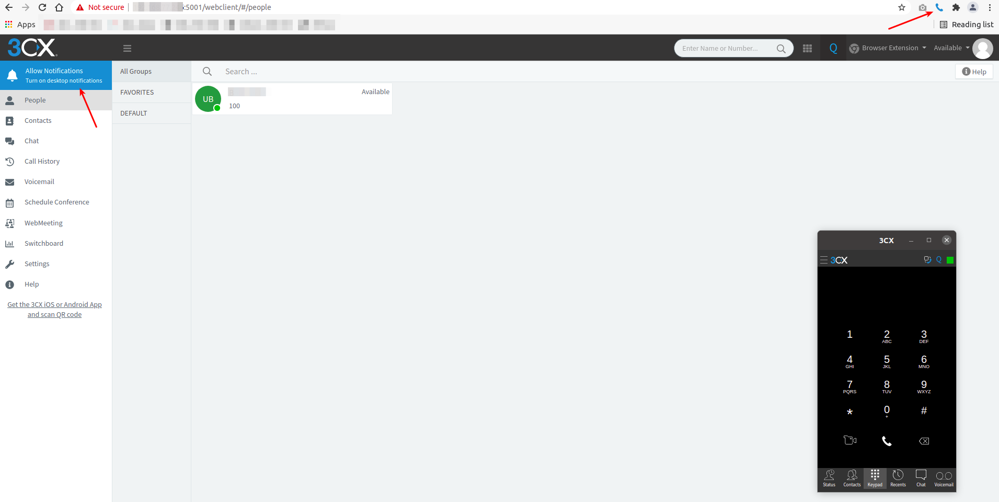

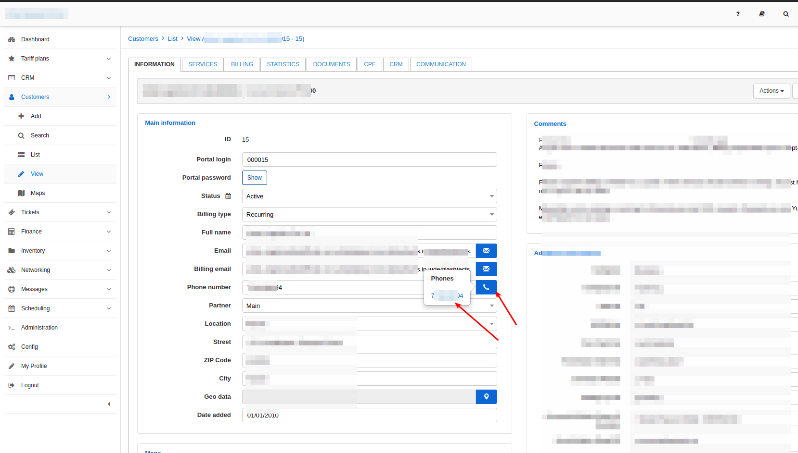

The calls history with its directions can be found in customer's profile, the **Communications** tab

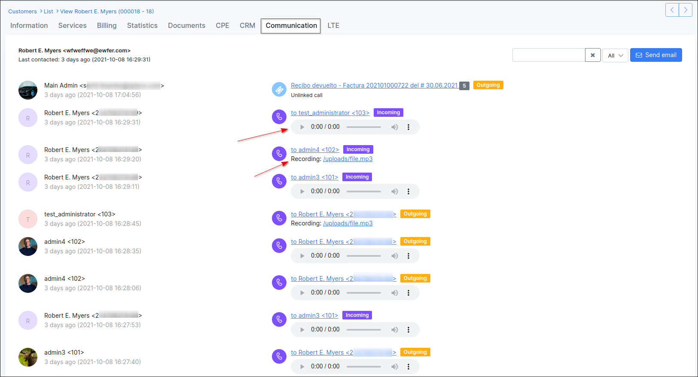

The player to listen the call will be visible if the add-on receives `voice_file_url` value. In case we use the 3d-party add-on that receives only `recording_url`, the link (`Recording: <link>`) to listen/download the file will appear instead.

To each call item in the list the description message can be added, the call can be link to the existing ticket in Splynx, if the ticket is closed, it will be reopened automatically.


### Troubleshooting

<details style="font-size: 15px; margin-bottom: 5px;">
<summary><b>Case 1: Calls are not recorded if a web browser with the 3CX extension is used to interact with a customer</b></summary>
<div markdown="1">

Navigate to the 3CX server admin dashboard, click **Settings** and in the **Recording Quota** section **disable** the option `Compress recordings to save space (ADPCM format 256Kb per minute instead of PCM format 1Mb per minute of recording)`:

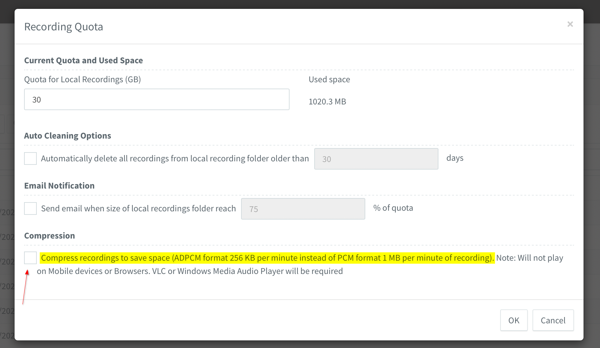

The option **Compression** - enables to compress recordings in ADPCM format 256Kb to further conserve disk space.


</div>
</details>
