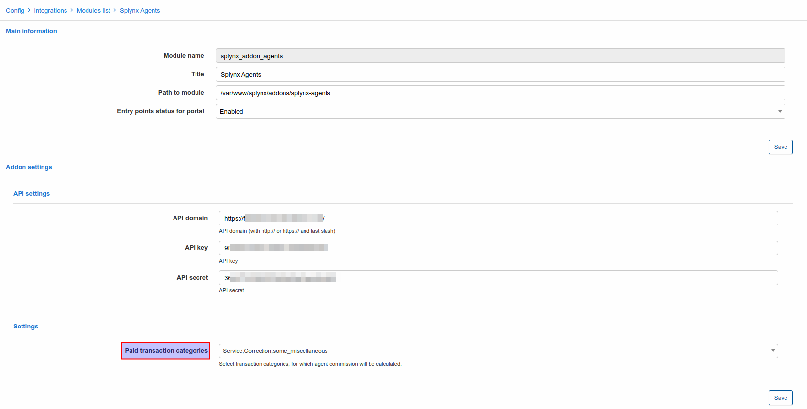
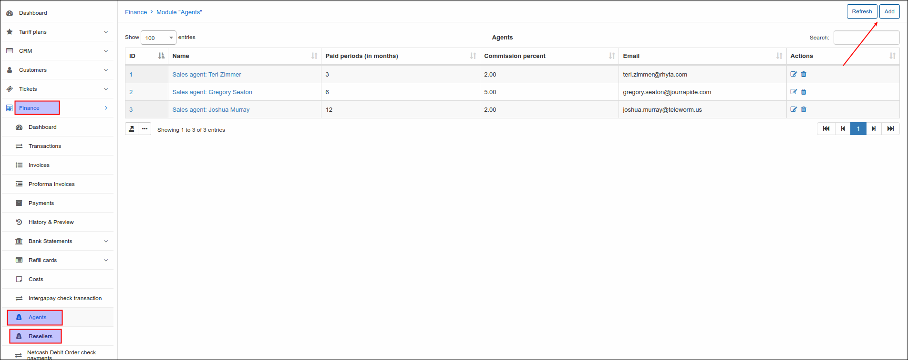
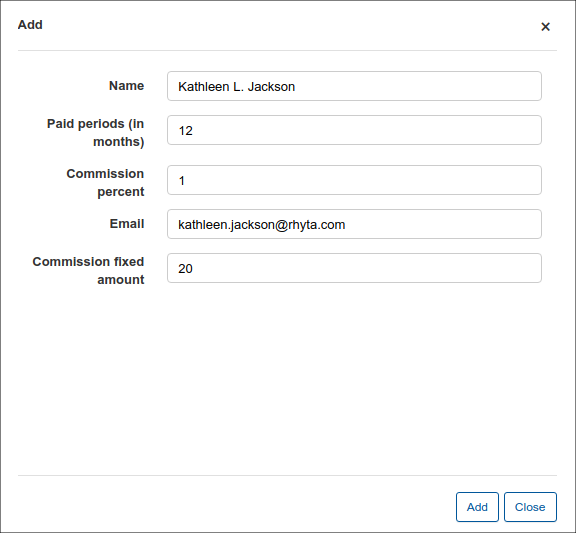
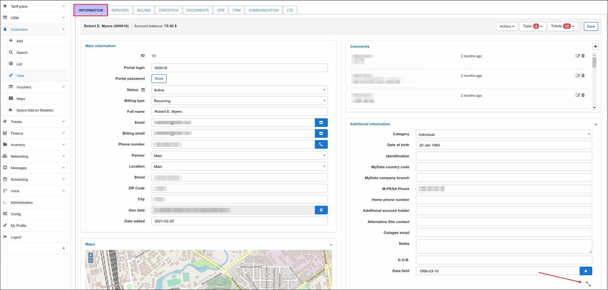
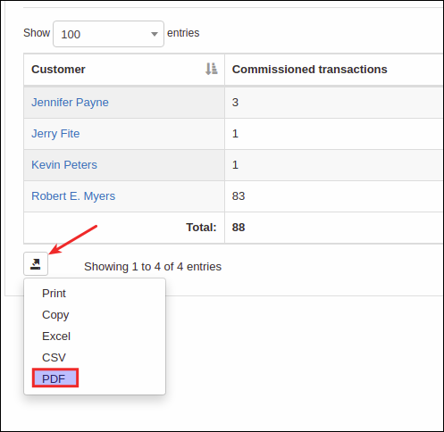

Agents and Resellers add-ons
========

*Agents* is a Splynx add-on module designed for the sales representatives, it helps to organize the commission structure and calculate the percentage from the new deals in your organization.

*Resellers* is a fork of *Agents* add-on and is used only for the resellers' representatives and it has the same functionality.

Offering competitive commissions to sales/resellers team members can motivate them to make more sales and improve their performance. There are many types of compensation structures to choose from, and sales leaders should implement a plan that aligns best with their team’s specific needs.

The first step to activate *Agents* / *Resellers*, is installing the add-on. This can be done in two ways, via CLI on the Splynx server and via the Splynx Web UI.

To install the add-on via CLI, the following commands can be used:

```bash
apt-get update  
apt-get install splynx-agents
// apt-get install splynx-resellers
```

To install the add-on from the Web UI:

Navigate to `Config → Integrations → Add-ons`:


Find there the "splynx-agents" or "splynx-resellers" add-on and click on the install icon in the *Actions* column of the table


Then, click on the "OK, confirm" button to begin the installation process


Once the installation process has completed, all configurations for the add-on can be found in `Config → Modules → List`, simply click on the edit icon of the module and you will be able to change settings of the add-on like the *Paid transaction categories* (the [transaction categories](configuration/finance/transaction_categories/transaction_categories.md), for which agent or reseller commission will be calculated).



**Note:**

**For the selected transaction categories will be automatically added `discount` and `refund` categories for the correct calculations in report.**

## Using the Agents / Resellers module

To create the *agent / reseller*, click on `Finance`, select the necessary module and press *Add* button:



In new window, you can specify the *agent's / reseller's* name, paid periods (in months), commission percent and the email. Also, you can edit the provided info or delete the created account.

**Note:**

**If a zero value is specified in `paid periods` field, the commission will be paid all the time. The start period is the date of the first transaction of the customer or date is grabbed from the filed `period_from` or `date` of transaction**



To link the particular *agent / reseller* to specific customer, open the customer profile on information tab, click on the icon to show additional fields, select the necessary account in the appropriate field and press *Save* button.




In `Administration → Reports → Agents (Resellers)` you can find the detailed reports in tabs: **the consolidated report by all agents (resellers)**, **the detailed report by specific agent (resellers)** and **the report by the specific customer**.


The report is generated by valid customers for the selected period, it shows how much you need to pay commission for some period. The reports' examples:


**Note:**

**If the transaction period is longer than the period for which the commission is paid, the commission is calculated only for the valid period. For example: if the client pays for a full year, and we pay the commission for a half of a year, the agent receives the commission for half of a year at once**

Also, you can export any report from these three tabs to Excel, CSV or PDF file, just click on <icon class="image-icon"></icon> icon and choose the required format:

export_to_file.png

