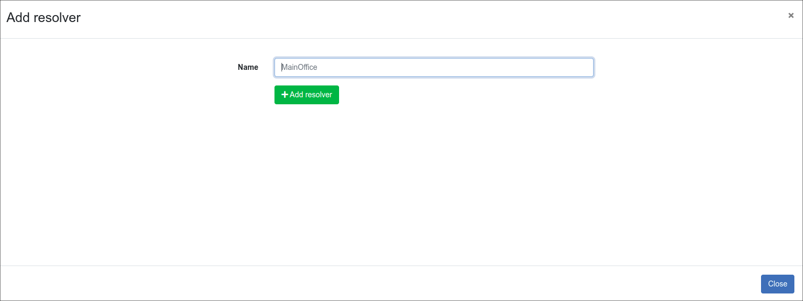
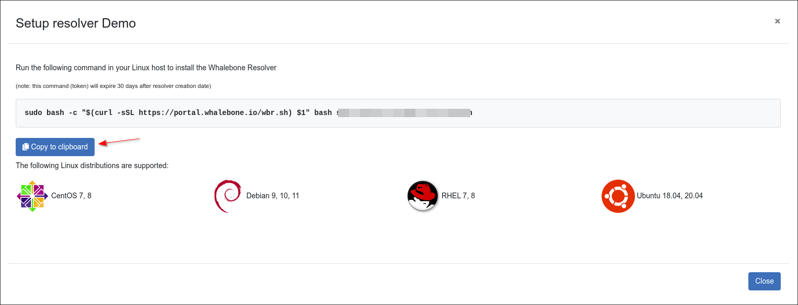

Whalebone
=============================

[Whalebone](https://www.whalebone.io/) is a service for security filtering of DNS traffic and based on the implementation of [Knot Resolver](https://www.knot-resolver.cz/) features. Whalebone is used to monitor DNS activity to indicate that a security issue may occur elsewhere in your network. This secure DNS solution provides: content filtering, malware, phishing, outgoing SPAM or DoS campaigns blocking, blacklisting of IPs and many more options. As a result it makes your network secure, fast, and reliable.

To allow you to make use of all advantages of Whalebone, our developers have integrated Whalebone service into Splynx via API.

In this guide, we are going to learn how to install the *Whalebone* add-on in Splynx, make the basic configuration of *Whalebone* as a local DNS resolver and how to check the statistic of visited websites in the measured period.

### Installation of Whalebone

Whalebone can be deployed in several [scenarios](https://docs.whalebone.io/en/latest/deployment.html), but in our example we will use it as a full-fledged **local DNS resolver** in the following network topology:

The main advantage of such scheme is visibility of local IP addresses that send the actual DNS requests.

Whalebone supports the latest versions of the most popular Linux distributions, but only without desktop environments (GNOME, KDE, etc.). The **minimum hardware requirements** are 2 CPU cores, 4 GB RAM, and a 40 GB HDD. Such machine can handle up to 20 000 users.

The **network setup requirements** you can find [here](https://docs.whalebone.io/en/latest/local_resolver.html#local-resolver-system-requirements)

Once the server is ready and you bought the Whalebone license, go to the Whalebone Portal, on the menu bar click on **Resolvers** and press the button **Create new**.

Type a name for your new resolver.

Once you’ve entered the name, click **Add resolver** button, after clicking the button an informative window will pop up with one-line command for the installation.

Copy the command and run it on your server dedicated for the local resolver. The command will run the installation script and will pass the one time token used for the resolver activation (the same command can not be used repeatedly).

If the script installation is successful, the notification `Final tuning of the OS - [OK]` will be displayed. Also, the script creates a detailed log - `wb_install.log` in current directory.

<icon class="image-icon"></icon> **IMPORTANT:** Make sure you limit the access to the local resolver on port 53 (UDP and TCP) from the trusted networks only, otherwise it can be misused for various DoS attacks. Also, double check if traffic is allowed on localhost as well, e.g. `iptables -A INPUT -s 127.0.0.1 -j ACCEPT`.

As soon as the resolver becomes **Active**, you can route the traffic to it and start protecting your network.

To test the security filtering of your Whalebone resolver, try to open the next domains:

- `http://malware.test.attacker.online`
- `http://c2server.test.attacker.online`
- `http://spam.test.attacker.online`

When you open these domains, a blocking page like the following should appear:

