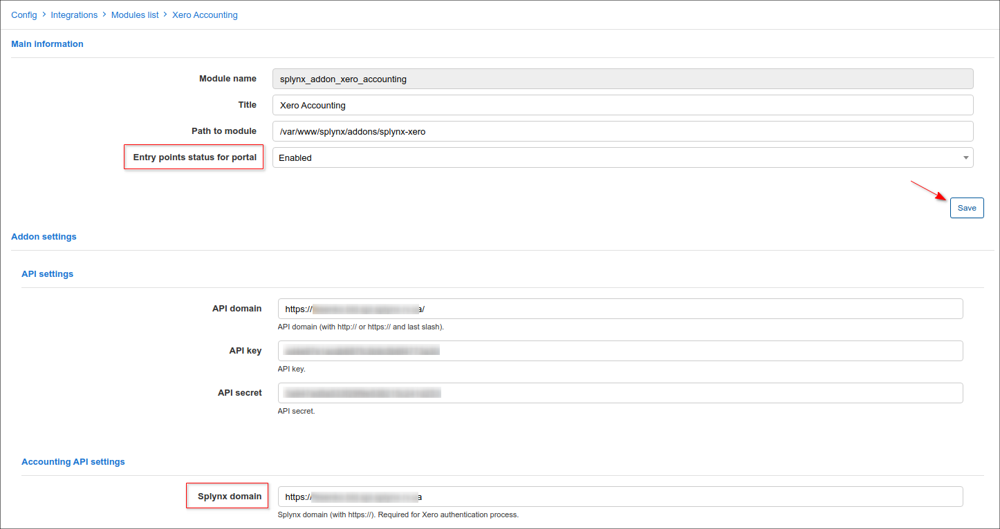
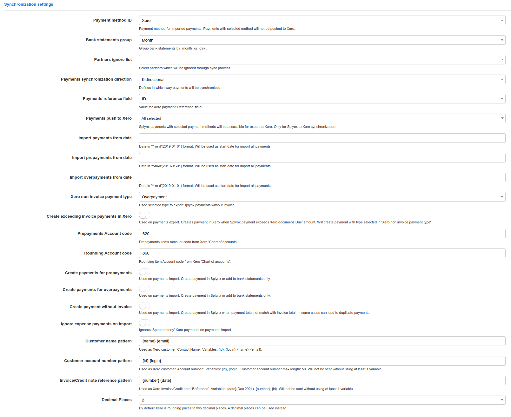
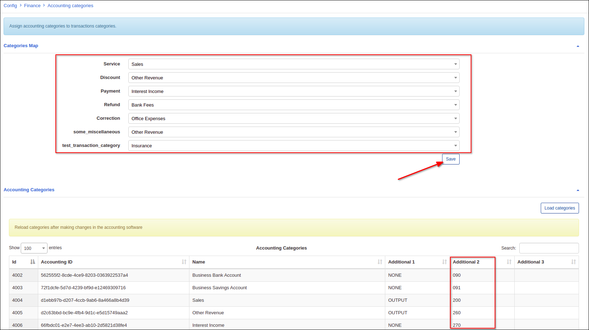
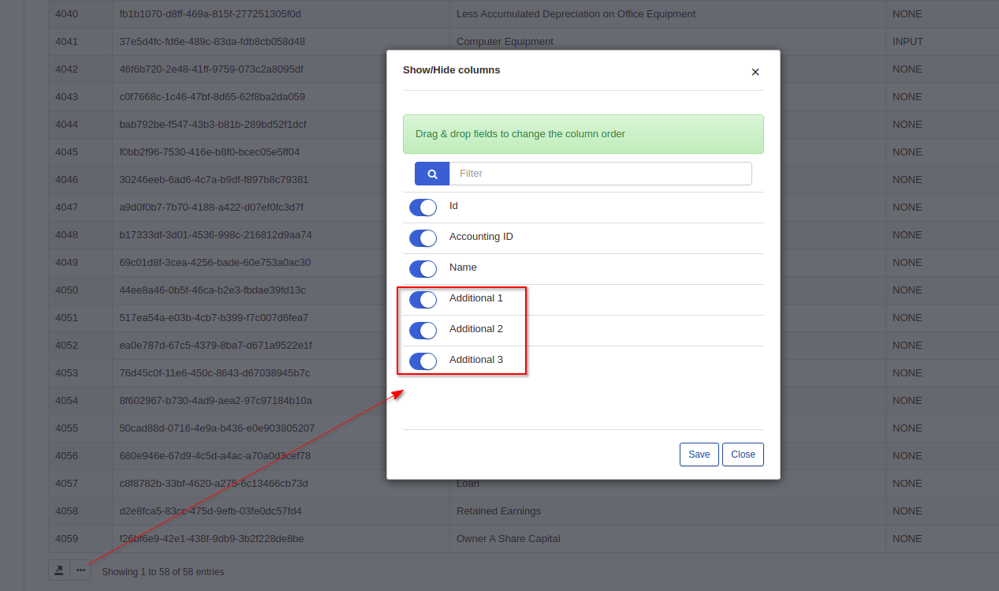
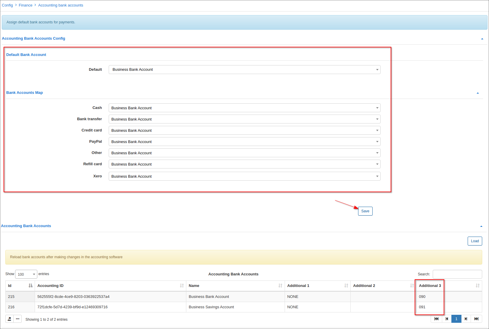
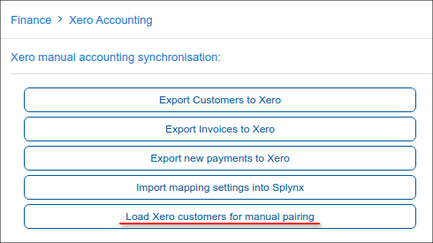

Xero accounting
=============================================

Splynx is able to sync customers, invoices and payments with Xero accounting software - https://www.xero.com

To install the Xero addon, navigate to **Config/Integrations/Add-ons**:

In the list of available addons, locate or search for "splynx-xero". Once located, click on the install button in the *Actions* column to begin the installation process:

Once the installation has completed, navigate to **Config/Integrations/Modules list** and click on the edit button in the *Actions* column:

The general configuration of the Xero integration module can be viewed and edited here. First of all we need to specify the "Splynx domain" in the *Accounting API Settings* section:

The Splynx domain must be the same as the API domain URL but without last slash "/". **HTTPS is required!**

### Synchronization settings:

**Payment method ID** - select the payment method for imported payments;

**Bank statements group** - group bank statements by "month" or "day";

**Partners ignore list** - select the partners of which will be ignored in sync process. Customers, invoices and payments of the partners selected here, **WILL NOT** be synced with Xero.

  ***Note! Only one partner should be synced - multiple partner sync is not supported in accounting integrations***;

**Payments synchronization direction** - define the direction of syncing payments: Xero -> Splynx or Splynx -> Xero. If Xero to Splynx is selected - all payments which were created in Splynx will not be synced to Xero;

**Payments push to Xero** - select the payment methods to sync to Xero, this selection only applies if the selected method to sync payments is set to "Splynx to Xero";

**Import payments from date** - specify the date in 'Y-m-d'(2019-01-01) format, which will be used as the start date for importing all payments;

**Import prepayments from date** - specify the date in 'Y-m-d'(2019-01-01) format, which will be used as the start date for importing all prepayments;

**Prepayments account code** - Prepayments items Account code from Xero 'Chart of accounts';

**Rounding account code** - Rounding items Account code from Xero 'Chart of accounts'.

### Cron settings

These are the global settings to automatically sync items between the two platforms, in any selected direction of syncing.

**Customers** - enables/disables automatic syncing of customers
**Invoices** - enables/disables automatic syncing of invoices
**Payments** - enables/disables automatic syncing of payments.

If any of the above items are not enabled to sync automatically, we can manually sync items via the Web UI under `Config/Integrations/Splynx Xero Accounting`, with the export and import functions.

### Let's start with Xero

In the next step, we have to connect the Xero account with Splynx, to achieve this, click on the "Connect with Xero" button:

After linking your Xero account with Splynx you will see a list of Xero organizations. Select the organization of which you will use with Splynx:

**NOTE**: all customers, invoices and payments will only be synced with the selected organization. If the organization must be changed in the Splynx Xero addon, you will have to reset all synced invoices, customers, and payments, and start from scratch.

When the Xero account linking is completed, the first step is to import mapping settings (chart accounts in Xero, tax rates, and bank accounts) into Splynx. Click on the "Import mapping settings into Splynx" button to achieve this.

When this process completed, navigate to **Config/Finance**, you will see 3 new sections: *Accounting categories, Accounting bank accounts and Accounting taxes* - each of which will have to be configured.

Let's start with Accounting categories:

Under "Categories map" ALL categories must be selected with an item from "Accounting categories". Pay attention to the "Additional 2" field under accounting categories, each category should have an account code. To enable displaying of additional fields, click on the breadcrumbs (column selector) button at the bottom of the page and simply enable the fields to display:

If the synced category has no account code - Xero will not be able to sync invoices for this category.

As soon as the relevant categories are configured, we can proceed with bank accounts:

We will follow the same procedure with bank accounts, each bank account should have an account code (additional 3 field here) and the default bank account should be selected.

The last accounting config to sync are tax rates:

Once "Accounting categories", "Accounting bank accounts" and "Accounting tax rates" are configured, the Splynx Xero addon is ready to start syncing.

In our test environment, we have 2 customers and a few invoices for each customer, let's sync them to Xero:

Once the customer sync has completed, we can sync the invoices:

As you can see from the image above, an invoice was skipped due to an incorrect tax rate (not matching with the tax rates that we synced from Xero).

On the Xero interface, we can see our synced customers and invoices:

Let's capture the payment related to the invoice "C0000006" for the customer "Andrew":

Now we can sync payments from Xero to Splynx by clicking on "Import new payments into Splynx". On our test Xero account we had a lot of payments, so all of them were synced, but only payments which are matched to a corresponding customer will be created in Splynx.

Payments which we've synced from Xero can be viewed in **Finance/Bank statements/History**:

If some payments are skipped, or you need to view payments - navigate to the above mentioned section to view all payments.

As you can see from the image above, only 1 payment was processed (created). The statement record with an "Error", did not create a payment because all invoices with an amount of "2" were already paid in Splynx (we marked it as paid), but overdue in Xero. When there's a discrepancy in payments, we do not sync these payments.

Sometimes it's required to manually pair a statement record(create a payment in Splynx) to a customer because the integration logic has been built in directly to avoid any mistakes. We recommend checking bank statements on a regular basis.

Lastly, we can view the paid invoice as well as the payment under the customer's billing tab:

### Xero logs

Sync logs can be found under **Administration/Logs/Accounting integrations**:

If a customer/invoice/payment has an "Accounting ID", this indicates that it was synced, if not, it was not synced.

The same for invoices and payments, if accounting ID is present - it was synced:

"Invoice ID" corresponds with Splynx invoice ID's.

"Payment ID" corresponds with payment ID's in Splynx.

### Xero tweaks

In this menu, there are a few more settings and tools related to the Xero addon:

**Connect with Xero** - if the Splynx-Xero addon was disconnected from the Xero account, you have to reconnect here;

**Refresh OAuth token** - setting to refresh the OAuth token;

**Edit connection** - used for editing the connection with Xero, when the credentials were changed in Xero;

**Customers manual pairing** - this function is used where there are existing customers in Splynx as well as Xero. There is a "Load Xero customers for manual pairing" button. This feature pulls the customer list from Xero into Splynx and allows the admin to manually pair the customers without having to create them in either platform again.

We only have 2 customers and they are paired, if the status is "Not paired" in the "select pair" field, you can find the required customer from Xero to pair with this customer;

**Tools** - this menu is used for resetting the accounting database, all items will be erased. It is mainly used when the organization changes. Before changing the organization, the accounting database must be reset:

