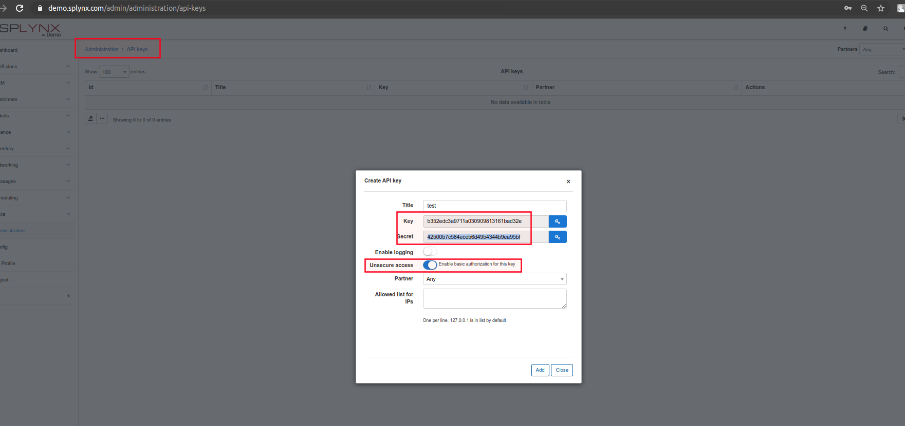
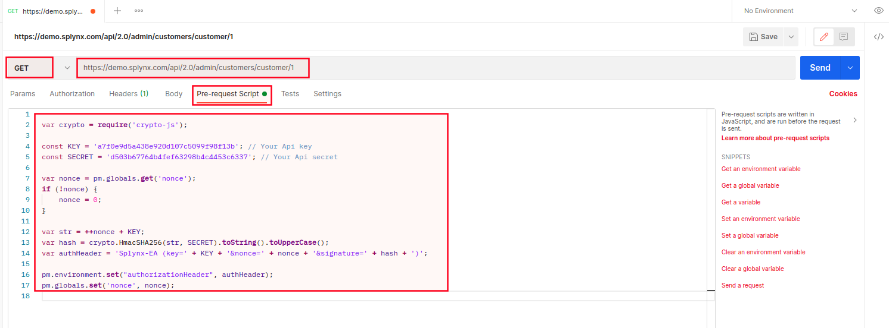

API Documentation
=============
Splynx system has its own Application Programming Interface (API) which allows software applications to communicate with each other via API calls. In order to simplify the workflow with Splynx API in testing and development you can use [Postman](https://www.postman.com/). *Postman* - is an open source tool and can be easily downloaded [here](https://www.postman.com/downloads/) according to your desired platform. After install the app and sign up for account you can start work on Postman startup screen.

Splynx supports the following type of authentication:

**Access by token**

Generate the token for authorization and send GET request. Please note that it's necessary to create an admin user account in Splynx and assign the role e.g. super administrator, it depends on what the access rights you need.


The request method (verb) determines the nature of action you intend to perform.

**Basic authentication**

Add API key with *Unsecure access* in `Administaration → API keys`;

Encode you secret phrase to *Base64*, for example on this [web site](https://codebeautify.org/base64-encode);

Copy the encoded text, insert it as a value for *Authorization* key in Postman and press Send. Check the result in *body* section.




**Access by signature**
*Like in API v1*

Create API key and its secret in `Administaration → API keys` ;

Create pre-request script in Postman, for example:

```

var crypto = require('crypto-js');

const KEY = 'a7f0e9d5a438e920d107c5099f98f13b'; // Your Api key
const SECRET = 'd503b67764b4fef63298b4c4453c6337'; // Your Api secret

var nonce = pm.globals.get('nonce');
if (!nonce) {
    nonce = 0;
}

var str = ++nonce + KEY;
var hash = crypto.HmacSHA256(str, SECRET).toString().toUpperCase();
var authHeader = 'Splynx-EA (key=' + KEY + '&nonce=' + nonce + '&signature=' + hash + ')';

pm.environment.set("authorizationHeader", authHeader);
pm.globals.set('nonce', nonce);


```

Create autorizaton request with `{{authorizationHeader}}` value and press Send.




The output results indicate that tests were successful.

To get started with Postman, please check its [documentation](https://learning.getpostman.com/).

For more information about Splynx API, please check our wiki page: https://splynx.docs.apiary.io
