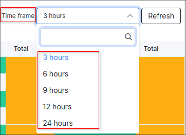
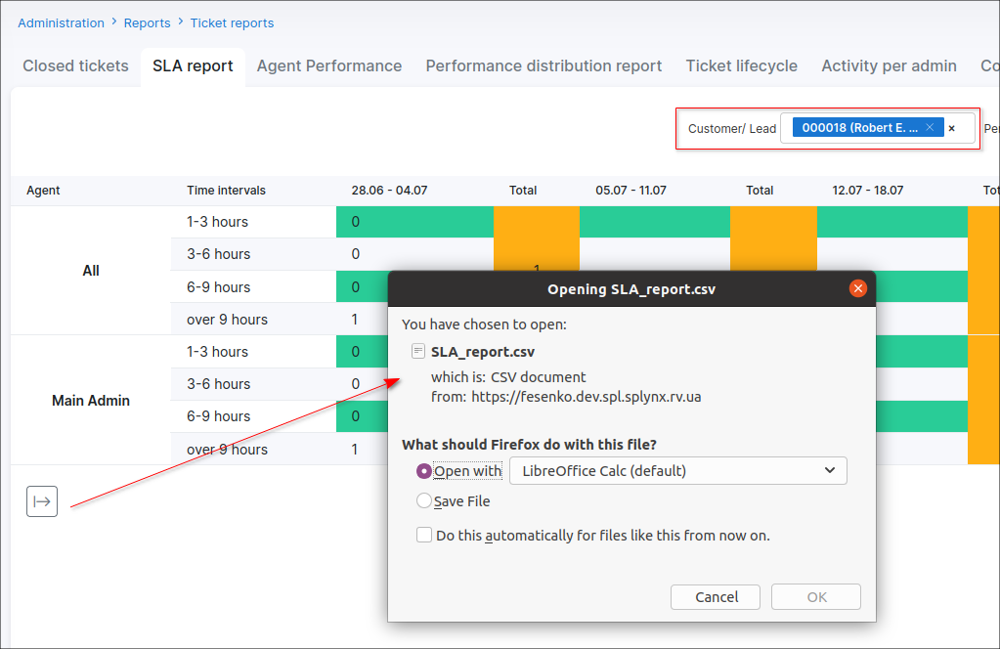
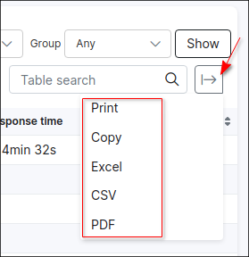
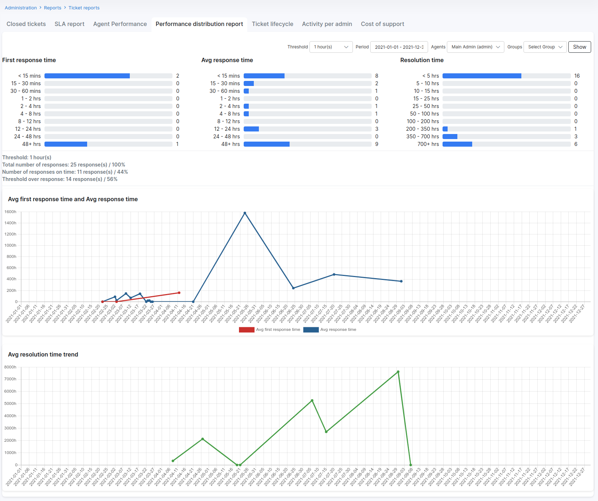

Ticket Report
==============


This section displays all data pertaining to tickets and useful tools to rate and observe performance in your company. The ticket report section consists of 7 sub-sections/tabs. Each providing information on tickets and agent performance in a different perspective.


**Closed tickets**

This subsection of ticket reports is used to rate agent performance with regards to tickets.

To view any data in this tab of tickets reports, it is necessary to first specify the criteria of results you wish to view. This can be done with the filter at the top right of the table. Simply specify a period and which administrator on your system you would like to view results of and click on Show button:


The report will then present a ticket ID, the administrator the ticket was assigned to and the subject of the ticket. Furthermore, the report will provide a rating system for you to rate the agents according to the following criteria: Comment,	Form,	Content,	Timing,	Feedback, and	Grade.

**Comment** - used to add a specific comment with regards to any of the other grading criteria

**Form** - used to rate the agents structure of information in the ticket

**Content** - used to rate the content the agent has provided in the tickets

**Timing** - used to rate the response times of the agents

**Feedback** - used to rate the relevance of the agents feedback to the customer.

**Grade** - this is a total obtained from the results of the rating criteria to give the administrator a total score.

Each of the rating criteria are rated by means of "1" or "0".

0 - being not adequate or correct;
1 - being adequate or correct.


This table can then be exported in a format of your preference by means of the export <icon class="image-icon"></icon> icon located at the bottom of the table:


**SLA report**

This section is used to display the agents response times to tickets grouped by specific time frames. We can specify time frame periods to show: 3h, 6h, 9h, 12h, 24h  and made reports for these periods.




To display data in this report, it is necessary to first specify a period to retrieve the SLA report data. Simply specify the period and click on Refresh button to view the results for that period. The report will display data of each admin in the system and their response times under each time interval pertaining to a specific date group, as well as the total of response time intervals for each date interval:


We can choose the report relation to the specific customer/lead to display and save it as CSV file.



**Agent performance**


This section of ticket reports displays a report of agent/admin performance for the selected period, according to the following criteria for all administrators on the system:


**Parameters**

**Tickets assigned** - Number of tickets assigned to the admin in the selected time period

**Tickets resolved** - number of tickets resolved/closed in the selected time period by the admin

**Tickets reopened** - number of tickets that have been assigned to the admin which have been reopened in the selected time period.

**Tickets reassigned** - number of tickets that have been reassigned by the admin

**FCR %** - percentage of tickets resolved/closed after a single contact made with the customer by the admin, during the selected period

**Private notes** - number of private notes added by the agent during the selected time period (add notes and reassigned)

**Responses**	- a total number of responses the admin has made during the selected time period

**Average first**	- an average response time of the admin first response during the selected time period

**Average response time**	- an average response time taken by the admin to respond to the requester during the selected time period

**Average resolution time** - an average time taken for an admin to resolve/close a ticket in the selected time period

This report/table can be exported in a format of your preference from that which is available with the use of the export <icon class="image-icon"></icon> icon located at the bottom left of the table:




**Performance distribution report**



This section summarizes a report of average times taken by administrators to send initial responses, average response times in general, and resolution times. The data displayed on the report will be retrieved from the criteria that you have specified in the filter located at the top right of the page, data will only be displayed once you have specified the necessary criteria in the filter. The data can be filtered by a specific period, agent(s), and/or group(s).


Simply specify the criteria and click on Show button to display the results


The performance distribution report is divided into three sections:

The first section displays statistics of "First response times", "Average response times" and "Resolution times", for each time interval according to the criteria specified in the filter:


The second section displays a graph representing average first response times marked red and average response times marked blue for the period specified, within an hour:


The third and final section displays a graph of the average resolution time of tickets for the specified period within an hour:


**Ticket lifecycle**

This section summarizes a report of total or average time taken for the resolved tickets, the output result can be split by *type*, *source*, *priority*, *group* withing a specific period of time.


**Activity per admin**

This tab shows the history of admins' activity within a specific time period. The information can be used to track what was done on the previous steps by other administrator.


**Costs of support**

This tab shows the value of support via tickets in correspondence with company revenue per customer. The formula to compute the **MRR Cost (per action)** is the next:
```
(Total actions / Monthly Recurring Revenue) * Quantity of customer services
```

**Total actions (in `+` out `+` notes)** is divided on **Monthly Recurring Revenue**, after that the result is multiplied by **Quantity of customer services**.


