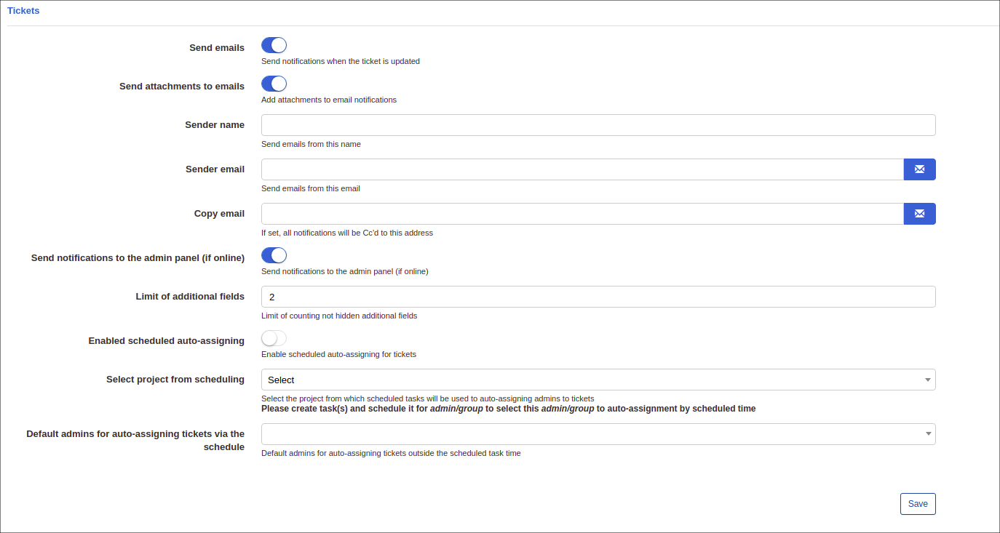

Tickets
=============
**_Config -> Support -> Tickets_**

## TICKETS

In this module you can configure the sender details for [ticket notifications](configuration/support/ticket_notifications/tickets_notifications.md).

**Please note that email sending must be configured under [Config->Main->Email](configuration/main_configuration/email_config/email_config.md) first.**

**Send emails** - if this option enabled, Splynx will send notifications when tickets are updated;
**Send attachments to emails** - if this option enabled, attachments in ticket messages  will also be sent in the notifications;
**Sender name** - name of sender;
**Sender email** - email address of sender. Email sending for this address must be configured under [Config->Main->Email](configuration/main_configuration/email_config/email_config.md);
**Copy email** - send copies of all emails to this address(if set);
**Send notifications to the admin panel(if online)** - if this option enabled, admins will receive a notification when they are online on the admin page.

## SCHEDULED AUTO-ASSIGNING

Let's imagine a situation where you(administrator "splynx") are the lead-support engineer. You have another support engineer(administrator "admin") and you've started to use shifts. The administrator "splynx" will work from 09:00 to 14:00 and all tickets will be assigned to him, and the administrator "admin" will work from 14:00 to 23:00 and "splynx" admin doesn't want to re-assign all tickets to "admin" while he is not working. For this purpose we have a feature scheduled auto-assigning of tickets for a time period, and it can be configured to auto assign all tickets to the administrator "admin" from 14:00 to 23:00.

First of all a project must be created under [Scheduling->Projects](scheduling/projects/projects.md)
and an admin must be selected as the default admin(all tickets will be assigned to him).

Then to make all tickets assigned to the administrator "admin" you have to create a task [Scheduling->Tasks](scheduling/tasks/tasks.md) under your project which you are using in this module.

Select the correct project, create a descriptions, assign it to the admin which will receive all tickets and the most important - enable the option "Is scheduled". In this example, it's scheduled from 14:00, for 9 hours so from 14:00 to 23:00, all tickets will be assigned to "admin" and after 23:00 "splynx" will receive all tickets again.

## TICKET ASSIGNMENT

Admins for auto-assigning tickets can be configured here.

**Admins available for auto-assigning tickets** - select an admin or admins available for auto-assigning;
**Sending notifications** - there are 2 options available:
  * Random admin(will be assigned to a random admin) - notification will only be sent to the admin who receives the ticket(admin from available list) and the ticket will be assigned to this admin;
  * All available admins(will not be assigned to anyone) - all admins will receive a notification but the ticket will not be assigned to anyone.

## TICKETS LINK STATUS WITH ACTION

The configuration of ticket statuses. Custom statuses can be added/removed under [Config->Support->General ticket configuration->Ticket statuses](configuration/general_ticket_configuration/ticket_config.md)

**On creating** - sets the status to "New" when a ticket is created;
**On opening** - when the ticket was closed, and re-opened, it sets the status to "Work in progress";
**On closing** - when a ticket is closed, it sets the status to "Resolved";
**On customer reply** - when a customer replied to a ticket, it sets the status to "Waiting on agent";
**On agent reply** - when an admin replied to a ticket, it sets the status to "Waiting on customer".

## DEFAULT TICKET TYPE

The configuration of default ticket types after creation. Custom ticket types can be added/removed under [Config->Support->General ticket configuration->Ticket Types](configuration/general_ticket_configuration/support/ticket_config.md)

