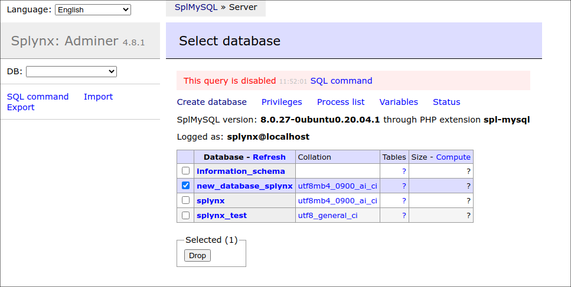

Adminer
============

<icon class="image-icon"></icon> **Important:**

**We strongly advise against using *Adminer* on your own because the changes made in this tool are permanent and can damage your system if something is done incorrectly. The data can be lost if anything is deleted while using this tool and changes to sensitive data can corrupt the database completely. The Splynx team is not responsible for any changes you make to the database using this tool.**

The **Adminer** - is a full-featured database management tool used to access your Splynx server database. We use the [fork](https://github.com/splynx/adminer) of the official tool which is adopted to the Splynx requirements.

All data on your server can be accessed and operated with *Adminer*. This is our method of accessing your database to resolve any changes/errors that may occur or may be inexplicable from the information displayed in the GUI of your Splynx server.

Navigate to `Config → Tools` and click on **Adminer** button, the tool GUI will be opened in a new tab of your browser with the request to enter your administrative password:

Type your password and press **Confirm** button. After that you can start work with the tool:

**NOTE:**

- If you try to drop any database which contains the word `splynx`, the attempt will be blocked;

- The actions that have been performed in **Adminer** are logged in `Administration → Logs → Operations`

Related links:

- The main features of *Adminer* tool are listed [here](https://www.adminer.org/en/#features) (not all features can be supported in Splynx);
- [Why is Adminer better than phpMyAdmin?](https://www.adminer.org/en/phpmyadmin/);
- The online demo of the official *Adminer* tool is available [here](https://demo.adminer.org/adminer.php?username=).

