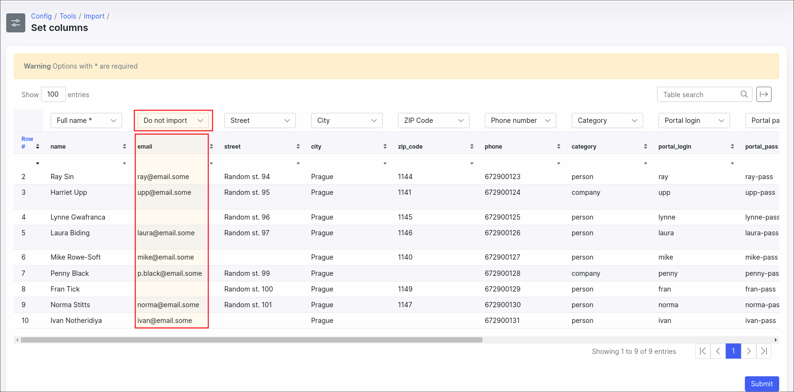
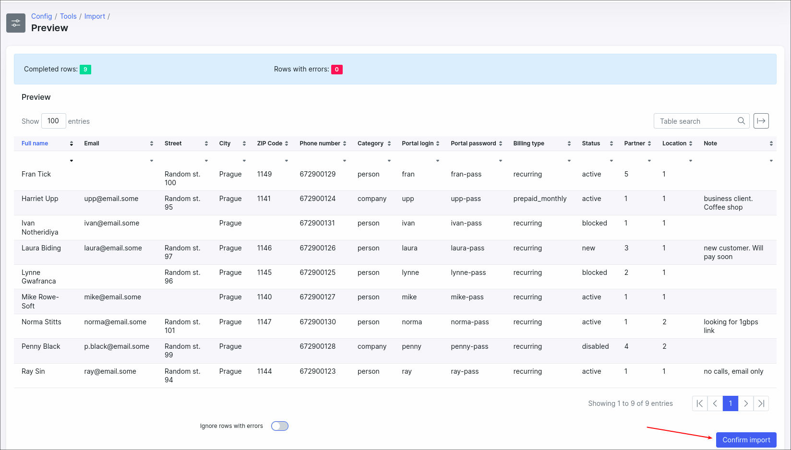
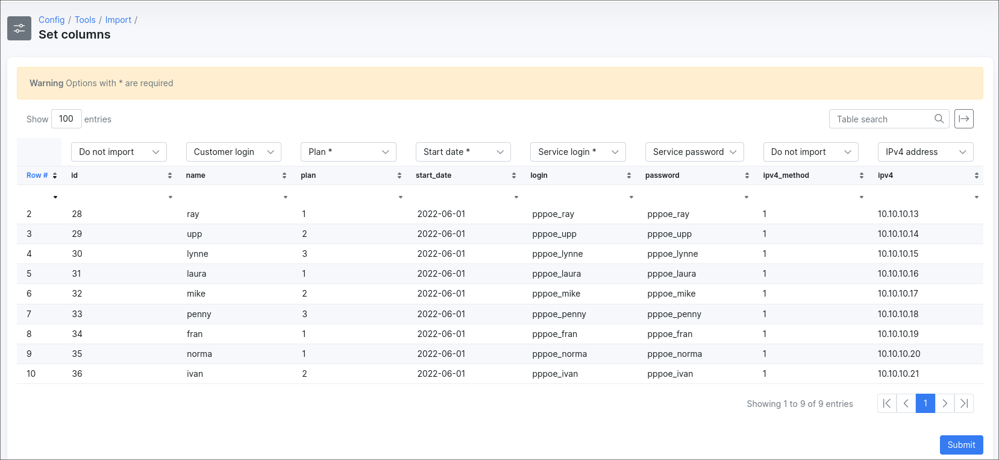
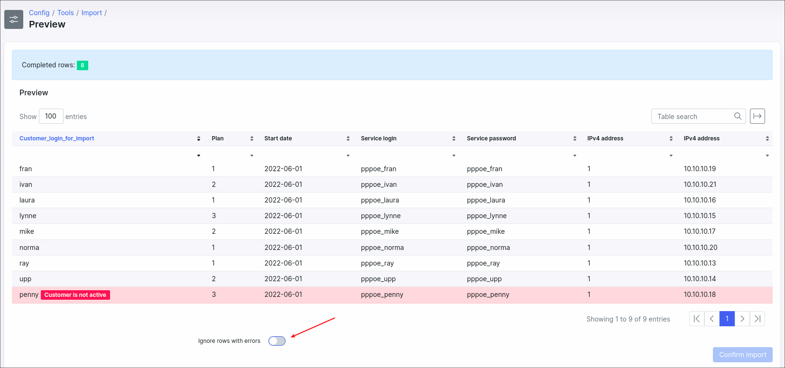

Import
======

When you are migrating to Splynx it is needed to import existing customers from your previous system into a new one. Manual import will take a lot of time and we have a tool to save this time.
Using the import tool you can import your data (customers, tariff plans, routers, leads, administrators, services, inventory items and products, etc) into Splynx in a few clicks. All what you need is a CSV file with your data.

### Customers import

To open this tool navigate to `Config -> Tools -> Import`:

We have a CSV file with next structure:

Let's import it:

select "Customers" module and upload your file:

once file is loaded you need to define columns for import:

here you need to select appropriate column according to file columns:

**Some tips for import**
* Fields with * are required. For customers the only required field is "Full name";
* Email must be valid: eg. email@some.email (email@some is invalid);
* For the "Category" column there are only 2 available option: *person* or *company*. Strictly in lower case;
* For the "Location" and "Partner" columns use only locations and partners IDs from Splynx, not names;
* It's not required to import all columns from the file. You can select the "Do not import" for a column and it will be ignored:

Once columns are defined, click on "Submit" button at the bottom of this page. This will generate a preview for import. Click on "Show preview and confirm" button to check the preview and confirm:

If there are no rows with error you can click on the "Confirm import" button and the import process will start on a background but when you have some errors and do not want to start the import again you can enable the "Ignore rows with errors" option at the bottom of this page and the error rows will be ignored during the import and you'll have an option to download the file with errors to reprocess them later.

Here is the result of successful import:

Under "Actions" you can check the import summary and download this record from the list.

### Internet services import

Once customers are imported and internet plans are created we can import internet services for these customers. The flow is the same - select appropriate module, upload a CSV, define columns, import.

In this file, column "id" will be ignored and in the "name" column we have customer's login. To match records from the file with existing customers in Splynx you can use email address, customer login or customer ID (column names "Customer email", " Customer login" and "Customer" accordingly).

Required fields for services: login, plan(tariff ID or name), start date.

We will match customers by login so instead of the "Customer*" field we will use "Customer login" field:

**Tips for services import**
* For the "Plan" column use tariff plan ID or plan name;
* Start/end date in next format - YYYY-MM-DD;
* Service login is unique value;
* IPv4 pool must be created before the import with IPs under Networking/IPv4 networks.

We have 1 error in services as the customer is inactive:

you won't be able to confirm import without enabled option "Ignore rows with error". To import it without this error record enable that option and confirm.

