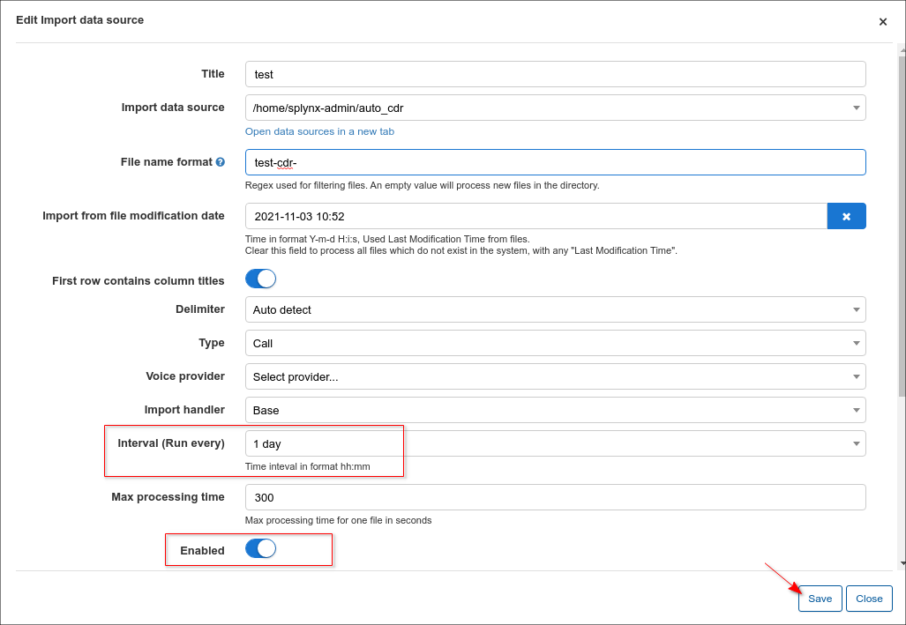

Auto CDR processing
==========

The Voice auto CDR processing is managed here.

The process is similar to the [Voice -> Processing -> CDR import](voice/processing/processing.md), but here we can import multiple CDR's together, automatically.

**NOTE:** In order to create an *Auto CDR Processing* entry, it is necessary to create an **Import data source location** first. This can be done in `Config → Voice → Import data source`. More information you can find in the [Import Data Source](configuration/voice/import_data_source/import_data_source.md) guide.

Once we have added a data source, then we can proceed with creating an **Auto processing entry**.

Let's **create an auto processing entry** by clicking on the **Add** button located at the top right corner of the table:

The data source parameters:

  * **Title** - provide a relevant name for the entry;

  * **Import data source** - select a data source from the drop-down list (in our case we used the local storage which was created on previous step);

  * **File name pattern** - Regex for filtering file names (uses pcre syntax):
    this will process all the files that have pattern entrances in the file name.
    Check the [Examples](voice/auto_cdr_processing/examples/examples.md). We have all the CDR file names starting with `test-cdr-` (e.g. *test-cdr-2021-11-01.csv*);

  * **Import from file modification date** - specify the file modification date in `Y-m-d H:m:s` format for the initial import. In our example, will be imported files from November 2021 because we have specified 2020-11-01 00:00:00, but if the file with calls was created in July and it was modified at 2020-11-01 00:10:00, it will also be imported. Clear the field value to process all files which do not exist in the system, with any `Last Modification Time`.
  Also, pay attention that the CDR files must have unique names as Splynx checks files by their names and if a file with a particular name has been imported into Splynx and the same file has since been modified, Splynx will not re-load the modified file as that file has already been imported.

  * **First row contains column names** - enable this option, if the first row in your CDR's contains the columns' names;

  * **Delimiter** - select a *delimiter* character (*Tabulator*, *Comma*, *Semicolon*) that marks the beginning or end of a unit of data from drop down list;

  * **Type** - select a type (*Call*, *Message*, *Data*, *Mixed*) from the drop-down list, relevant to the data you would import. In our case it's only calls;

  * **Voice provider** - select the necessary voice provider;

  * **Import handler** - select your handler from the drop-down list;

  * **Interval (run every)** - how often the auto processing will executed;

  * **Max processing time** - max time in seconds that Splynx will spend to process one file. If processing of the file takes more than the specified value - it will be ignored;

  * **Enable** - when a toggle is enabled, an auto processing unit will be executed every time `Interval` value, and if a toggle is  disabled - you will have to run it manually;

**Position** and **Column** values should be specified according to your file. If you are using a handler - columns configuration can be ignored.

But CSV file must contain such required columns as `Source`, `Datetime` (or separated `Date`, `Time` columns), `Duration`, `Destination` and `Type`. And columns quantity and columns order (`Pos.`) should be the same as in imported file.

After Auto CDR processing entries have been added, you can run import manually (in order to test it's functionality, after successful test results, the auto import can be enabled to execute all the processing actions automatically), in `Config → Voice → Auto CDR processing`, simply click on the <icon class="image-icon"></icon> (Run import) button. Before running an import, we recommend to check the files preview that will be imported:

We have 2 files to be imported and all are correct, so we can press <icon class="image-icon"></icon> icon to start the import:

After the import has been completed, we can check the results by clicking on the "History" button:

In the current case, the first file was fully processed and the second one was completed with warnings. Simply place the mouse cursor on the `Warning` status message of the file to see the number of *processed/unprocessed* rows:

Close the *Auto CDR processing history* window and click on the <icon class="image-icon"></icon> (Show warning rows) icon to view more information about the warnings:

As we can see, the call can't be placed to the correct service with the source number = `380974323450`. To fix this, we should choose the required customer and add the voice service, after that add to the service the phone number = `380974323450` and specified its direction as `outgoing`.

 Let's reprocess the warnings:

After reprocessing, we have successfully imported all files. Now we can enable the auto processing to grab new files from the data source location, once a day. So Splynx will automatically grab and import files with calls:

