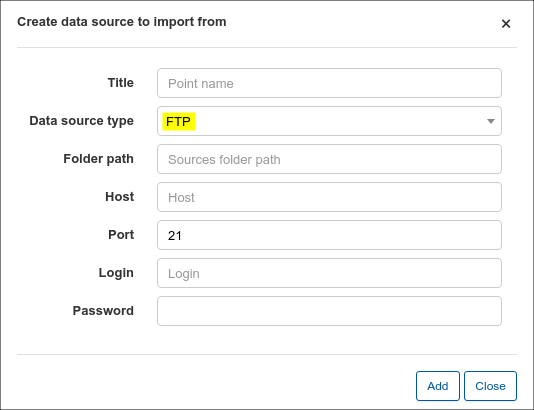

Import Data source
=============

We can import CDR's to charge customers and print their registered calls on their invoices.

In this section, we can create `Import data source location (-s)`, it's used to configure the [Auto CDR Processing](configuration/voice/auto_cdr_processing/auto_cdr_processing.md) and to import CDR files from a specified location.

 To **create Import data source location**, navigate to `Config → Voice → Import data source`

 

 Click on the **Add** button located at the top right corner of the table:

 

 The following **types of data source** location can be used:

 * **FTP**

 

 * **SFTP**

  

 * **Local**

 

The following parameters need to be configured to add a new data source to import from:

* **Title** - provide a relevant name for the data source location;

* **Data source type** - select a type from the drop-down list:

* `FTP` - a selected value requires to specify *Host* IP address, *Port*, *Login* and *Password* of the server where CDR files are located;

* `SFTP` - a selected value requires to specify *RSA private key* and the same parameters as for *FTP* of the server where CDR files are located;

* `Local` - a selected value requires to specify the local *Folder path* value. It implies that CDR files are located on the Splynx server, e.g. `/home/splynx-admin/auto_cdr`;

 Once the data source is added, you can test the connection, edit the data source or delete it using the buttons provided in the *Actions* column:

 

 **Important**

- **When using a (S)FTP server as a CDR data source - make sure that connection is successful**;

- **In case of using a `Local` data source type (storage on Splynx server), make sure that the folder with the CDR files has the correct permissions and `splynx` user is the owner**;

- **The CDR files must have unique names as Splynx checks files by their names and if a file with a particular name has been imported into Splynx and the same file has since been updated, Splynx will not re-load the updated file as that file has already been imported**.
