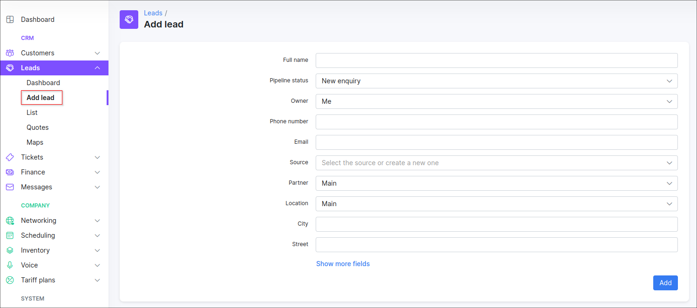
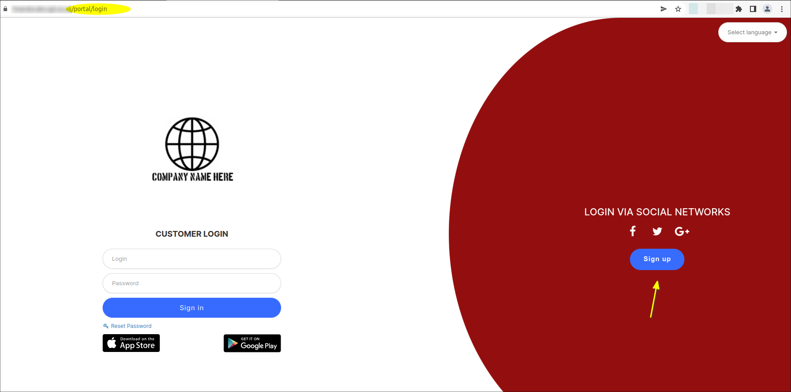
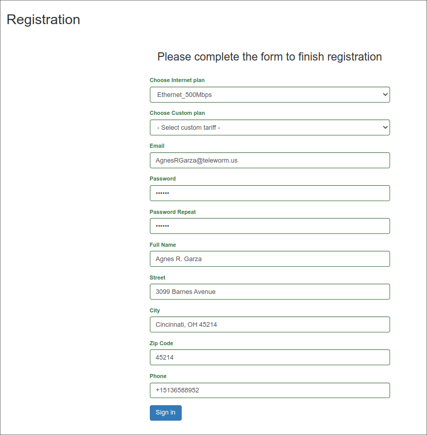
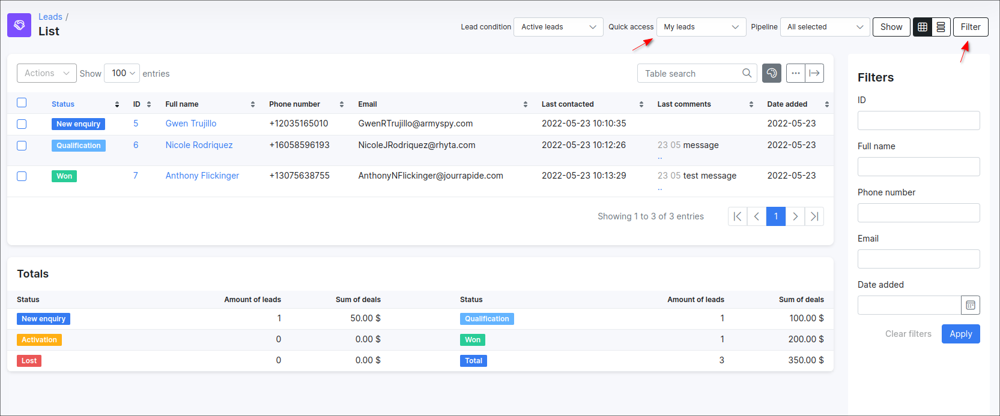
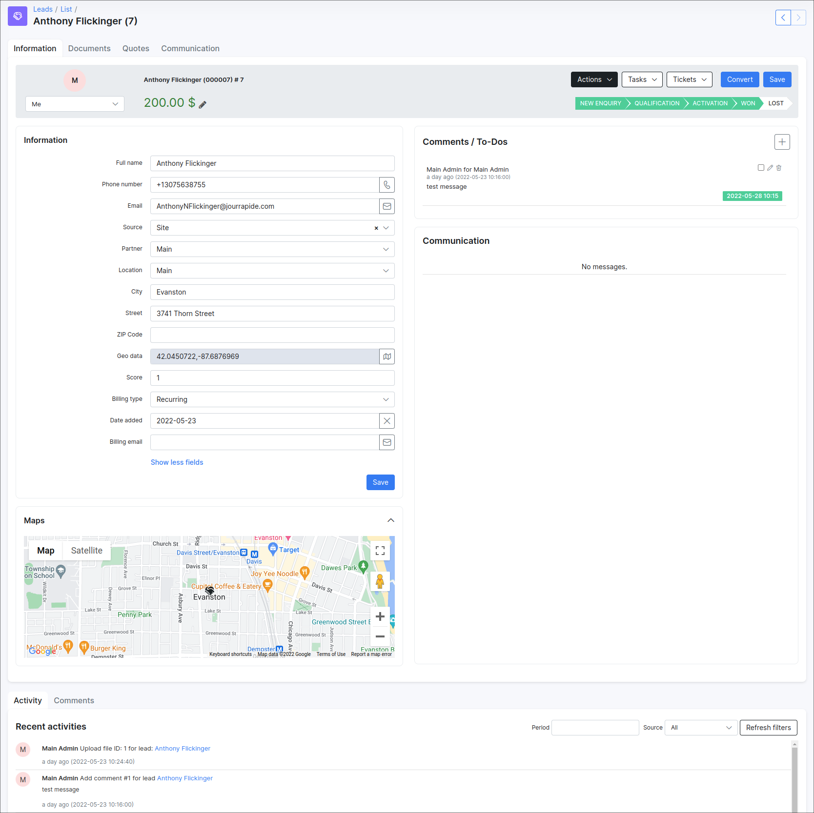
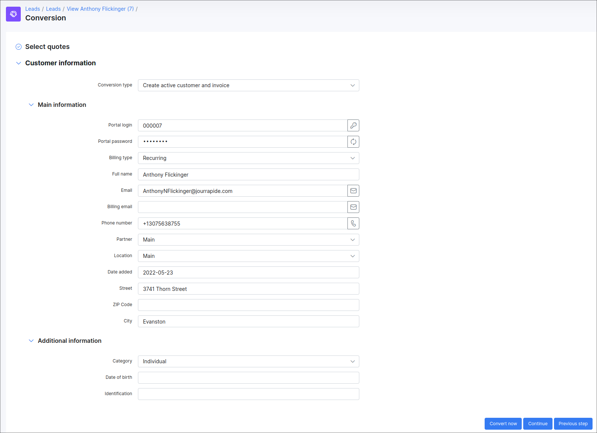
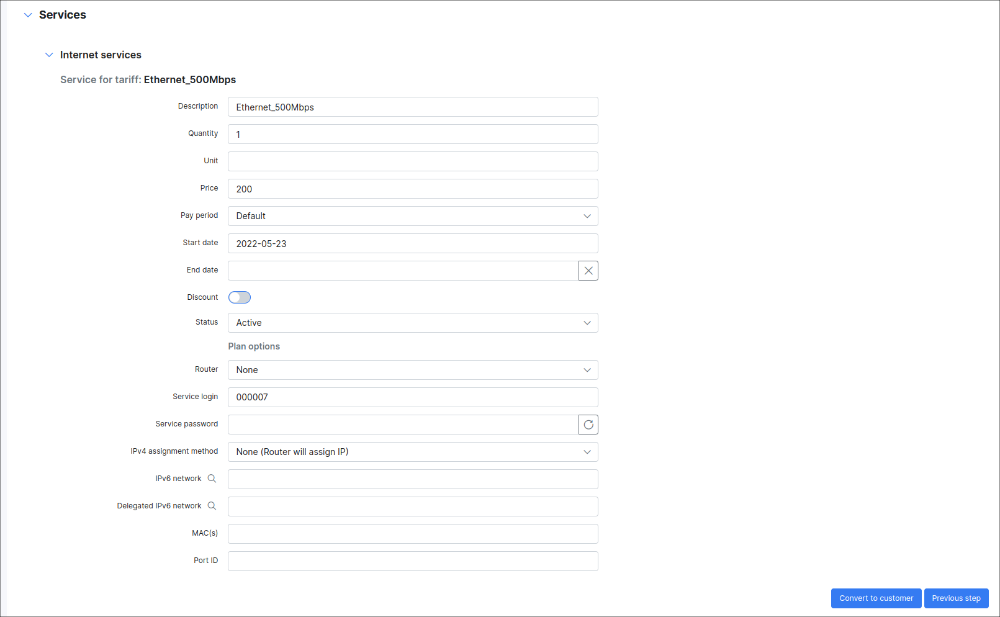

Leads
=======
A lead is a person or business who may eventually become a customer. Leads are the central part of the lead management module that binds all other functions together.

Our first step is to **Add a new lead** - here we will specify all the details pertaining to the prospective customer (*Owner*, *Pipeline Statu*, *Source*, etc.). The information added here will also be used when converting a lead to a customer.

**Full name** - name and surname of the lead; 
**Pipeline status** - status of the lead (stage in the process); 
**Owner** - administrator that will be responsible for the lead; 
**Phone number** - contact number(s) of the lead, multiple numbers supported and separated by comma `,` sign; 
**Email** - email address(es) of the lead, multiple addresses supported and separated by comma `,`sign; 
**Source** - where/what/how the lead obtained/received/gained interest or information about your company; 
**Partner** - partner the lead will belong to in the list of partners; 
**Location** - location the lead will belong to in the list of locations; 

Persons interested in signing up for a subscription can also be referred to the customer portal where, they can sign up by means of a registration form with relevant details required to contact them.

The **leads list** is where we'll find a complete list of all **My leads** (default view) - these are the leads which the current administrator is responsible for.

 However, you can to change the list of leads to display, by selecting a category from the drop down list to view specific leads thereof. We also have the option to filter leads according to several fields in the filter tab 

Next, we can view a lead by clicking on their `full name`/`ID` - this will open the lead page, where all the details relevant to the lead can be defined or edited.

In the leads information page, all details will be entered as per a normal customer except information regarding to a service.

Lead specific details:

- **Score** - a scoring function that can be used to score leads based on popularity;

- **Pipeline status** - status/level in the process the of lead (statuses can be customized in `Config → Leads → Leads pipeline`);
- **Owner** - administrator who is responsible for the lead;
- **Source** - where the lead originates from or discovered the product/company.

 All changes made to the selected lead can be viewed in the recent activities tab at the bottom of the page. Where comments can be added with customizable icons/color schemes.

In the **Actions** drop-down list found in the information page of the selected lead, we can access the following functions:
- **Creating a message**, which will be sent to the customer (can be processed with preconfigured template);
- **Delete the lead** - delete the lead account;
- **Convert the lead** - convert the lead into a customer (see conversion process below);
- **Create task** - creates a task related to the lead (directs to [scheduling a task](scheduling/scheduling.md));
- **List of tasks** - list all tasks related to lead;
- **Create** ticket - allow you to create a ticket addressed to the current lead;
- **All tickets / Opened / Closed** - items in the Tickets drop-down menu allow to open a linked list that is associated with the current lead, the advanced filter will be applied.

   

## Converting a lead to a customer

Our main objective for the Leads module is to achieve converting prospective customers into subscribers of our services.

We can choose to convert leads to customers by accessing the actions tab and clicking **Convert** .

This will initiate the conversion process, consisting of three steps.

1. **Select the quote/s** - quotes that will be used to create the customer's service/s (the services quoted and agreed upon).

2. **Customer information** - choose which type of conversion we want to use, `create active customer and invoice` or `create inactive customer and proforma invoice`. We can choose to complete the conversion within this step by clicking *convert now*, skipping the services step, or continue to add services existing on the customers quote.

3. **Services** - the final step, allowing us to edit the services of the quote we selected in step 1.
Once all details have been entered, we can complete the process by clicking on *convert to customer*.

