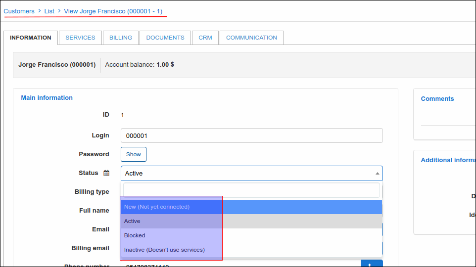
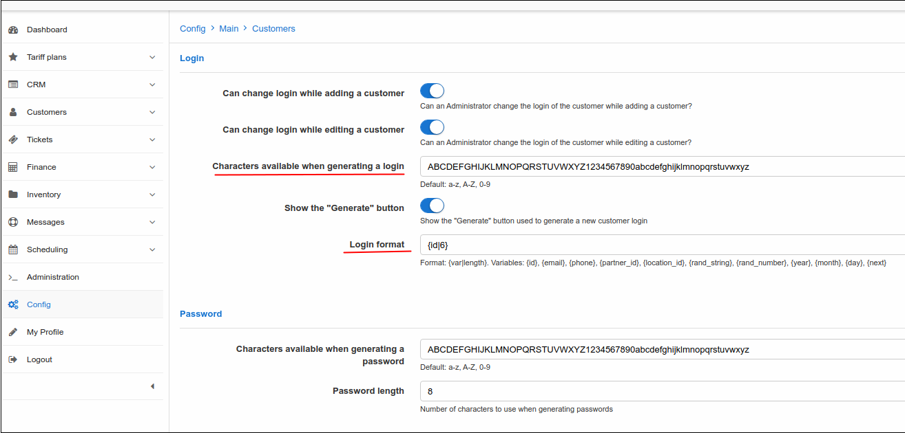
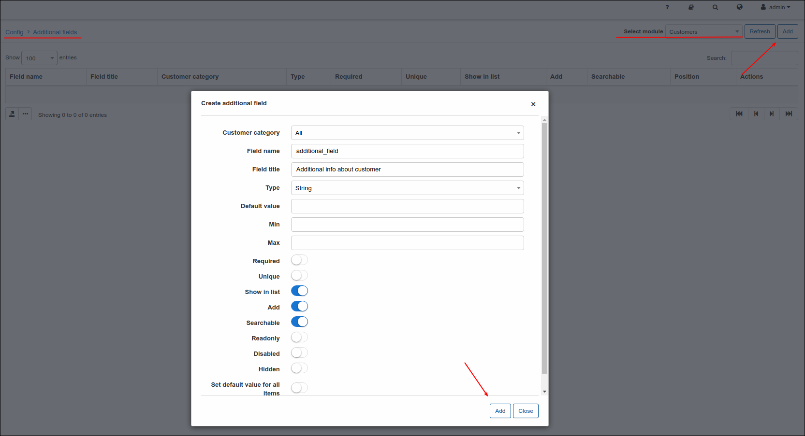

Adding a new customer
===================

To add a new customer, click on the _Customers Menu → + Add_. A window will appear for you to fill in the client details in the provided fields:

* `Login and Password` - login and password can either be automatically generated or you may choose to manually create them . The <icon class="image-icon"></icon> button is used to automatically generate a new login and<icon class="image-icon"></icon> for a password.
* `Billing type` - method in which you will bill the customer (prepaid or recurring)
* `Full name` - name and surname of the customer
* `Email` - email address of the customer (the multiple ones are supported separated by comma ",")
* `Billing email` - email address of the customer only for the billing correspondence (the multiple ones are supported separated by comma ",").
*The current field has the next logic:*
*if the billing email field is empty - all emails are sending to email(-s) from main "Email" field;*
*if there is the email in the "Billing email" field - all billing notifications will be send to this billing email and all other emails will be send to email from main "Email" field. As a result, Splynx doesn't duplicate the billing notifications to email(-s) from the main "Email" field.*
* `Phone Number` - phone number of the customer (the multiple ones are supported separated by comma ",")
* `Category` - if customer is a private person or a company.
* `Date of birth` - birthday of the customer
* `Identification` - the passport number of the customer
* `Partner` - partner the customer belongs to
* `Location` - location the customer belongs to
* `Date added` - the date when the customer has been added
* `Street` - the customer's street name
* `ZIP code` - ZIP code of the customer's area
* `City` - the city of customer's residence
* `Geo Data` - physical coordinates of the customer

**Customer status**

The status of your customers plays a significant role in the system with regards to services and accounting. The status of a customer influences whether the system will account for the customer's services in a billing perspective and whether the customers service are active, suspended(blocked) or stopped.

Here are descriptions of the different customer statuses for you to understand how this influences the system:

* **New (Not yet connected)** - This is the status given to newly added customers by default.
* **Active** - This status allows the customer access to their services and the system accounts for their services based on their _Billing settings_.
* **Inactive** (Doesn't use services) - This status stops customers services and the system from accounting. It is the status given to customers' automatically when they've reached the _deactivation (grace) period_. This status is given to customers who will no longer use your services. In case the customer's account has _Inactive_ status it can be deleted.
* **Blocked** - This status suspends customers' services due to non-payment/failed to make payment on time, while system still accounts for customer's services in a billing perspective.  

Automatically generated login and password are created based on the randomized characters. These characters and the format can be modified to your preference.

To define these characters and its format , click on _Config → Main→ Customers_.

It is possible to personalize a customer's parameters with the _Additional field_ function in _Config → System → Additional fields_. These are custom fields you require for any given informational data within the system for your customers.

To create the additional field in the form of adding of the new customer or on the information tab of the existed customer, select _Add_ and specify the necessary parameters:

