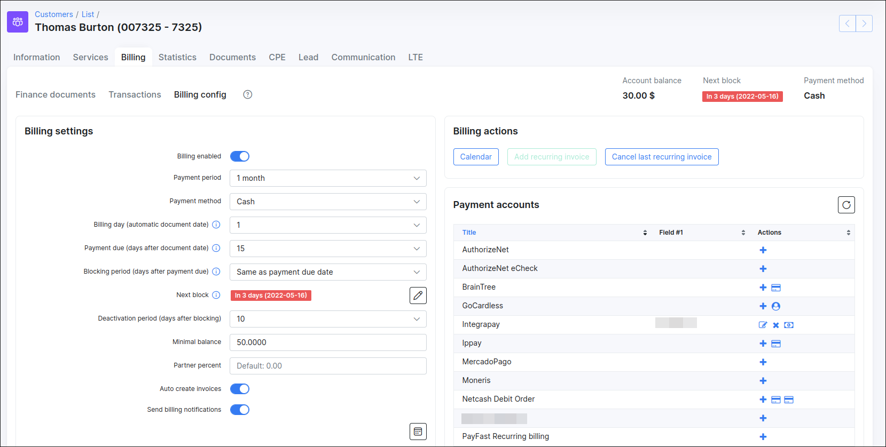
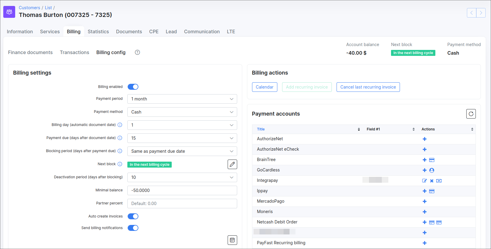
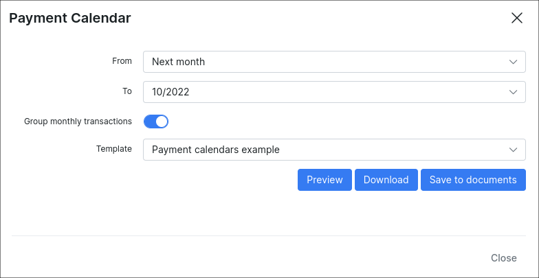
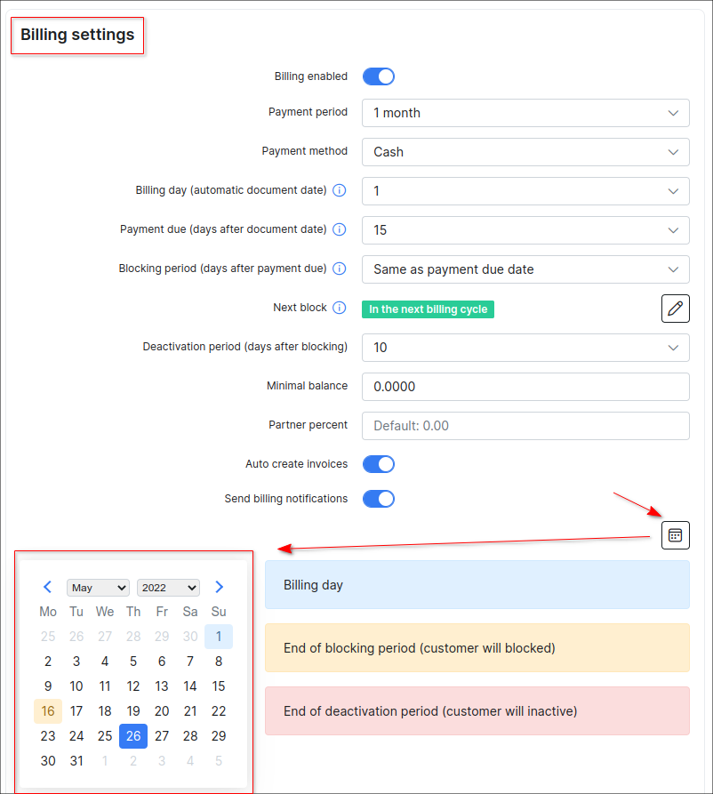
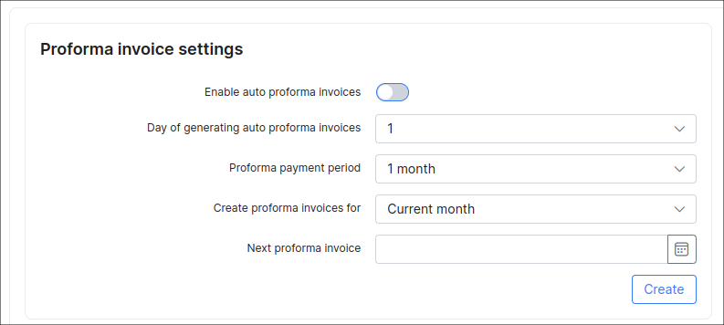

Customer billing
==========

This is your centralized finance department for each customer. Here you can customize your customer's billing to suit agreements and unique terms made with the respective customer, with regards to how they will be billed and interactions thereof.

The customer *Billing* tab is divided into 5 sub-tabs:

* **Billing Overview** - the main information configuration page of your customer billing;
* **Transactions** - all transactions pertaining to the customer can be found here;
* **Invoices** - all invoices generated for the customer can be found here;
* **Payments** - all payments made by or on behalf of the customer;
* **Proforma Invoices** - a list of all proforma invoices is kept for future reference.

## Billing Overview

*Billing Overview* tab displays 5 main sections:

* Billing Settings
* Proforma Invoice Settings
* Payment Accounts
* Billing Address
* Reminders Settings

**Billing Settings**

In this section you can set up the billing of the **selected customer**.

(The global settings for **all customers** are located in `Config → Finance → Settings`).

**Billing settings description:**

* **Billing Enabled** - enables or disables billing for customer (whether the system should take customer into account or not);
* **Period** - the period the customer will be billed for;
* **Payment method** - means in which way client will make payments; credit card, cash, etc.;
* **Billing day** - when the customer will be charged and invoices will be generated;
* **Billing due** - when the customer needs to make payments before being blocked. Even though the customer will have a blocked status, their services will still be accounted;
* **Next block** - the indicator for customer's profile with recurring billing type that shows the date when customer will be blocked. The displayed date can be edited, it implies that the date of the last charge (from which the billing due is calculated) will be changed. If the parameter `Enable processing of Billing Due` in `Config → Finance → Automation` is disabled, the status will be shown as `Disabled in config`. The status `Already blocked` means that customer has been blocked, the status `In the next billing cycle` means that the customer's balance exceeds the minimum required value;
* **Deactivation period (Grace period)** - when the customer's services will be marked as inactive, client no longer uses services and the system no longer accounts for it;
* **Minimal balance** - defines the minimum amount of funds that must be available in the customer account balance at any time, even after the service charge, in order to avoid blocking. The default value is `0`. This value can be changed to another according to your needs. The negative value (e.g. `-50`) is allowed to use as well;

<b>Example</b>

A **minimum balance** is the minimum amount of money that customer has to keep on their balance, maintaining a minimum balance will allow customer to avoid being blocked on the next day after Billing due. It means a customer balance cannot drop below the specified amount at any time during billing cycle.

For instance, a customer uses some Internet service (e.g. its price is R100) and has the next settings on Billing overview tab:
- Billing day = 1;
- Billing due = 15;

The recurring invoice will be auto generated on the 1st day of next month. And imagine that customer will pay R100 for the invoice on the same day.

If we have `0` (zero) value as a minimum balance requirement, a customer won't be blocked, because their balance will be equal to the set value.
If customer balance becomes negative, customer will be blocked on the 16th day of the month.

If we have `50` value as a minimum balance requirement, a customer need to pay R150 for the invoice to keep R50 on the balance to avoid blocking. If a customer has less than 50 on the balance, they will be blocked.

If we have `-50` value as a minimum balance requirement, a customer can pay only R50 for the invoice, because it's allowed to have a negative balance, but no less (`-60`, `-70` etc.) than`-50`. Pay attention, if a customer pays R60, the account balance will be `-40` that is acceptable value. Even if a customer pays the full price for the invoice, the account balance will be equal to `0` and, as a result, a zero value will be greater than allowed minimal balance.

* **Partner percent** - shows the individual partner percent value the customer belongs to. The global `Partner's commission (%)` setting is located in `Config → System → Company Information`;
* **Create invoices** (after Charge & Invoice) - creates an invoice automatically after using the charge & invoice button <icon class="image-icon"></icon>
* **Auto pay invoices from account balance** - enables/disables the automatic paying of service from the customer's account balance, the payment will be completed if there are enough funds on the balance;
* **Send finance notifications** - the toggle allows individually to enable/disable finance notifications for customer, the global configuration is located in `Config → Finance → Notifications`.

## Payment Accounts

The accounts of customer which are used to make payments in the Splynx system.

 

 You can edit the available accounts to add customers accounts details with the `+` icon.

 

## Billing address

Billing address can be configured here if it is different to the address on the **Main information** tab of the customer. By default, it is left empty and the address is taken from the **Main information** tab of the customer.

Specific billing address can be set here if the customer uses a different address for billing from the listed one in the *Main Information* page.

## Billing actions

 The actions section provide a quick access toolbox when dealing with customer billing.

**Charge & Invoice**

<icon class="image-icon"></icon>

Customers can be charged **manually** with the `Charge & Invoice` button. 
Simply click on the button, a *Charge and Invoice* window will appear where you can select the date and period of charging, then click on `Preview` to view service (-s) description and click on `Charge & Invoice` button to manually charge the customer.

The system will automatically charge the customer and the new transaction and invoice items will be created, they can be viewed in the *Transactions/Invoices* tab.

**NOTE:** if you are charging a customer **manually**, the new invoice will be created only if the `Create invoices (after Charge & Invoice)` setting is enabled in customer's `Billing → Billing config → Billing settings`. The global `Create invoices (after Charge & Invoice)` setting is located in `Config → Finance → Settings` (*Invoices settings* section).

During the process of adding a service to a customer, the **discount can be adjusted**. Navigate to customer services tab and select the desired service to apply the discount to, click on `Edit` icon <icon class="image-icon"></icon>. The edit service window will appear where you can apply the discount according to the parameters highlighted and you may add a note for reference in discount message. Once the discount has been set, it will appear in the new window when the button <icon class="image-icon"></icon> is pressed and the final price will be calculated automatically.

**Payment Calendar**

<icon class="image-icon"></icon>

You can generate a payment calendar for the customer with the use of templates.

By default payment calendar generating is disabled. To enable it you need to activate the `Payment Calendar` option in `Config -> Finance -> Settings`.

**Cancel last recurring invoice**

<icon class="image-icon"></icon>

This button can be used to cancel the previous bill of a customer. This feature ensures that charges are cleared appropriately in the system by deleting the invoice and transaction pertaining to the charge.

**Save**

<icon class="image-icon"></icon>

Save any change made in the customer billing tab.

In **Proforma Invoice settings** it is possible to enable the option `Enable Auto Proforma Invoice` creation for the current or next month as well as being able to choose a prepay payment period (up to 12 months).

In **Reminders settings** you can enable automatic sending of reminders to customers to remind them to pay for their services.

**NOTE:** Such settings as **Payment for Reminder #3**, **Amount of Payment Reminder** and **Comment on Payment Reminder** are deprecated, please do not use them in the *Reminders* section configuration.

## Transactions

Transactions are divided into 2 sections, namely, **Debit transactions** and **Credit transactions**

**Debit transactions** - transaction added to customers account with amounts to be paid. (decreases customers account balance) 
**Credit transactions** - transaction added to customers account after making payments. (increases customers account balance) 

All transactions can be edited or deleted.

The option to print, copy or save customer's transactions list, in either CSV, Excel or PDF files can be found at the bottom of the table.

We can also customize the transactions table by enabling/disabling fields or drag&drop fields in a preferred method of displaying.

More information about the transaction properties can be found in the [Transactions](finance/transactions/transactions.md) guide.

## Invoices

All invoices generated for the selected customer are shown in the invoices table. It displays the invoice number, date of issuing, payment date and status of payment.
Just as with transactions the option to print out, copy or save customer's invoices in CSV, Excel or PDF files and sort columns by drag & drop fields.

The invoices list comes well equipped with tools found in the operations column. With these tools invoices can be paid and marked as unpaid, edited (if not paid), viewed as PDF's, sent to the customer or deleted. Payments of paid invoices can be deleted here as well.

The functions of each button in operations can be found by simply hovering over the icons.

The detailed descriptions and the explanation of invoicing can be found here -  [Invoices](finance/invoices/invoices.md)

## Payments

The Payments table contains all payments related to the selected customer, providing a table that displays the date of payments, payment types, amounts, invoice numbers and comments on the payments. Just as with transactions and invoices the option to print, copy or save customer's payments in CSV, Excel or PDF files and sort columns by drag & drop fields.

More information about Payments can be found here -  [Payments](finance/payments/payments.md)

## Proforma invoices

The table of all Proforma invoices related to the customer can be viewed here, displaying proforma invoice numbers, date of invoices, total amounts, payment dates and statuses (if it's paid or unpaid).
The option to print out, copy or save customer's proforma invoices in CSV, Excel or PDF files and sort columns by drag & drop fields.

Detailed information about Proforma invoices and the creation thereof can be found here - [Proforma invoices](finance/proforma_invoices/proforma_invoices.md)

**Totals** for the transactions, invoices, proforma invoices and payments tabs can be found at the bottom of each section. Providing totals for relevant fields of the table within the tab.

Transactions tab total table:

