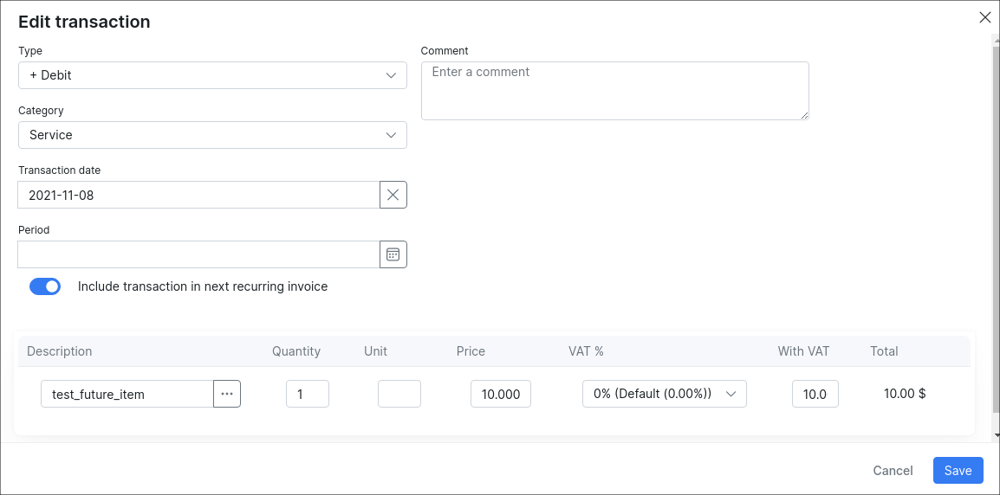
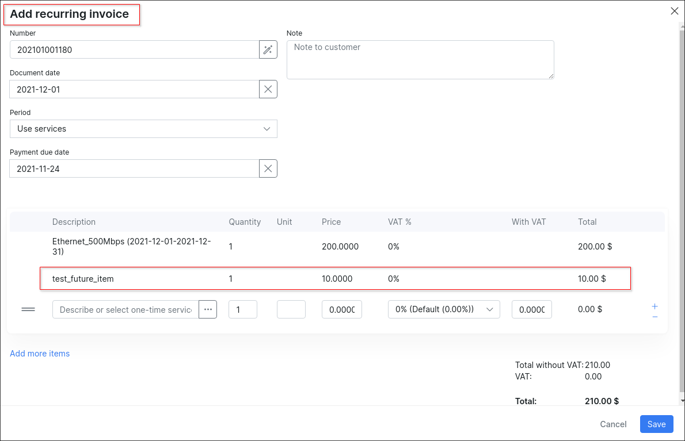
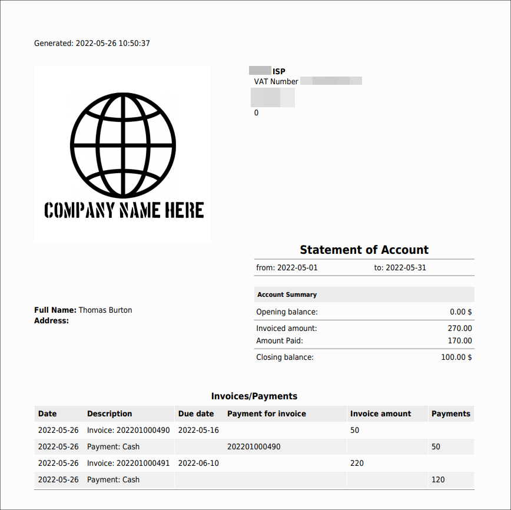
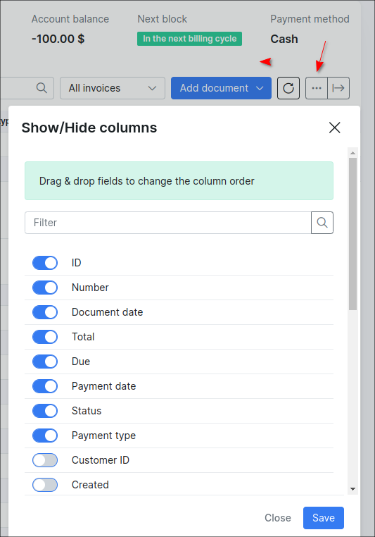
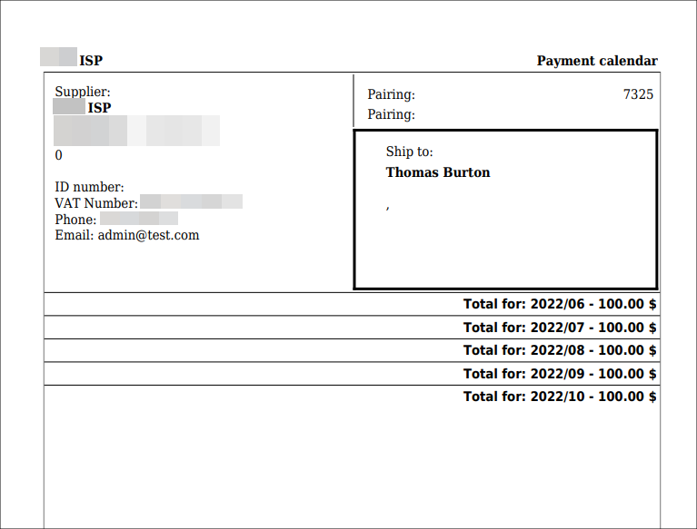

Customer billing
==========

This is your centralized finance department for each customer. Here you can customize your customer's billing to suit agreements and unique terms made with the respective customer, with regards to how they will be billed and interactions thereof.

The customer **Billing** tab is divided into 3 sub-tabs:

* **Finance documents** - here you can create any type of financial documents for the customer and you can also check the list of all existing ones;
* **Transactions** - all operations related to the customer can be found here;
* **Billing config** - the billing configuration page for the specific customer in Splynx.

## Finance documents

In this section can be found all financial documents related to the particular customer in Splynx or can be added the new ones:

- **One-time invoice**;
- **Recurring invoice**;
- **Proforma invoice**;
- **Payment**;
- **Credit note**;
- **Future items**;
- **Statement**

**NOTE:** The statements will not be shown in the table. But when the statement is added (generated), the options to send it to the customer's email, save to the customer's [documents](customer_management/customer_documents/customer_documents.md) or download it as a PDF file are available. More information can be found below.

**One-time invoice**

The *invoice* is a financial document which indicates the supply of goods or services between a vendor and a customer.

The *One-time* invoice is designed for the customer who pays a one-time cost to obtain the product or service. If they need it again, when they choose, they’ll pay again. Usually, you can **create the one-time invoice** if you want to charge customer for [One-Time Plan](configuring_tariff_plans/one_time_plans/one_time_plans.md):

1. Click on the <icon class="image-icon"></icon> button and in the drop-down list select `One-time invoice` item.

2. In the new window, click on the <icon class="image-icon"></icon> (breadcrumbs) icon and in the drop-down list choose the existing *One-Time Plan*, it will be automatically added to the one-time invoice with all details (e.g. price, VAT, description etc.).

In order to add the additional item (-s) to the one-time/recurring invoice, press `+` sign or use the option `Add more items`, after that specify its date, price, quantity, description etc.

The option `Load items from uncharged transactions` is used to add to the current invoice (*One-time* or *Recurring*) the future item (a `+Debit` transaction) that was created with the option `Include transaction in next recurring invoice` and such transaction has not yet been included to any charge.

3. Press **Save** button to create the invoice.

**NOTE:** The items with negative price value can be added to any type of invoice, but the invoice total price cannot be with the negative amount, it can only be equal to `0` or  greater than `0`.

**Recurring invoice**

The *Recurring* invoice is when the items or services are supplied to a customer on a regular basis and the automatic charge is applied. If there’s no change in services your customers regularly need, the usage of the recurring invoicing is more preferable.

The detailed descriptions of *Invoices* can be found here - [Invoices](finance/invoices/invoices.md).

**Proforma invoice**

A *Proforma* invoice is a non-official estimated invoice in advance that is given to a customer before products or services are supplied. It looks almost identical to one-time/recurring invoice, however it doesn't care the same weight because it's provisional. In other words it's a 'good faith' agreement between the vendor and the customer, used to avoid unexpected charges down the line.

The detailed information about *Proforma* invoices can be found here - [Proforma invoices](finance/proforma_invoices/proforma_invoices.md).

**Payment**

The *Payment* is a record that indicates an amount of money that has been paid. The Splynx can authorize the [payment methods](configuration/finance/payment_methods/payment_methods.md) to be made using bank transfer, credit card, cash etc.
To show all payments that customer has made, select `Payment` type and the list of items will be shown:

Usually the payment is related to specific invoice however it can be added manually as standalone in Splynx, in this case the credit note (`-Credit` transaction) will be created.

More information about *Payments* can be found here - [Payments](finance/payments/payments.md)

**Credit note**

The *Credit Notes* help to simplify the invoicing processes, it is useful for adjusting errors in created invoices. It allows you to lawfully amend an invoice, without having to delete or alter it.
In other words, the *Credit Note* - a `-Credit` transaction added to customers account after making payments (increases customers account balance).
For example, you sent to customer the invoice which contains an error and the invoice has been paid, as a result you need to re-bill the customer for the billing period. Since you can’t change an invoice’s total amount, you need to apply credit note to correct the balance.
The experience with creating a new invoice with the negative price in order to refund a money to customer is now a thing of the past.
The *Credit notes* provide accurate and complete records keeping of the transactions that occur after an invoice has been created.

The detailed description and the explanation of the credit notes management can be found in the [Credit Notes](finance/credit_notes/credit_notes.md) guide.

**Future items**

The *Future item*  - a `+Debit` transaction with the option `Include transaction in next recurring invoice`, it can be added to customers account with amounts to be paid (decreases customers account balance).

The option `Include transaction in next recurring invoice` defines if the current future item will be included to the next *Recurring* (or *One-time* invoice if the option `Load items from uncharged transactions` was used) invoice.

As a result, the uncharged future item can be loaded to the new *One-time* or *Recurring* invoice during its creation. If the future item has already been loaded into an invoice, it loses its functions and becomes a transaction in the created invoice.

To add a *Future item*:

1. Click on the <icon class="image-icon"></icon> button and in the drop-down list select `Future item`.

2. In the new window, specify the item (-s) details such as period, category, comment, item description, its price etc.

3. Press **Save** button to create the future item.

The future item will be added automatically to recurring invoice when we are going to create it:

More information about the transactions can be found in the [Transactions](finance/transactions/transactions.md) guide.

**Statement**

The *Statement* (an account statement) - is a document that summarizes and lists all the Invoice/Payments or Transactions records within a specific time period. Such report can be sent to the customer on the email, saved to their [documents](customer_management/customer_documents/customer_documents.md) or exported to the separate PDF file.

To add the *Statement*:

1. Click on the <icon class="image-icon"></icon> button and in the drop-down list select `Statement` item;

2. In the new window, specify the period (this/last month, custom range etc.), select what types of records should be included (`Invoice/Payments` or `Transactions`) and press *View* button.

3. Choose one of the next options: *Send to customer*, *Save to document* or *Download as PDF*.

You might also be interested in the [Statements report](administration/reports/statements/statements.md) tutorial.

------------

The icon <icon class="image-icon"></icon> is designed to print, copy or save customer's finance documents as Excel, CSV, PDF file, it can be found at the top right corner of the table.

------------

The **Total invoiced** and **Total paid** tables show the statistic of all finance documents in relation to the particular customer. These tables can be found at the bottom of finance documents section page. The **Total paid** table may differ depending on what payment methods are set up in the system.

------------

We can also customize each of the table related to all types of finance documents, all/one-time/recurring/proforma invoices, payments, credit notes or future items by enabling/disabling fields or drag&drop fields in a preferred method of displaying.

------------

## Billing config

Billing config displays 6 main sections:

* Billing Settings
* Billing actions
* Proforma Invoice Settings
* Payment Accounts
* Billing Address
* Reminders Settings

## Billing Settings:

In this section you can set up the billing of the **selected customer**.

(The global settings for **all customers** are located in `Config → Finance → Settings`).

**Billing settings description:**

* **Billing Enabled** - enables or disables billing for customer (whether the system should take customer into account or not);
* **Payment period** - period the customer will be billed for;
* **Payment method** - means in which way client will make payments; credit card, cash, etc.;
* **Billing day** - when the customer will be charged and invoices will be generated (default value is `1`st day of the month. The available values are from `1` to `28`);
* **Payment due (days after billing day)** - when the customer needs to make payments before being blocked. **Even though the customer will have a blocked status, their services will still be accounted** (default value is `15` days after `billing day`. The available values are from `1` to `28`). From Splynx v4.0, the current option cannot be disabled in select menu, that solved the problem when the invoices with `overdue` status could be created from scratch <!-- SPL-8581 -->;
* **Blocking period (days after payment due)** - allows to extend the period when customer will be blocked (by default the value is `0`. The available values are `Do not block` and from `0` to `99` days after `Payment due`). The option `Do not block` allows to disable customer blocking, if the option is enabled, the customer deactivation won't work as well;
* **Next block** - the indicator for customer's profile with recurring billing type that shows the date when customer will be blocked. The displayed date can be edited, it implies that the date of the last charge (from which the billing due is calculated) will be changed. If the parameter `Enable processing of Billing Due` in `Config → Finance → Automation` is disabled, the status will be shown as `Disabled in config`. The status `Already blocked` means that customer has been blocked, the status `In the next billing cycle` means that the customer's balance exceeds the minimum required value;
* **Deactivation period (days after blocking) (Grace period)** - when the customer's services will be marked as inactive, client no longer uses services and the system no longer accounts for it;
* **Minimal balance** - minimal balance required in the customer account to avoid being blocked;
* **Partner percent** - shows the individual partner percent value the customer belongs to. The global `Partner's commission (%)` setting is located in `Config → System → Company Information`;
* **Auto create invoices** (after Charge & Invoice) - creates an invoice automatically after using the charge & invoice button <icon class="image-icon"></icon>
* **Send billing notifications** - toggle allows individually to enable/disable finance notifications for customer, the global configuration is located in `Config → Finance → Notifications`.

## Payment Accounts

 The accounts of customer which are used to make payments in the Splynx system.

 

 You can edit the available accounts to add customers accounts details with the "**+**" icon.

 

## Billing address

Billing address can be configured here if it is different to the address on the **Main information** tab of the customer. By default, it is left empty and the address is taken from the **Main information** tab of the customer.

Specific billing address can be set here if the customer uses a different address for billing from the listed one in the *Main Information* page.

## Billing actions

 The actions section provide a quick access toolbox when dealing with customer billing.

**Charge & Invoice**

<icon class="image-icon"></icon>

Customers can be charged **manually** with the `Charge & Invoice` button. 
Simply click on the button, a *Charge and Invoice* window will appear where you can select the date and period of charging, then click on `Preview` to view service (-s) description and click on `Charge & Invoice` button to manually charge the customer.

The system will automatically charge the customer and the new transaction and invoice items will be created, they can be viewed in the Transactions/Invoices tab.

**NOTE:** if you are charging a customer **manually**, the new invoice will be created only if the `Auto create invoices` setting is enabled in customer's `Billing → Billing config → Billing settings`. The global `Auto create invoices` setting is located in `Config → Finance → Settings` (*Invoices settings* section).

If the transaction with `Include transaction in next recurring invoice` option is created, it will be added to the subsequent invoice (*One-time* or *Recurring*). For example, you create manual transaction with `Include transaction in next recurring invoice` option, after that apply `Charge & Invoice`, the service and manual related transactions are visible in the preview:

When we apply `Cancel last charge` option, only service transaction will be removed with the invoice. The manual transaction can be deleted manually in `Billing → Transactions` tab.

During the process of adding a service to a customer, the discount can be adjusted. Navigate to customer services tab and select the desired service to apply the discount to, click on `Edit` icon <icon class="image-icon"></icon>. The edit service window will appear where you can apply the discount according to the parameters highlighted and you may add a note for reference in discount message. Once the discount has been set, it will appear in the new window when the button <icon class="image-icon"></icon> is pressed and the final price will be calculated automatically.

In case the previous invoice was canceled and the administrator doesn't want to change e.g. the invoice number, the option `Use the last canceled invoice` can be applied during the next manual charge.

**Payment Calendar**

<icon class="image-icon"></icon>

 You can generate a payment calendar for the customer with the use of templates.

By default payment calendar generating is disabled. To enable it you need to activate the `Payment Calendar` option in `Config -> Finance -> Settings`.

**Cancel last recurring invoice**

<icon class="image-icon"></icon>

This button can be used to cancel the previous bill of a customer. This feature ensures that charges are cleared appropriately in the system by deleting the invoice and transaction pertaining to the charge.

**Save** (the button at the bottom of the page)

<icon class="image-icon"></icon>

Save any change made in the customer billing tab.

In **Proforma Invoice settings** it is possible to enable the option `Enable Auto Proforma Invoice` creation for the current or next month as well as being able to choose a prepay payment period (up to 12 months).

In **Reminders settings** you can enable automatic sending of reminders to customers to remind them to pay for their services.

