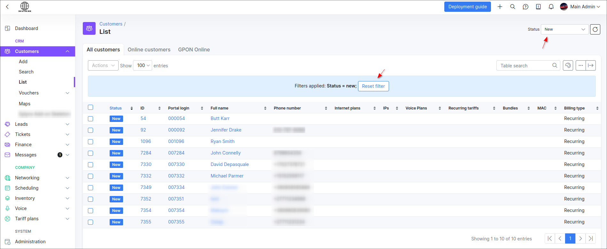

Dashboard
=========

Dashboard is the main control panel in Splynx which will help you check financial and customer statistics on a daily basis. From the dashboard, you can also monitor system performance and immediately get information about your network devices health and the state of other modules.

At the top of the live dashboard you can find the blocks with the number of **online customers**, the number of **new customers**, **new and open tickets** as well as the number of **devices down** in your network, in blocks with summarized information or if you are looking for more detailed lists of the data presented in the blocks, take a look on browse buttons in blocks, it helps to quickly jump to the full list of necessary information.

**Live dashboard** is divided into 6 main parts:

**System status** <icon class="image-icon"></icon> - displaying information on free memory, last DB backup, last remote backup, etc.

**Customers** <icon class="image-icon"></icon> - representing statistics about new, active, online, online today, blocked customers, etc.

**Networking** <icon class="image-icon"></icon> - a brief count of the number of routers, IPv4 networks, Monitoring, public and private addresses etc.

**Finance** <icon class="image-icon"></icon> - a convenient table with the statistics of unpaid/ paid, debit transactions and payments for the current and last months.

**CRM** <icon class="image-icon"></icon> - a count of all leads, quotes and deals in the system.

**Tickets** <icon class="image-icon"></icon> - a quick list of tickets grouped by the status thereof.

The navigation menu bar is located on the left side of the page, with the following modules:

- [Tariff Plans](configuring_tariff_plans/configuring_tariff_plans.md) - the list of all your services and products in the system;

- [CRM](crm/crm.md) - the new customers management platform;

- [Customers](customer_management/customer_management.md) - the customisable list of all clients in the system;

- [Tickets](tickets/tickets.md) - the ticketing system and the place of support communication;

- [Finance](finance/finance.md) - all aspects related to your finace

- [Inventory](inventory/inventory.md) - the physical devices and the equipment are managed here;

- [Networking](networking/networking.md) - the networking management platform;

- [Messages](support_messages/support_messages.md) - the support communication system for all your customers;

- [Scheduling](scheduling/scheduling.md) - the *To Do* list for your technical staff;

- [Voice](voice/voice.md) - the voice rates and CDR processing management;

- [Administration](administration/administration.md) - the administrative page of your Splynx server;

- [Config](configuration/configuration.md) - the place where all settings for each module are located;

- [My Profile](my_profile/my_profile.md) - the profile page of the administrator currently logged into the system;

- `Logout` - the option to logout from the system

**Enjoy your work with Splynx!**
