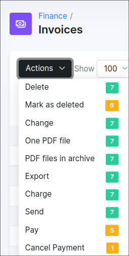
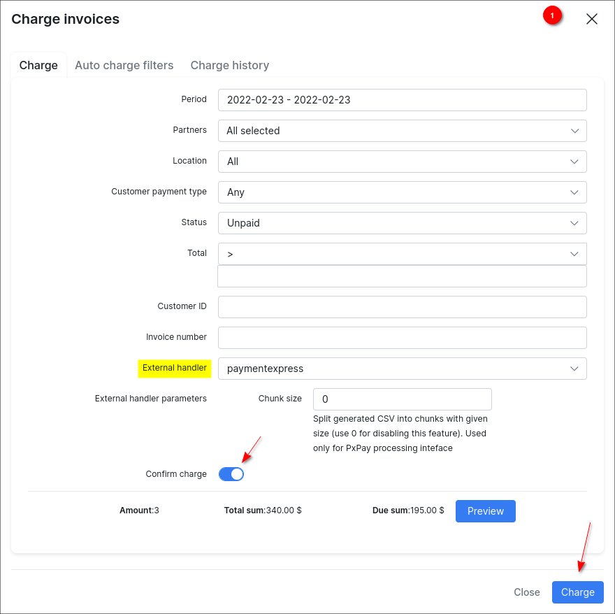
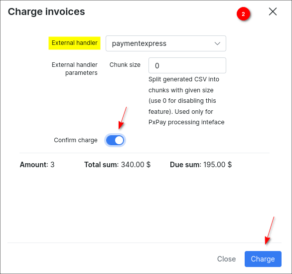
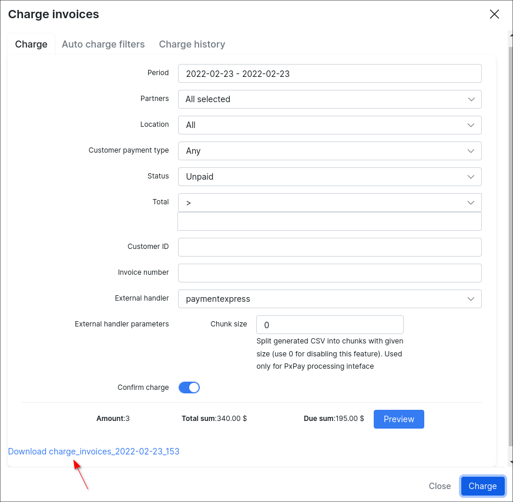
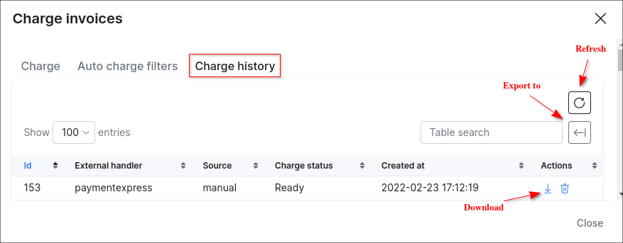
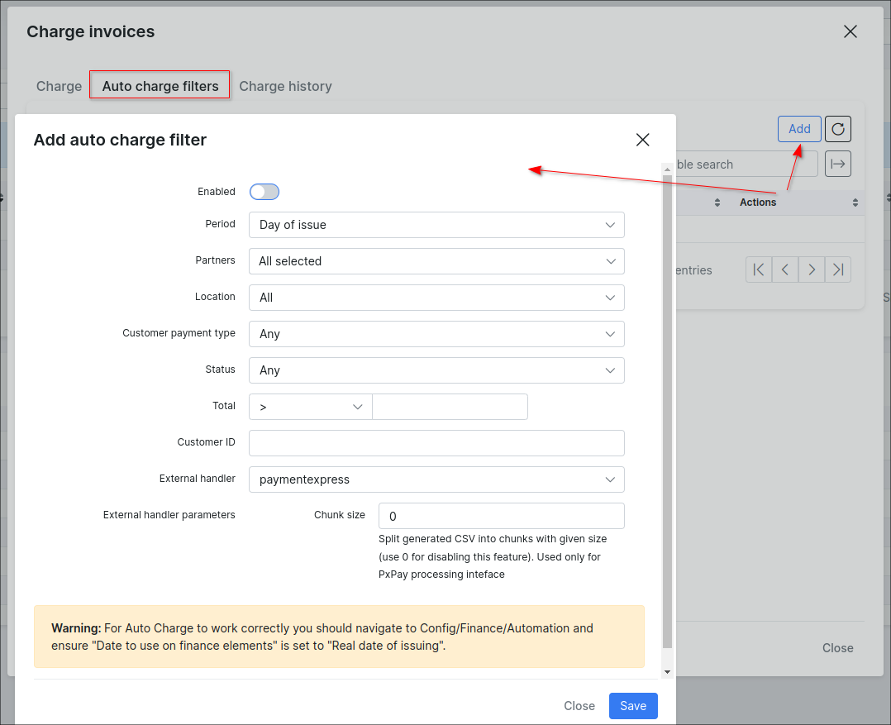
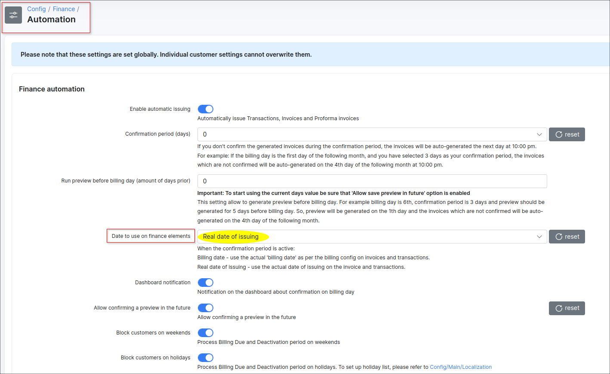
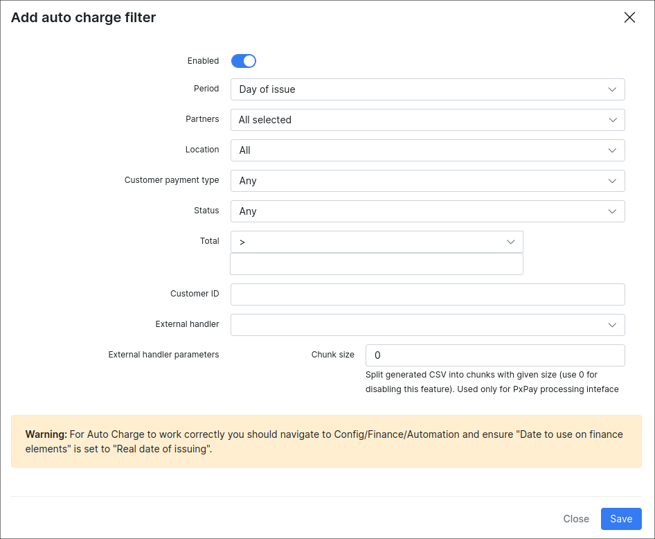
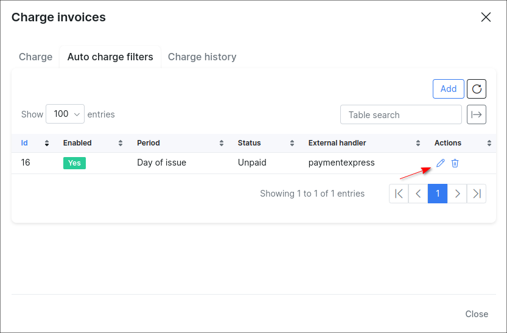
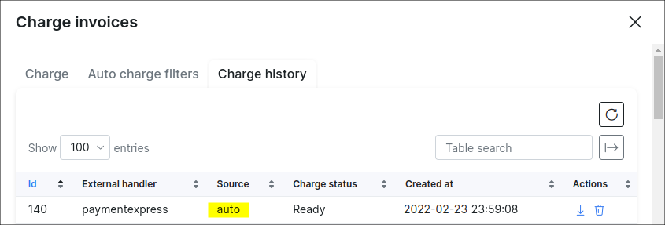

Invoices
==========

An invoice is a commercial document that specifies a transaction between a buyer and a seller.
If goods or services were purchased on credit, the invoice usually specifies the terms of the deal,
and provides information on the available methods of payment.
An invoice is also known as a bill or sales invoice.

Splynx provides the ability to work with or without invoices.
Without issuing invoices, Splynx just receives payments and charges customers each invoice period without creating an official document. When invoicing is required, Splynx is able to generate invoices automatically or an administrator can issue invoices manually.

Invoices can be created conjointly or separately. Invoices in PDF format are fully customizable with templates.
All documents generated by Splynx can be exported in different formats for printing or sending to the end-users.

---

* **All issued Invoices** can be found in `Finance → Invoices`. With the use of a filter, it is possible to display invoices by **Period** of time, **Partner** or **Status** (*Any, Paid, Unpaid, Deleted*). Beneath the list/table of invoices you'll find a totals table that displays a total of all invoices by their status, the number of invoices in each status and the total amount of money paid and unpaid in each status of invoices.

Let's consider the invoice statuses in details:

| Status  | Description |
| ------------ | ------------ |
| <icon class="image-icon"></icon> | the invoice has been created, but the customer has not made any payments towards the balance |
| <icon class="image-icon"></icon> | the invoice has not been paid and is not yet past due but payment is sent for processing. Once the invoice payment is processed successfully, the invoice will be updated to either a `Paid` or `Unpaid` status. If the due period has been exceeded and the amount hasn't been paid, the status will be changed to `Pending Overdue` or `Overdue` status  |
| <icon class="image-icon"></icon> | a payment has been successfully collected |
| <icon class="image-icon"></icon> <icon class="image-icon"></icon> | the invoice was paid from customer's balance, a status is applied only if customer has enough funds |
| <icon class="image-icon"></icon> | no payment was received for this invoice and the `Billing due` date has already passed |
| <icon class="image-icon"></icon> | the invoice was marked as deleted. If `Delete transactions` toggle is enabled and we apply the `Mark as delete` option for unpaid invoice, the invoice will be marked as deleted and its auto transaction (-s) will be removed, otherwise (toggle is disabled) the invoice's transaction won't be removed. The manual transaction (-s) will remain in any case. |

---

To **export** the list of invoices for accounting purposes, open `Finance → Invoices` and click on `Export` button.

In the export window, you can choose the period of time and the export type/format (PDF, CSV, external handler, etc.).

Alternatively, once you have selected the required invoices, you can export them using one of the following actions `One PDF file`, `PDF files in archive`or `Export` in the mass `Actions` drop down menu.

---
If one of the [payment add-ons](payment_systems/payment_systems.md) is configured for customers in Splynx, you can manually **charge** the invoices all at once using the `Charge` button at the top right corner of the table or you can use the same named option in the mass `Actions` drop down menu by selecting the required invoices before.

In new window specify the necessary options for invoice charge:

- **Period** - the time period when the invoices were created;

- **Partners** - the service [provider](administration/main/partners/partners.md) to which the customer is assigned to;

- **Location** - the customer [location](administration/main/locations/locations.md);

- **Customer payment type** - the [method](configuration/finance/payment_methods/payment_methods.md) that is used by customer to make payments;

- **Status** - the status of invoice, by default is used `Unpaid`;

- **Total** - the total sum of the invoice, the amount can be specified by `=`(equal to), `<`(less than) and `>` (greater than) sings;

- **Customer ID** - the customer id within the Splynx;

- **Invoice number** - the number of invoice in Splynx, usually the format `{year}{partner_id|2}{next|6}` is used by default, it can be changed in `Config → Finance → Settings`;

- **External handler** - requires one of the [payment add-ons](payment_systems/payment_systems.md) in Splynx to be installed, as a result this determines which handler we can choose here;

- **External handler parameters** - the additional parameters that can be used with a specific handler. These may vary depending on the selected handler. For example with `paymentexpress` handler we can set `chunk size` parameter in order to split generated CSV file (used only for *PxPay* processing interface in *Payment Express*); With `netcash_do` handler we can set `action date` parameter to specify the date of affected transaction (-s), etc. ;

- **Confirm charge** - the toggle allows to confirm the charge;

- **Preview** - the button helps to check the invoices information before performing the charge.

Once charged successfully, bank statements and batch files will be created and sent to payment add-on side and the charged invoices will change to a *Pending* state. It takes some time to receive the payments or bounced payments.

To download the charge result files click on the link under the `Preview` button or click on the <icon class="image-icon"></icon> icon in *Charge history* tab.

Splynx checks for any payments and allocates them to the correct invoice, as a result the invoices will become *paid* or *unpaid*. You can check the status of the bank statements for the charge invoices in `Finance → Bank Statements → History`

---

The invoice charging process can be automated using the **Auto charge filter**. Open `Finance → Invoices`, click on `Charge` button and select `AUTO CHARGE FILTERS` tab. Then press `Add` button.

**NOTE:**
**Auto charge filter doesn't require any confirmation from the administrator, so use it with caution.**

**To make Auto Charge work properly you should navigate to `Config → Finance → Automation` and ensure that the value in `Date to use on finance elements` field is set to `Real date of issuing`.**

<b>Explanation</b>

Why we **cannot** use `Date to use on finance elements` value that is equal to `Billing date` with Auto charge filter?

Let's imagine that we have the default settings in `Config → Finance → Automation`:

`Confirmation period (days)` = **3**;

`Date to use on finance elements` = **Billing date**;

And `Billing day` = **1** for the customers in Splynx (the option is located in  `Config → Finance → Settings`)

Consequently, the invoices will be auto-generated and will be visible for customers on the 4th day of the next month, but the date creation of such invoices is the 1st day of the month. The Auto Charge filter won't find the invoices on 1st day of the month because they are not visible to customers. When the 4th day arrives, the Auto filter will not charge the invoices because its creation date is the 1st day of the month.

In new window specify the necessary options for auto charge filter:

- **Enabled** - the toggle to enable/disable the filter;

- **Period** - date when the filter starts;
  - **Day of issue** - the same day when the invoice is created;
  - **Day after issue** - the day after the invoice is created;
  - **Day before due date** -the day before the invoice is created;
  - **On due date** - the amount of days after the billing day the customer has to make payments before getting blocked (usually it's 15th day of the month);
  - **+N days after issue** - X days after the invoice was created, the number can be specified in new field **Days after issue**;

- **Partners** - the service [provider](administration/main/partners/partners.md) to which the filter is applied to;

- **Location** - the customer [location](administration/main/locations/locations.md) to which the filter is applied to;

- **Customer payment type** - the customer's [method](configuration/finance/payment_methods/payment_methods.md) to make payments;

- **Status** - the status of the invoice to which the filter applies;

- **Total** - the total sum of the invoice to which the filter applies, the amount can be specified by `=`(equal to), `<`(less than) and `>` (greater than) sings;

- **Customer ID** - the customer id within the Splynx;

- **External handler** - requires one of the [payment add-ons](payment_systems/payment_systems.md) in Splynx to be installed, as a result this determines which handler we can choose here. **External handler parameters** can be specified as well for some add-ons;

Then, press `Save` button. To edit the created filter click on <icon class="image-icon"></icon> icon.

The filter will be triggered on the selected day in **Period** field at 11:59 PM. The result of the charge execution can be checked in *Charge history* tab, the value in *Source* column should be `auto`.

---

* In `Finance → Invoices` there are a **number of operations** that can be executed with the icons in the **Actions** column:

| Action  | Description  |
| ------------ | ------------ |
|<icon class="image-icon"></icon>  |  View an invoice |
|<icon class="image-icon"></icon>   | View an invoice as a PDF file  |
|<icon class="image-icon"></icon>   | Download an invoice as a PDF file  |
|<icon class="image-icon"></icon>   | Send an invoice via Email/SMS or as a message to Customer portal |
|<icon class="image-icon"></icon>   | Edit a payment  |
|<icon class="image-icon"></icon>   | Delete a payment or mark it as unpaid  |
|<icon class="image-icon"></icon>   | Delete an invoice with/without transaction |
|<icon class="image-icon"></icon>   |Pay an invoice|

The same operations with invoices you can find in [Customer billing](customer_management/customer_billing/customer_billing.md) too.

* To **view an invoice** with the view icon<icon class="image-icon"></icon>, it is necessary to configure an **invoice template** first in `Config → System → Templates` and also to specify the use of the selected/modified template in `Config → System → Company information`.

On the **Company information** page, we define the [partner](administration/main/partners/partners.md) and the PDF [template](configuration/system/templates/templates.md) ('Invoice PDF base' is selected as an example by default).
Once the PDF template is defined, it will be possible to view the invoice in PDF format.

---

[Finance formats](configuration/main_configuration/localization/localization.md) displayed on the invoice are customizable. Click on `Config → Main → Localization`,  to define the currency and other finance format settings.

Please note that all [templates](configuration/system/templates/templates.md) can be customized, navigate to `Config / Templates /` Choose the type of templates to display/work with and simple edit or add a new template you wish to use:

---

In `Config → Finance → Settings` can be found the **Global invoices settings** for all customers in Splynx system. In this menu, you can also define the **Invoice number format**, by default is used `{year}{partner_id|2}{next|6}`.

You might also be interested in [Finance settings](configuration/finance/finance_settings/finance_settings.md) description.

## Options description:

**Create invoices (after Charge & Invoice)** - toggle enables/disables an automatic invoice generation for specific customer when the **Charge & Invoice** was used in `Customers → View → Billing Overview`

The global option to **enable automatic issuing** is located in `Config → Finance → Automation` (see [Automation](configuration/finance/automation/automation.md)).

 When the toggle **Create Invoices (after charge & invoice)** is not enabled in customer's `Billing Overview` tab, you can create invoice manually using the **Add One-Time invoice** or **Add recurring invoice** buttons in `Billing → Invoices` tab, during the step of invoice creating you can choose the next options - **Use transactions** (enabled by default), type a description, select a date, add (optionally) note for the customer or memo for yourself and specify service details such as period, price, VAT etc.

The button **Add recurring invoice** allows the creation of invoice that will be issued on a recurring basis, separately from the global billing cycle.

---

Another way to create invoice is to use **Add Invoice from transaction** button in the [Transactions](finance/transactions/transactions.md) tab under `Billing → Transactions`.

**NOTE:** If a *transaction* was added manually using the **Add Transaction** button with the `Add to invoice` option, transaction would not be removed during the deletion of created invoice with it or using `Cancel last charge` button. Such unlinked transaction can be deleted manually.

<b>click here to see the step-by-step example</b>

So, if the invoice includes at least one manual transaction and we are going to remove this invoice, such transaction can be remove only manually. Let's check it:

**STEP 1**

Create a transaction with the `Add to invoice` option:

**STEP 2**

Add some service to customer, e.g. Internet service

**STEP 3**

In `Billing → Billing Overview` press **Charge & Invoice** button to charge the customer

**STEP 4**

Double check if the manual transaction has been added to newly created invoice

**STEP 5**

Delete the invoice completely using <icon class="image-icon"></icon> icon in `Billing → Invoices` tab. Or press `Cancel last charge` button in `Billing → Billing Overview` tab. The current invoice includes the auto (charge for service - step 3) and manual transactions (it was added manually in step 1).

The next warning message will be shown:

If the invoice includes only manual transaction (-s), e.g. invoice was created via **Add Invoice from Transactions** button, the warning message will be the next:

**STEP 6**

Check if the manual transaction is present in `Billing → Transactions`. Mind, that it can be removed manually.

Also, take into consideration the following:

- during the converting a [quote](crm/quotes/quotes.md) to the invoice in customer's profile (`CRM → Quotes` tabs) or the converting some lead account to customer one, the auto transaction will be created. If we remove the created invoice, the auto transaction will be removed as well;

- if we create the invoice manually e.g. using `Add one-time invoice` button and after that remove such invoice, the transaction will be removed automatically;

These statements and example above also apply to `delete` option in drop-down menu with mass **Actions** in `Billing → Invoices`. For more information about transactions, please navigate to the [Transactions manual](finance/transactions/transactions.md).

---

While deleting the unpaid invoice in customer's profile in `Billing → Invoices` tab, it's possible to use `Mark as delete` option instead of delete invoice completely. The option can be useful when we want to have a fuller context of the customer's billing flow.

In this case, the invoice will be marked as deleted and its auto transaction (-s) will be removed. The manual transaction (-s) related to the invoice will remain in any case. But such transaction can be deleted manually.

**NOTE:** The invoice (-s) with `Deleted` status cannot be reverted back to `Unpaid` status, only **Delete completely** option can be applied.

---

To **edit an unpaid invoice** click on the <icon class="image-icon"></icon> icon in customer's `Billing → Invoices` tab.

---

It is also possible to send invoices via email with the <icon class="image-icon"></icon> icon (if the email server is [configured](configuration/main_configuration/email_config/email_config.md)) in `Billing → Invoices`.
You can write a message body or choose a template to populate it.

You can also type a new message body and save it as a new template.

---
