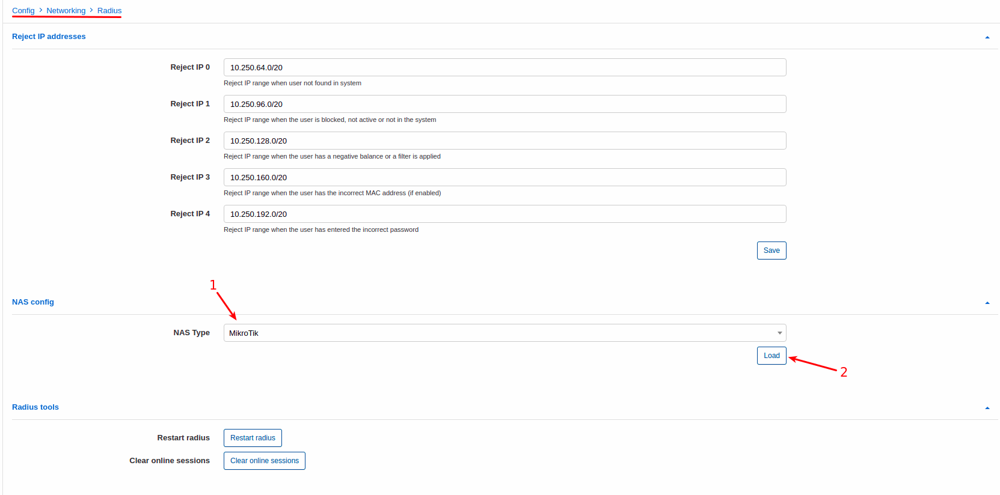
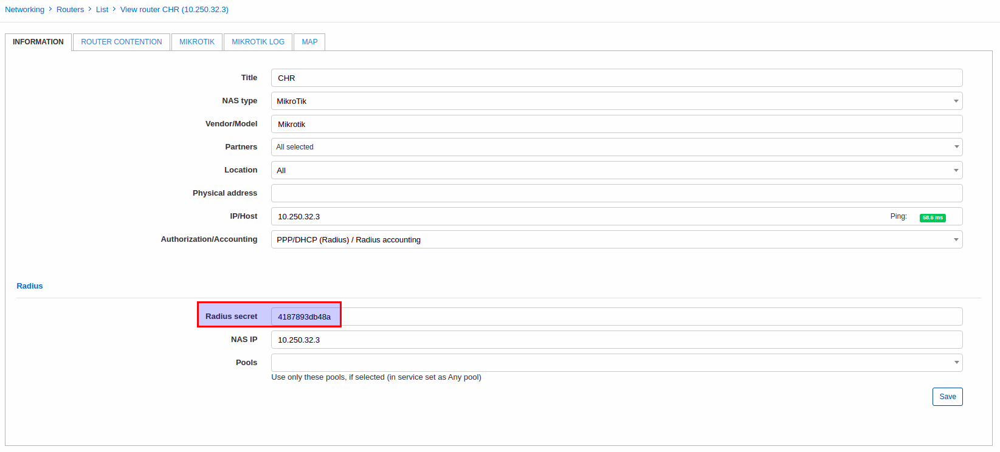
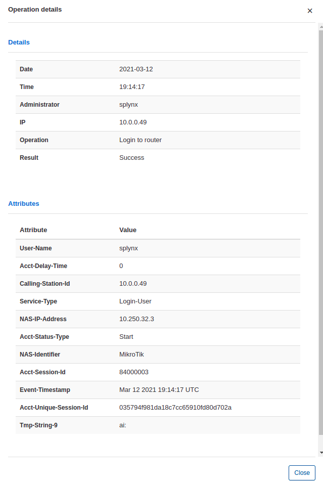

Radius admin login to Mikrotik routers
==========

Using this feature Splynx administrators can login to a Mikrotik router with their Splynx account credentials.

First of all this option should be enabled under `Config → Networking → Radius`:


select *Mikrotik* NAS type(1) and click on the Load button(2) and scroll down:



Enable this option(1) and save the configuration(2):


Once this is done open the router under `Networking/Routers/List` and save the RADIUS secret to use it on a RADIUS server configuration(on a Mikrotik router):



Open Winbox, click on `System → Users`. Click on the `AAA` button (1), enable `Use RADIUS` (2) and apply the settings (3).


Once this done let's configure the RADIUS server:


Enable service `login` (4) and any other required services.

In the `Address` field (1) specify the Splynx IP, `Secret` field (2) has to be the same as the RADIUS secret on the router in Splynx, `Src. Address` (3) - router IP.

In Splynx, under `Administration → Administrators` select the administrator and specify the level of router access:


We will setup full access to the router for the administrator with login *splynx* and save the changes.

Once this done we can open a Winbox(or any other method of login) and using credentials of the administrator *splynx*, login to the router. After successful login a current user will be displayed under `Active Users` under router's `System - Users` tab:


A sign **R** near Active User record means that this user was authenticated by RADIUS server.

You can track each router login/logout to a router using this method. To see logs navigate to `Administration → Logs → Operation` and search by action "Login to router" or "Logout from router":


to see more details click on this button:



Also this action will be logged in the `short.log` under `Administration/Logs/Files`:


Click on the actions button (2) to see more details:


### How to configure CPE admin RADIUS login when NAS device is not configured in Splynx

First of all we need to add the following details to the RADIUS configuration file in the Splynx server CLI. It's located here: `/etc/freeradius/3.0/clients.conf`:
```
client private-network-1 {
    ipaddr = 192.168.100.0
    netmask = 24
    secret = q1w2e3r4t5
    shortname = test_local_nas
    virtual_server = splynx
}
```
Where:
* `q1w2e3r4t5` - GLOBAL RADIUS secret;
* `192.168.100.0` - network address;
* `24` - network mask.

CPE configuration(command line commands):
```
/radius add address=Radius_server_IP secret=Radius_secret service=login
/user aaa set use-radius=yes
```
Where:
* `Radius_server_IP` - Splynx IP address;
* `Radius_secret` - Radius secret defined on the router in Splynx;

and lastly, enable this option under `Config/Networking/Radius extended`:


