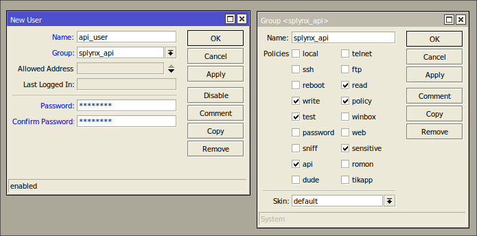
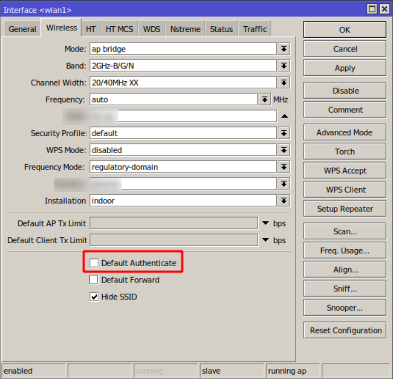
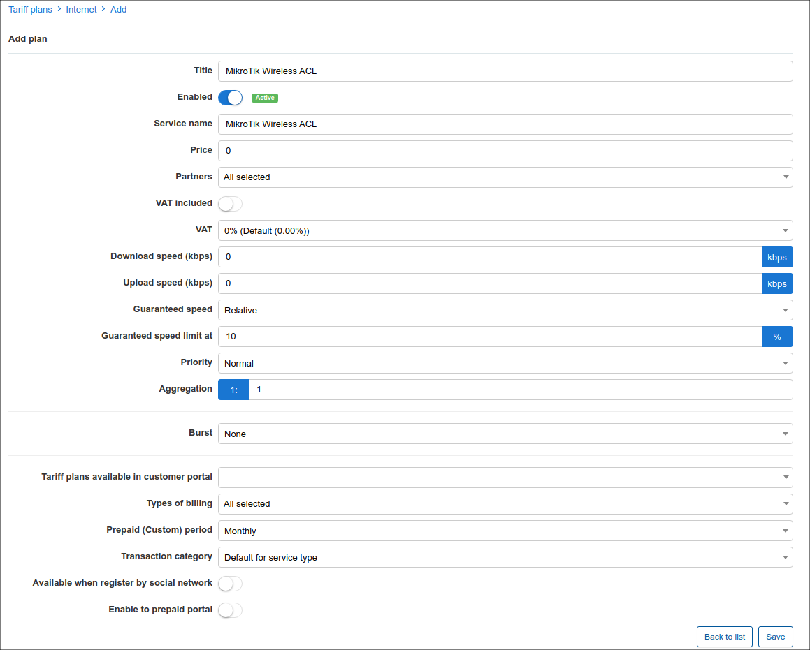
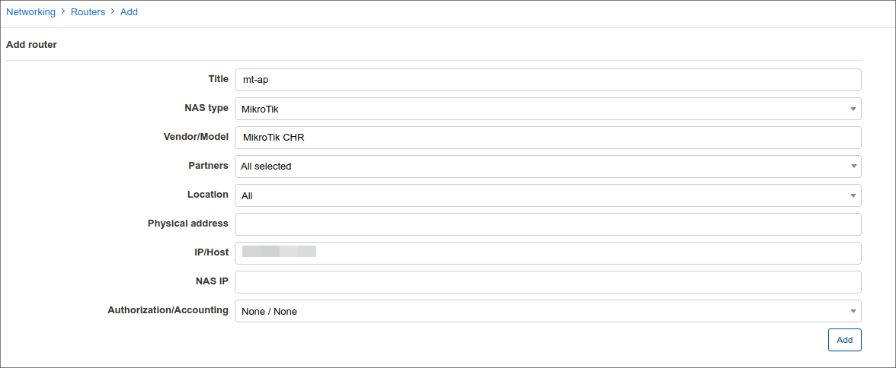
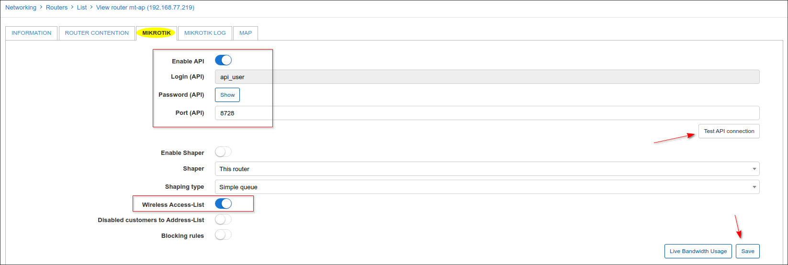
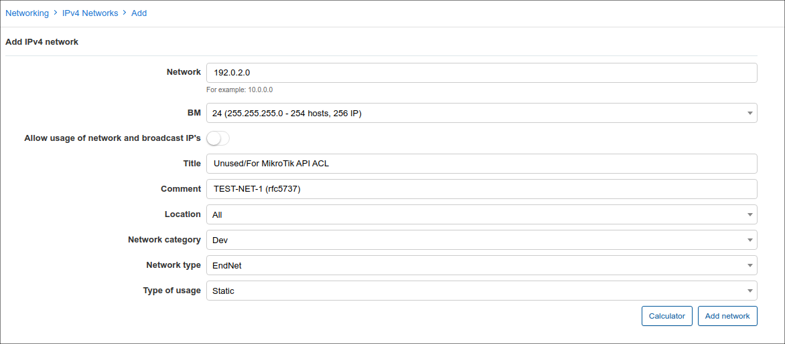
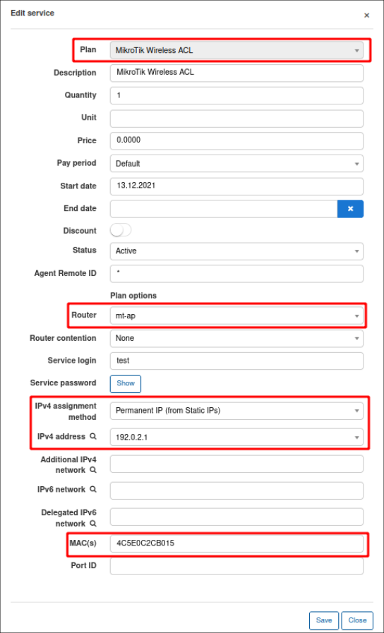
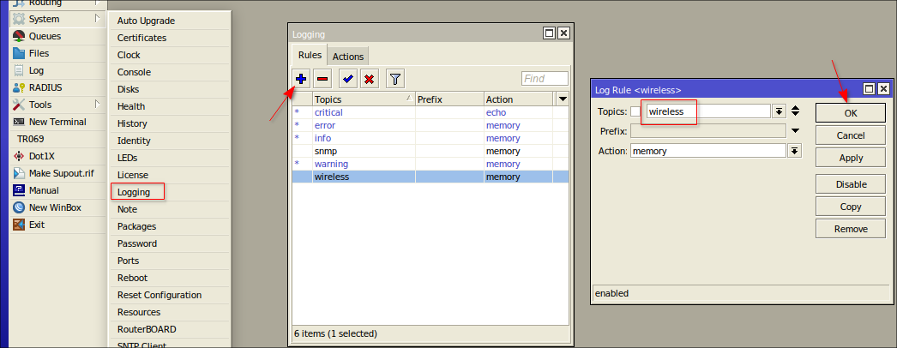
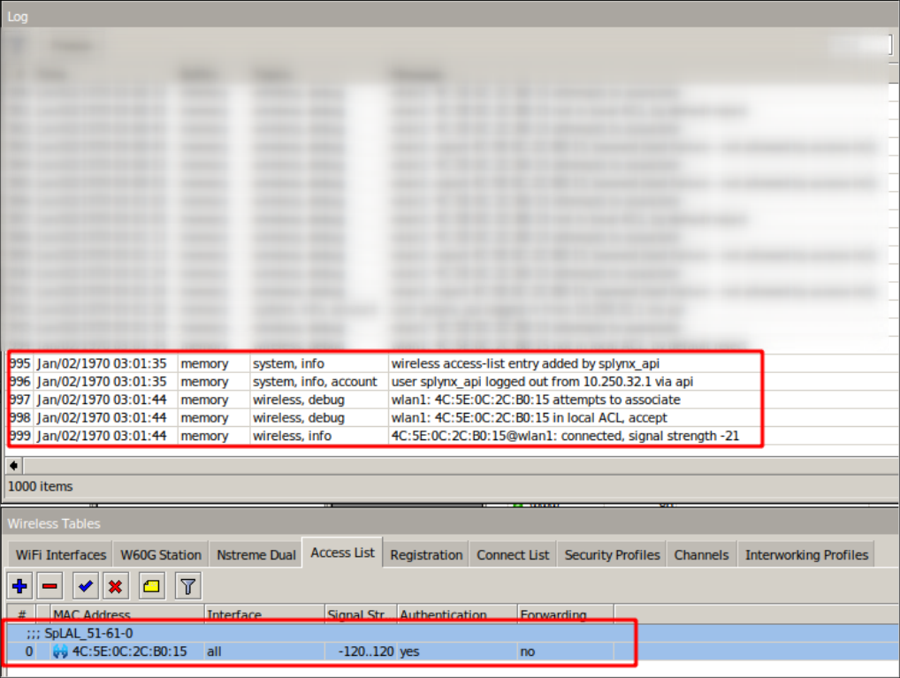

Mikrotik: Wireless ACL Authentication
==========

Splynx can authorize wireless stations on MikroTik by making changes to *Wireless Access List* in Router OS. With Wireless Access List you can set up the complex logic to work with customers: by signal strength, time of day, limit the speed of each customer, move their to a specific VLAN, etc.

On **MikroTik Wireless Access Point** device, make the following configuration steps:

1. Create a new user account and a special access group with the following permissions. After that, include the user account to the created group:

2. Disable **Default Authenticate** option in your wireless interface configuration:

Anyone can be connected to WiFi AP if *Default Authentication* option is enabled, just knowing the WiFi SSID and Password. So, we have to disable *Default Authentication* so that WiFi AP checks MAC address along with SSID and Password authentication.

Doing the above step MikroTik WiFi AP will turn into MAC address filtering WiFi AP. In MAC address filtering WiFi AP, The AP will first check whether any device which is eager to connect is allowed in Access List or not. If the device is allowed in Access List, it will be able to connect to WiFi AP otherwise it will be denied.

*Default Forward* - option allows the routing between the customers that are not in the Access List.

------------

On **Splynx** side, make the next configuration steps:

In our case, Splynx can connect each of the APs as a router over the network and add these rules via API to the Wireless ACL. Each AP can authorize the real services of the customers to access the Internet or it can be just added as a free service to block customer by the Wireless ACL.

3. Create a new Internet tariff for Mikrotik: Wireless ACL to prevent any possible issues:

4. Add your wireless access point as a separate router in Splynx

5. After the AP is added, navigate to 'MIKROTIK' tab and `enable API` with the help of toggle, then, add the user credentials from **step 1** to the related fields. Also, enable `Wireless Access-List` option. Press **Test API connection** to test the configuration.

6. **Important:** In Splynx v3.1, MikroTik Wireless ACL will be added through API only if the customer has `Permanent (Static)` IP address assigned to the related Internet service.

One possible workaround is to add an IP network address space that will not conflict with your network, e.g. you can use `192.0.2.0/24`, `198.51.100.0/24`, `203.0.113.0/24` pools that are reserved by *IANA* ([RFC5737](https://datatracker.ietf.org/doc/html/rfc5737)).

7. Add for the customer the Internet service which is based on the tariff created on the **step 3**.

**NOTE:**

**MAC(s)** = MAC address of station’s (CPE) wireless interface.

------------

To **check if the Wireless ACL Authorization works correctly**, enable `wireless` log on **MikroTik Wireless Access Point**:

 

If customer is `Active`, Splynx will add the ACL allowing their CPE to connect:

On the other hand, when the customer is `Blocked`, Splynx will remove the ACL and customer's CPE will be disconnected from AP:

