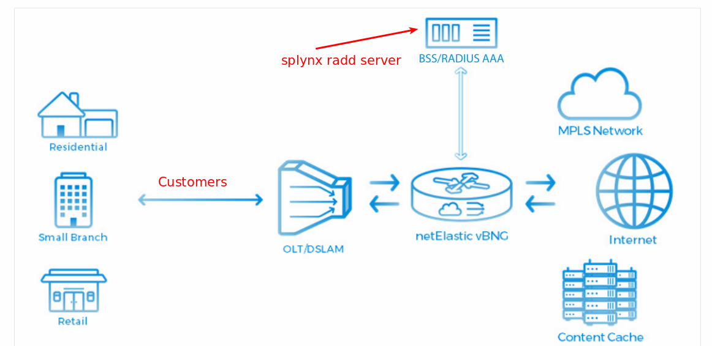
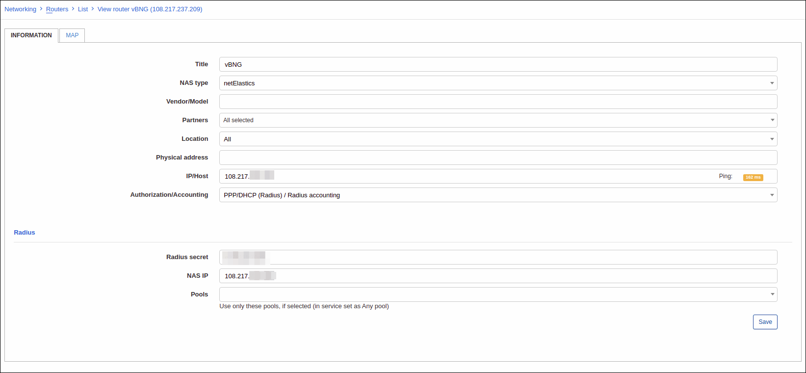
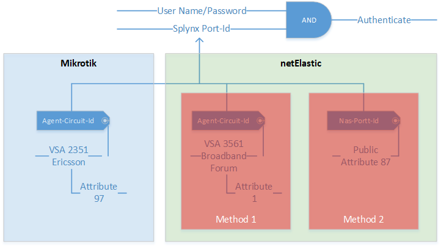
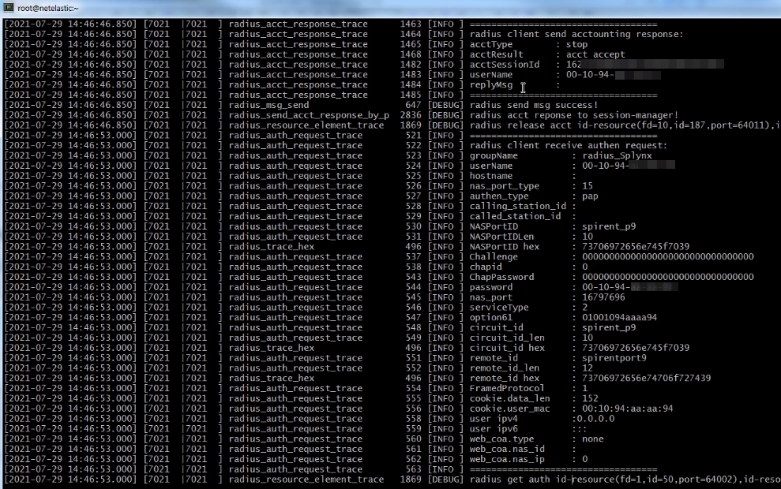
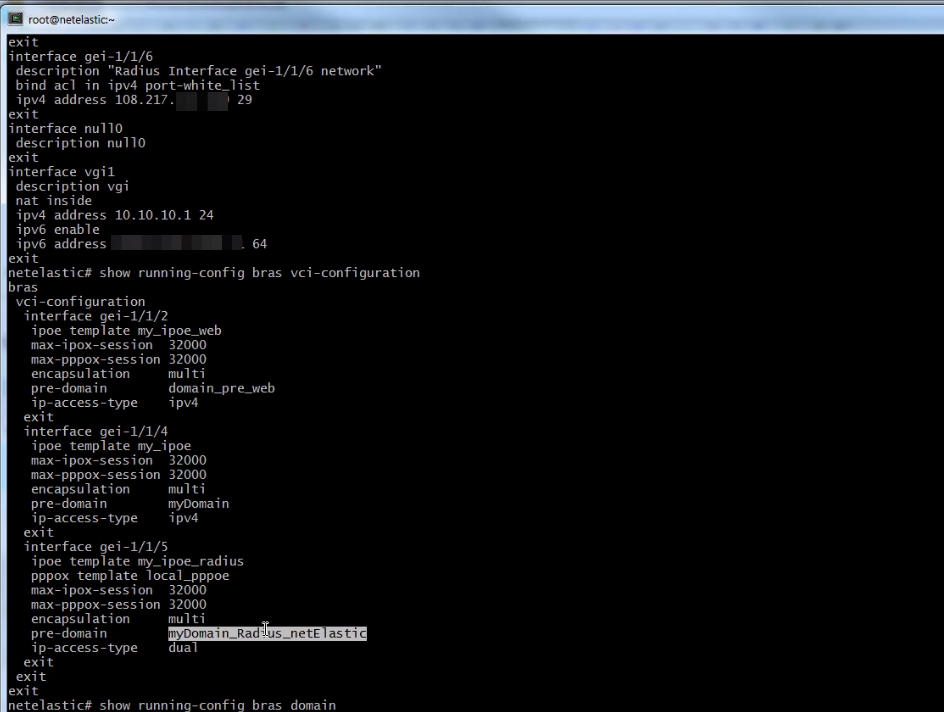
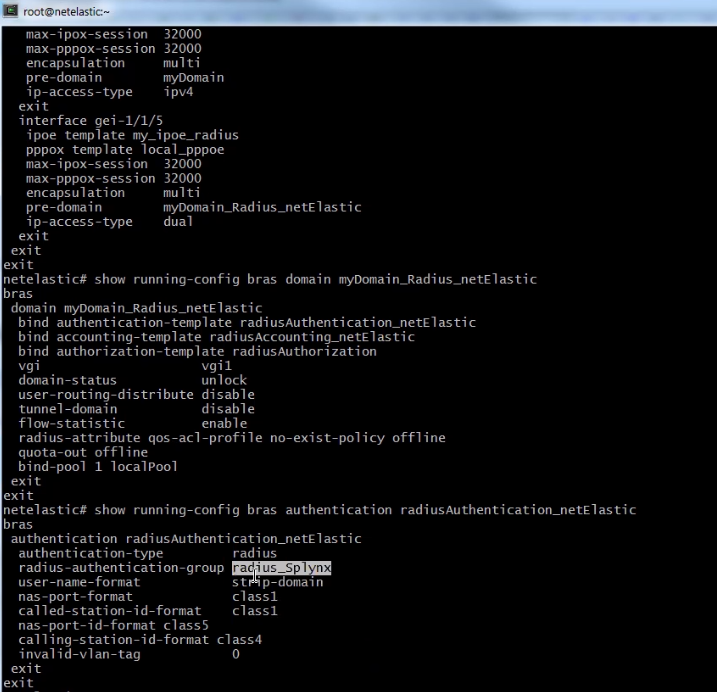
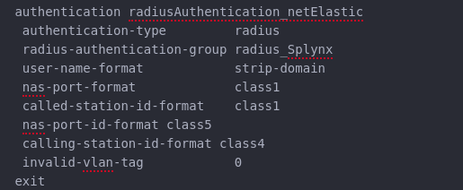
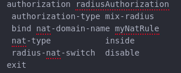
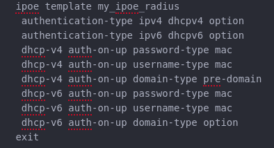

netElastic vBNG: IPoE, Radius configuration
==========
In this article will be shown the configure of virtual **Broadband Network Gateway (vBNG)** solution from [netElastic](http://www.netelastic.com/) along with its integration with Splynx ISP Framework. This solution can be used to complete AAA (Authentication, Authorization & Accounting) coverage of your customers via Splynx Radius server. Successful IPoE connections rely on the DHCP server running with vBNG to assign IP address.

Let's say that we have already installed the instances of vBNG Router, vBNG Manager and Splynx. In our demo we will create a test user with certain parameters using our Splynx and then, connect him over IPoE session to Internet through vBNG device.

To provide an IPoE connection for a customer using *vBNG (Virtual Broadband Network Gateway)*, we first need to connect such gateway to the Splynx radius server.

The process of configuring IPoE connections on the vBNG with Radius authentication, authorization and accounting involves the following steps:

1. Configuring access interface: VCI, VGI interfaces
2. Creating a domain, Authentication template, Radius Authentication group
3. Creating AAA Accounting template
4. Creating AAA Authorization template
5. Creating a IPoE template

------------

##### STEP 1 - Configuring access interface: VCI, VGI interfaces

How to install vBNG software and configure interfaces, you can find in its official .

In our example we use Splynx with IP: `139.59.xxx.yyy` and vBNG with IP: `108.217.xxx.yyy`

In Splynx, open `Config → Networking → NAS-types` and add a new NAS-type - *netElastics*:

 

After that add your vBNG to Splynx routers and get radius secret to connect it with Splynx.

 

vBNG software has the two methods to send attributes to radius server:

 

In our case, we should use the `method 2` to connect customers to Splynx. On the screenshot below we can see a request what was send from vBNG to Splynx

 

 After you connect your vBNG to the Internet you should configure a LAN interface to which you plan to connect the customers.
 In this example you can see all interfaces' configurations such as: **VCI interface**, **VGI1**, **WAN** and **gei-1/1/5 interface** to which customers will be connected.

 

##### STEP 2 - Creating a domain, Authentication template, Radius Authentication group

 On this screen you an see full domain configuration and authentication template what bind to domain:

 

Create an authentication group in order to point the IP address of radius server and the IP of your router:

 

 On the screenshot below you can see an authentication template configuration:

 

##### STEP 3 - Creating AAA Accounting template

Next step is to configure the radius accounting template:

##### STEP 4 - Creating AAA Authorization template

Then, create the authorization template:

##### STEP 5 - Creating a IPoE template

After you created the previous templates and bind them to your domain you should configure IPoE template to use it for customers as well:

Finally, double check all your configurations, from *interfaces* to *domain* one. The IP address should be assigned to your test user:

------------

**The test example of all configuration** you can find 
