Monitoring (Hardware)
==========

Using monitoring in Splynx you can track the status of your network and in case any device goes down, the system will automatically notify the responsible admins via the portal, email, SMS or each method comdined. Splynx is using SNMP and ping tools to monitor devices.

### Add a new device

To add a new device navigate to dashboard and under **Networking** section find **Hardware** option:

Inside this menu you can add a new device using "Add" button, display list of all devices, view recently selected monitoring device and check backups of these devices.

Let's click on "Add" button and add a new device into monitoring:

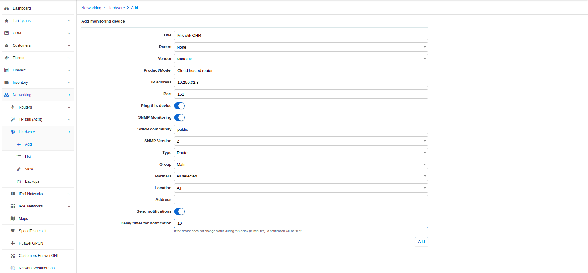

* **Title** - name of the device;
* **Parent** - select a parent device( if exists). You can build a parent-child relations in Splynx monitoring;
* **Vendor** - vendor name. You can add more vendors under _Config/Networking/Monitoring_;
* **Product/Model** - information about the device model;
* **IP address** - IPv4 of the device to which SNMP and Ping tools will connect;
* **Port** - SNMP port;
* **Ping this device** - If enabled, Splynx will ping the device to track connectivity;
* **SNMP Monitoring** - If enabled, Splynx will connect via SNMP to device and load available information. Should be also enabled on a device;
* **SNMP community** - define community, using "public" is insecure. We recommend to create some custom community on a device and use it;
* **SNMP Version** - select version (2 is recommended);
* **Type** - select type. You can add more types under _Config/Networking/Monitoring_ ;
* **Group** - define a group for device. This field is using for notifications configuration;
* **Partners** - defines the partner that can see the device;
* **Location** - defines a location;
* **Address** - information about the address where device is installed;
* **Send notifications** - enable/disable sending of notifications if device goes down/up;
* **Delay timer for notification** - set a delay in minutes to send notification about status change. If device is down, Splynx will wait for 10 minutes and is status doesn't change - will send a notification.

When device is up and running we can see the status:

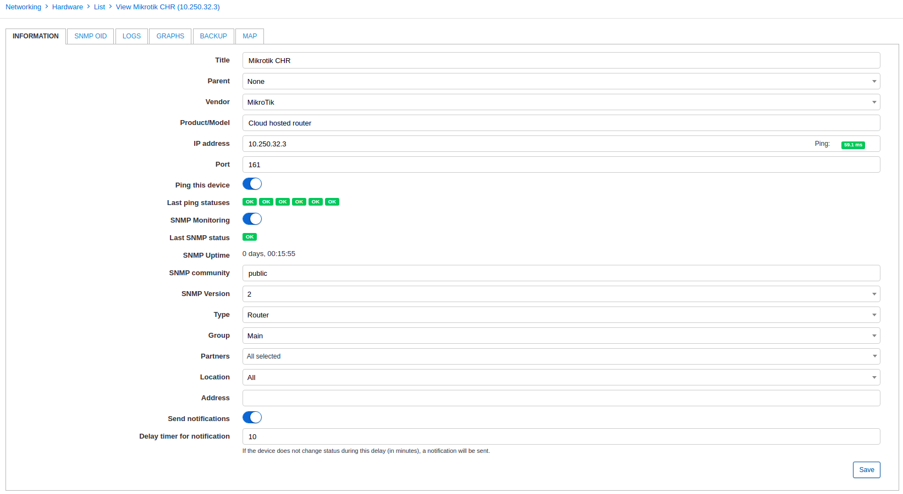

As you can see Splynx is able to ping this IP. If device is unreachable ping will be also unreachable and status of "Last ping statuses" will be negative.

### Graphs

That was initial configuration to get ping and SNMP status of the device. To monitor some advanced parameters we can use SNMP OIDs to get the values and measure such thing as CPU performance, memory usage, voltage or interface's speed. First of all we need to get available SNMP OIDs to build some graphs. We can do this under tab "SNMP OID":

You can run SNMP walk to get all available OIDs or add it manually using "Add SNMP OID" button. Let's click on "SNMP walk" to load OIDs automatically and avoid manual input mistakes:

Here you can load all OIDs or for interfaces only. Let's click on "Get all" button and wait 1-2 minutes for a result.

Once this done click on "SNMP walk" to see all OIDs what we received from a device:

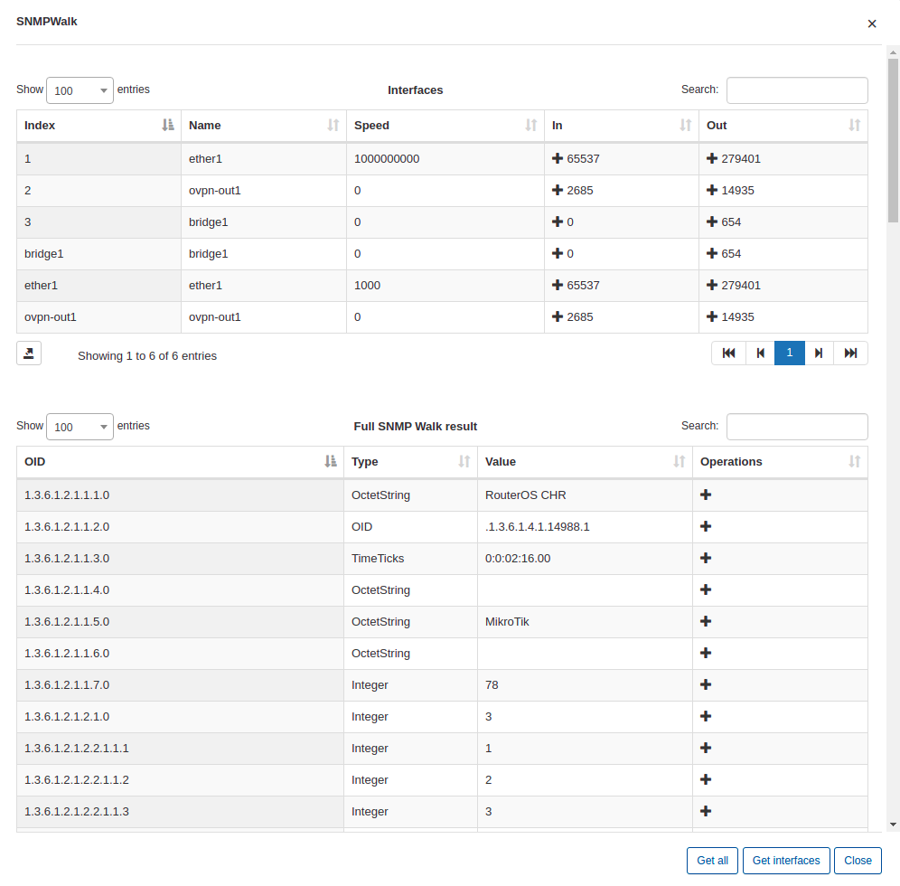

For example we need to monitor **ether1** port bandwidth so we need to click on "+" under these values:

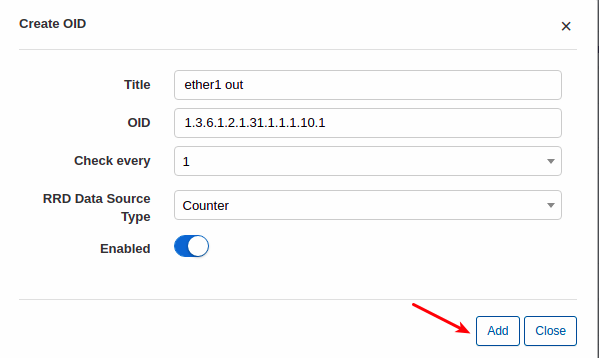

As a result we added 2 SNMP OIDs for monitoring in/out values of ether1 interface. Now we can create a graph with these OIDs.

**NOTE!** First - add OIDs, next build a graph.

To build a graph let's switch to "GRAPHS" tab and click on "Add graph":

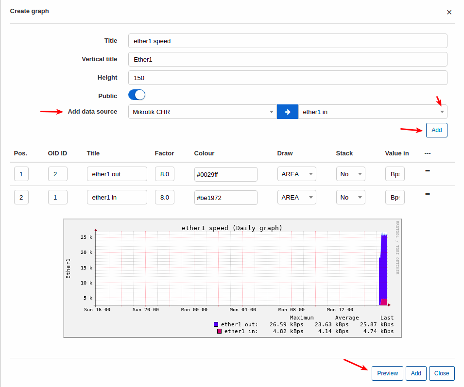

Here you need to specify title, vertical title and the most important is add data sources. In this case i need to select data source "ether1 in" and click add and after that select "ether1 out" and add. **If you are going to measure the interface speed - factor value should be 8 and "value in" = Bps**. Click on "Color" field to select a color and click on "Draw" field to select a way of displaying data(line or area). Click on "Preview" button to generate a preview and click on "Add" button to create a graph.

Now under "Operations" near each graph you can click on "Edit", "View graph", "Delete" buttons. Let's click on "View graph":

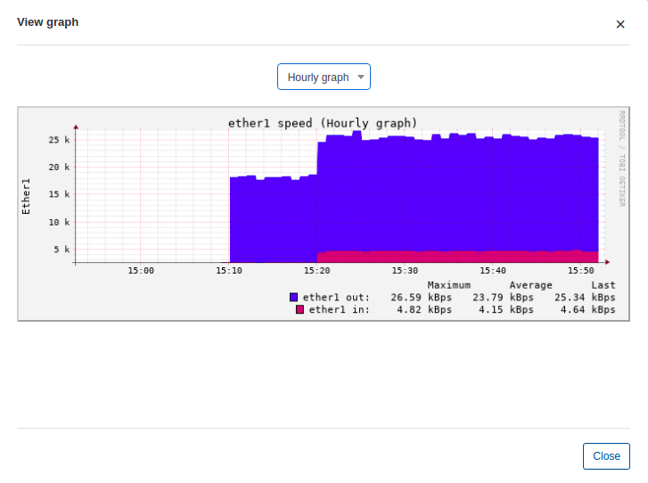

You can select different periods of time here.

### Backups

Devices added to the monitoring list can also be configured for backups. Simply configure the login details, port to communicate(SSH),the command, and specify the hours which you would like to run backups:

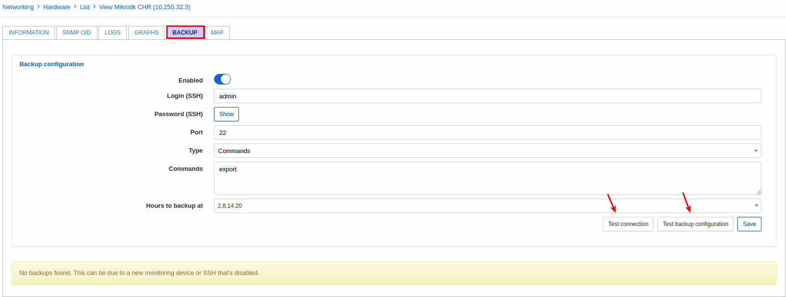

click on "Test connection" and "Test backup configuration" to ensure that it works:

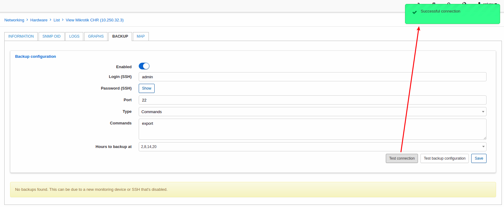

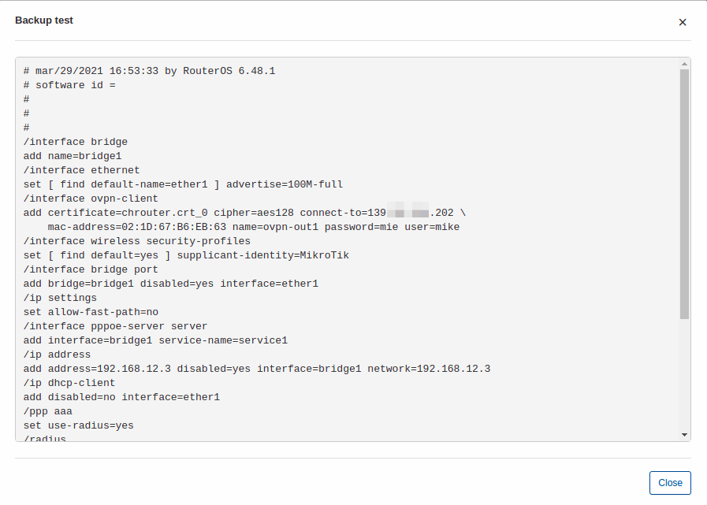

We are using MikroTik "export" command to get an export of all settings.

Here we have a first backup of our device:

Under "Operations" you can click on "Download" button or on "View difference" button. To see difference you should have at least 2 backups.

Under _Networking / Hardware / Backups_ you can find a list of all backups for all devices:

### Logs

Under **Logs** tab you can find log records:

### Notifications

It is possible to send a notifications when some device goes down. First action to do is to add a notifications group under _Networking / Monitoring / Groups_:

scroll down and find window "Groups":

With this setup I want to create a group "Engineers" where only administrator "admin" consists and this administrator will receive email notification + portal notification on a dashboard. The subject of an email will be "Device alert!" and body of a message is defined with email template what can be updated.

Once this done we need to change a group for a device:

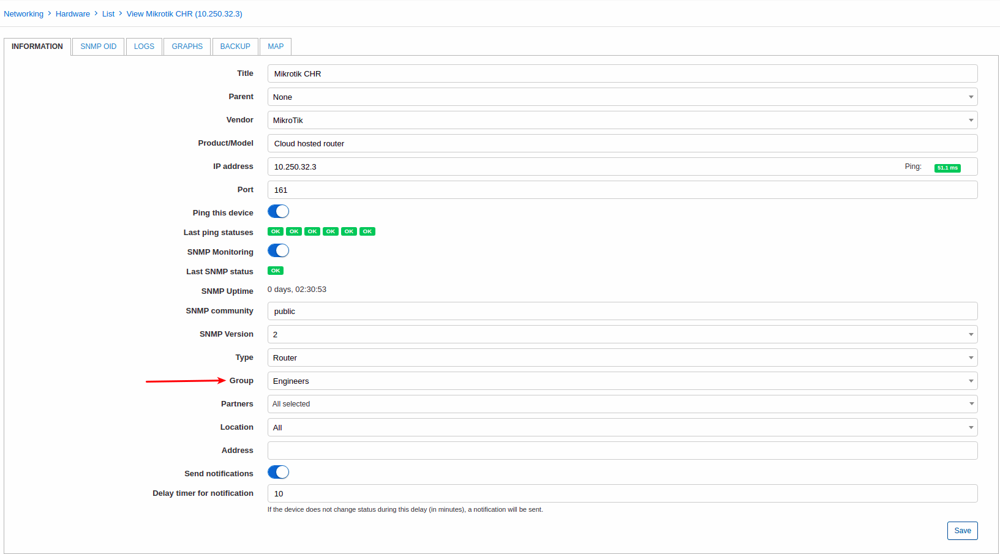

So as per device configuration an administrator from a group "Engineers" should receive a notification if device is down for more than 10 minutes:

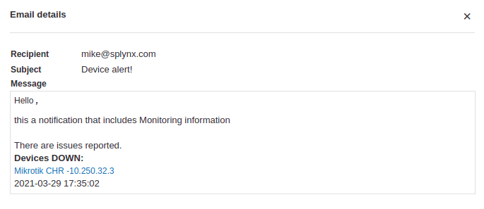

### Other

Charts and SNMP values from Monitoring can be used in [Splynx Weathermap add-on](networking/weathermaps/weathermaps.md) as on example below:

Please follow the video tutorials to find out more about Splynx monitoring:

<iframe frameborder=0 height=270 width=350 allowfullscreen src="https://www.youtube.com/embed/2XDbqc7b-cI?wmode=opaque">Video on youtube</iframe>

Ping tools :

<iframe frameborder=0 height=270 width=350 allowfullscreen src="https://www.youtube.com/embed/BebSml0tQ-U?wmode=opaque">Video on youtube</iframe>

CPU usage :

<iframe frameborder=0 height=270 width=350 allowfullscreen src="https://www.youtube.com/embed/jr_HKAT4qHA?wmode=opaque">Video on youtube</iframe>

Memory usage :
<iframe frameborder=0 height=270 width=350 allowfullscreen src="https://www.youtube.com/embed/yIlq_msIpmA?wmode=opaque">Video on youtube</iframe>
