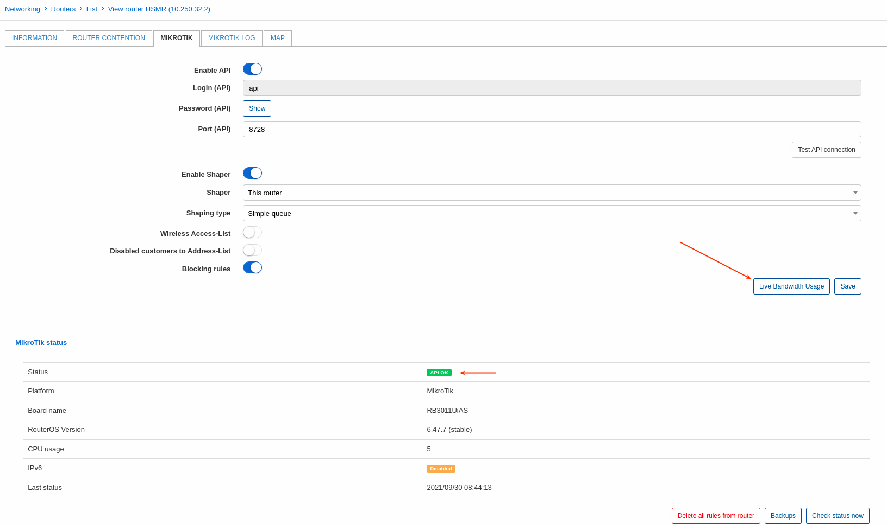
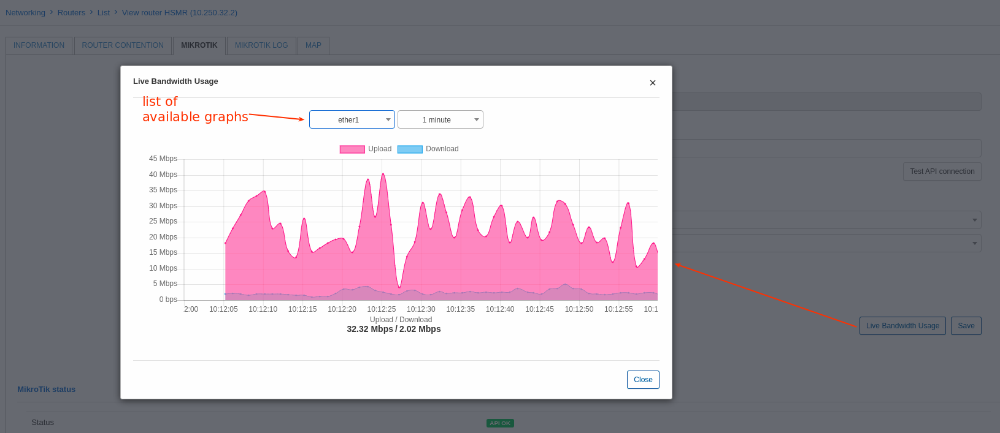
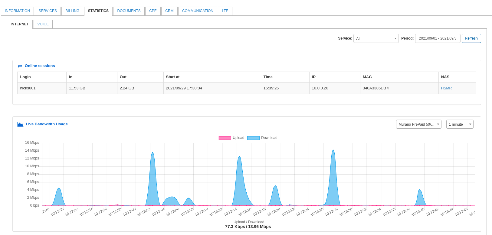

### Mikrotik Live bandwidth usage

Implemented in the release of Splynx version 3.0, we have a new feature called "Live bandwidth usage", which can be used in conjunction with Mikrotik devices.

Requirements:
1. Radius authorization required;
2. API should be configured and enabled for the router;
3. NAS Type supported - Mikrotik only;
4. Mikrotik RouterOS should be updated to a version newer than 6.43.

Navigate to `Networking / Routers / List`, click on the edit button of the desired router to configure and select the  "Mikrotik" tab.

API should be configured and enabled, API status should be "OK" and clicking on the “Test API connection” button, should return successfully.

Click on the "Live Bandwidth usage" button to view per-interface graphs of the router:

If the graph is available on the router - a customer who is connected to this router will also have this graph under their Statistic tab:

Navigate to a customer view and select "Statistics" tab:

If there’s no usage on the line - the graph will not populate any data.

*NOTE! If the graph is available on the router but not for a customer. You can run the following command on your server, via SSH:*

**sudo service splynx_node restart**

If after the restart of this module, the graph for the customer is still not available, please create a ticket with us so we can investigate the issue.

Another reason for this could be that the authentication is set to API and only Radius authentication will provide these graphs.
