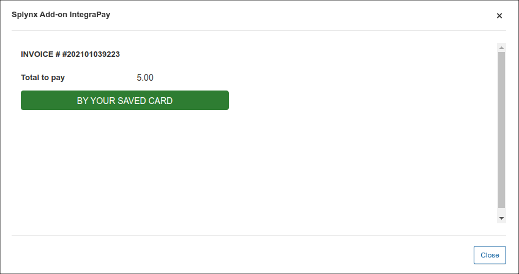
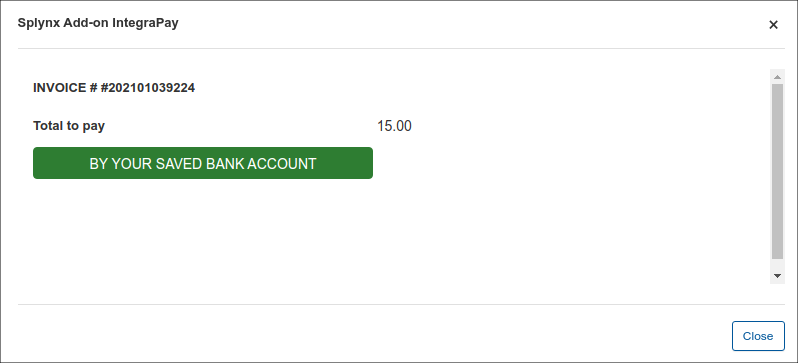
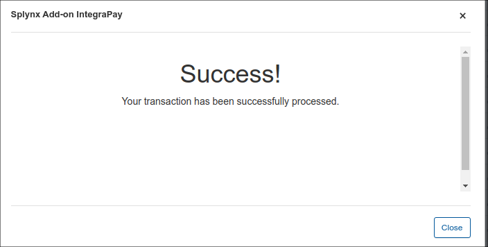
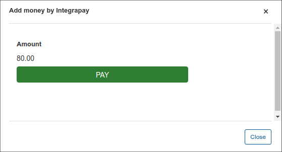
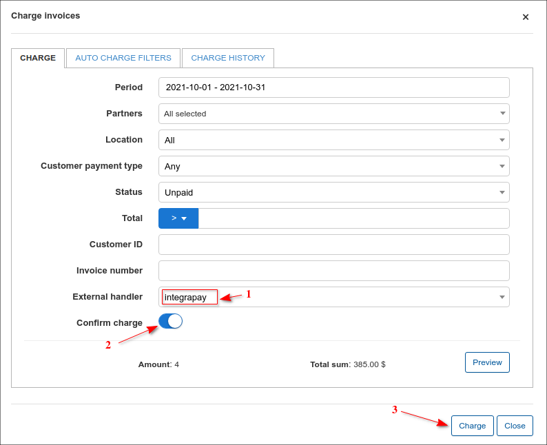

Integrapay
============

**Integrapay** is a Splynx add-on which allows customers to pay for invoices via the payment gateway - https://www.integrapay.com.au/. Customers using *Integrapay* can pay for their invoices through bank and credit card or you can charge your customers bank accounts by debit orders.

### Add-on installation

The add-on can be installed in two methods, via the CLI or Web UI of you server.

To install the *Splynx-Integrapay* add-on via CLI, the following commands can be used:

```
apt-get update
apt-get install splynx-integrapay
```
To install it via the Web UI:

Navigate to `Config → Integrations → Add-ons`:


Locate or search for the `splynx-integrapay` add-on and click on the *Install* icon in the *Actions* column, you will be presented with a window to confirm or cancel the installation, click on the **OK, confirm** button to begin the installation process.


### Add-on settings

The first step is to register an account on https://www.integrapay.com.au/. After registering, *Integrapay* will send you an email with your credentials, where  _**Bussines ID** is your **Username** and  **Api User Key** is your **Password**_ :


Then, you need to set your **Username**, **Business ID** and **Password** in Splynx under `Config → Integrations → Modules list → Splynx Add-on IntegraPay`.

Locate or search for the `splynx_addon_integrapay` add-on module and click on the
<icon class="image-icon"></icon> (*Edit*) icon in the *Actions* column


The configuration of add-on **Entry points** can be found in `Config → Integrations → Modules list`, near the `splynx_addon_integrapay` module item in *Actions* column, click on the <icon class="image-icon"></icon> (*Edit entry points*) icon. More information about *Modules list* can be found [here](configuration/integrations/modules_list/modules_list.md).

### Invoice payment

Before making any payment it's required to set up the bank account or the credit card, depends on what option customers would like to use to pay.

Navigate to `Finance → IntegraPay payment credentials` and type the required credentials.


Once the configuration has been completed, customers can pay their invoices on [Portal](customer_portal/customer_portal.md),

using the *IntegraPay* system in `Finance → Invoices`. Using the *IntegraPay* add-on the `Service Fee` value cannot be set, as a result, will be shown only `Total to pay` amount:






or pay directly on Portal Dashboard:




If everything goes well, you will see the status of the invoice marked as `Paid` (on the customer and admin portal).


Customers can also refill their balances using **Add money via Integrapay** menu on Portal Dashboard.




Additionally, you can charge all customers using one button, navigate to `Finance → Invoices`, set the period and click on **Charge** button as depicted below:




The [Charge history](finance/invoices/invoices.md) tab contains the charge history of all charges you have made, sometimes it is very helpful when there are finance issues.

### Add-on log files

*IntegraPay* add-on logs can be found in `Administration → Logs`:


In *Integrapay Logs* the different records can be viewed and its response details etc.


### Direct payments

Using the payments links is the simplest way to accept payments made with credit card or bank account. This feature is available in the *IntegraPay* add-on to pay *Invoices* and *Proforma Invoices*. This provides convenience and simplicity for your customers, so the amount of on-time payments will increase. For example, you can add a payment link to the e-mail with the (proforma) invoice, as a result, the customer can make payment quickly by clicking onto such link instead of logging in to their *Portal* page. In case the customer has saved the payment credentials on the *Portal*, they do not need to add further details when using the direct payment link in the future. If the credit card in not linked on the *Portal*, the payment details need to be entered each time the payment link is used.

To create a direct payment link, please use the patterns below:

**To pay the Invoice:**

<details style="font-size: 15px; margin-bottom: 5px;">
<summary><b>by invoice ID</b></summary>
<div markdown="1">

```
https://<splynx_domain_address>/integrapay/direct-pay-invoice-by-id?item_id=<Invoice_id>

```
</div>
</details>

<details style="font-size: 15px; margin-bottom: 5px;">
<summary><b>by invoice number</b></summary>
<div markdown="1">

```
https://<splynx_domain_address>/integrapay/direct-pay-invoice?item_id=<Invoice_number>

```
</div>
</details>

<br>

**To pay the Proforma Invoice:**

<details style="font-size: 15px; margin-bottom: 5px;">
<summary><b>by proforma invoice ID</b></summary>
<div markdown="1">

```
https://<splynx_domain_address>/integrapay/direct-pay-proforma-by-id?item_id=<proforma_id>

```
</div>
</details>

<details style="font-size: 15px; margin-bottom: 5px;">
<summary><b>by proforma invoice number</b></summary>
<div markdown="1">

```
https://<splynx_domain_address>/integrapay/direct-pay-proforma?item_id=<proforma_number>

```
</div>
</details>


<!---     do NOT remove

### Integration with BPAY

**Pay attention, this feature is not available in the major release of IntegraPay add-on.**

**BPAY** is an electronic bill payment system in Australia which enables payments to be made through online or phone banking service. The customers should be registered as BPAY billers with the BPAY operating company through its bank. Unlike receiving standard bank transfers or credit card payments – all BPAY transactions have a unique CRN (Customer Reference Number) which can be used to identify which customer made the payment and what invoice it is related to.

Splynx uses BPAY service via *IntegraPay* API to pay (proforma) invoices, but **we can only create a reference num. (CRN) for the invoice and the customer**.


<details>
<summary><b>How does BPAY work?</b></summary>
<p markdown="1">

1. SIP sends a customer an invoice displaying a BPAY logo, a **unique BPAY Biller Code** and a **Customer Reference Number (CRN)**;

2. A customer logs into their Internet banking and follows the prompts to make a BPAY payment;

3. A customer will be asked to provide the payment details: the **Biller Code**, the **reference number from the invoice/customer (CRN)** and the **amount**** they wish to pay. After that the customer’s bank validates the payment in real-time (the information about payment is transferred to *IntegraPay* via BPAY) with the system issuing a receipt;


4. Funds will be deposited into the corporate account.


More information you can find in an official [FAQ](https://bpay.com.au/bpay-for-you/personal-faqs).


</p>
</details>


**Pay the invoice by BPAY according to the created (proforma) invoice CRN in Splynx:**

1. (for administrator) Install and configure the *IntegraPay* add-on in Splynx (see above). Create the invoice for the customer to pay;

2. (for administrator) Double-check if the necessary entry point for (proforma) invoice is enabled: navigate to `Config → Integrations → Modules list → Splynx Add-on IntegraPay` and click on **Edit entry points**


3. (for customer) Open the [Portal](customer_portal/customer_portal.md), navigate to `Finance → Invoices` (`Finance → Proforma invoices`) and click on `Pay via BPay` icon near the unpaid invoice (the [bank statement](bank_statement_processing/bank_statement_processing.md) will be created in `Pending` status - it will be used to read the status of transaction from *IntegraPay* side. The payment will be created if the customer pays the invoice in their bank and we receive information about this transaction from *IntegraPay*): showing the Customer Reference Number (CRN) of the current invoice indicates that it has been generated successfully and the CRN is fixed in *IntegraPay*.


4. A customer makes payment using the provided Biller Code and Customer Reference Number (CRN). After that, a new transaction associated with CRN will appear in the customer profile.


**Pay the invoice by BPAY according to the created customer CRN in Splynx:**

1. (for administrator) Install and configure the *IntegraPay* add-on in Splynx (see above). Create the invoice for the customer to pay;

2. (for administrator) Double-check if the `BPay CRN` entry point in `Finance` section of customer portal is enabled: navigate to `Config → Integrations → Modules list → Splynx Add-on IntegraPay` and click on **Edit entry points**

3. (for customer) Open the Portal, click on `Finance` item on the sidebar, then click on `BPay CRN` item: the unique CRN for customer will be generated (each customer will have their own unique CRN)


4. A customer can pay any amount of money using the provided Biller Code and Customer Reference Number (CRN). Then, Splynx receives the status of the transaction and the money will be added to the customer's balance. Only the payment will be created in the customer profile.


<icon class="image-icon"></icon> **Things to keep in mind:**

- the change of transaction statuses is performed by API request from Splynx, which is limited to no more than 1 request per hour (the task is executed by *cron*);

- the two methods (for the invoice and the customer) of CRN generation in Splynx can work simultaneously;

- when a customer incorrectly entered the amount of payment for the invoice and the amount is less than the required amount, it simply creates a payment that is not linked to the invoice;

- if a customer later pays the correct amount using the same CRN (of the invoice), the payment should be linked to the correct invoice;

- if the amount of payment is larger than required, then 2 payments will be created in Splynx. The one with the required amount and it will be linked to the invoice, the second one will be added to the customer's balance;

- in case an invoice is paid or deleted before the transaction status is analyzed by Splynx, the information about this event will be added to the log and the transaction will be marked as processed.


**Add the Bpay logo with references to the (proforma) invoice templates**

Navigate to `Config → Templates`, choose `Invoice PDF` or `Proforma Invoice PDF` **type** and near the required template click on the
<icon class="image-icon"></icon> icon in the *Actions* column to edit the template.

<icon class="image-icon"></icon> **It's recommended to create a new template instead of changing the default one**.

Add the next line to the *footer* of your template:


After that, double-check if the correct template is selected in [Company information](configuration/system/company_information/company_information.md), the fields: `Invoice PDF Template` and `Proforma Invoice PDF Template`.

**CRN for the invoice:**


<details>
<summary><b>for Invoice PDF template</b></summary>
<p markdown="1">


```   


```


</p>
</details>


<details>
<summary><b>for Proforma Invoice PDF template</b></summary>
<p markdown="1">


```   


```


</p>
</details>


**CRN for the customer:**


<details>
<summary><b>for Invoice PDF template</b></summary>
<p markdown="1">


```   


```


</p>
</details>


<details>
<summary><b>for Proforma Invoice PDF template</b></summary>
<p markdown="1">


```   


```


</p>
</details>


**Example:**


-->
