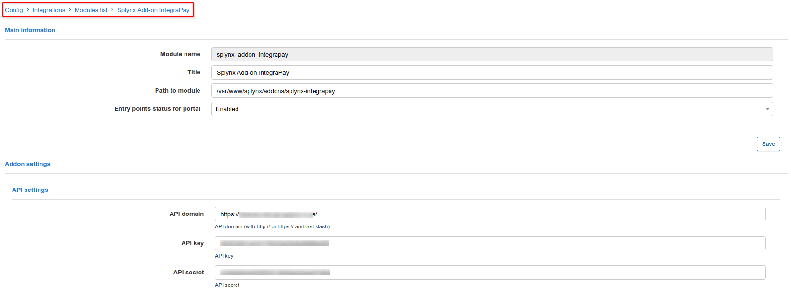
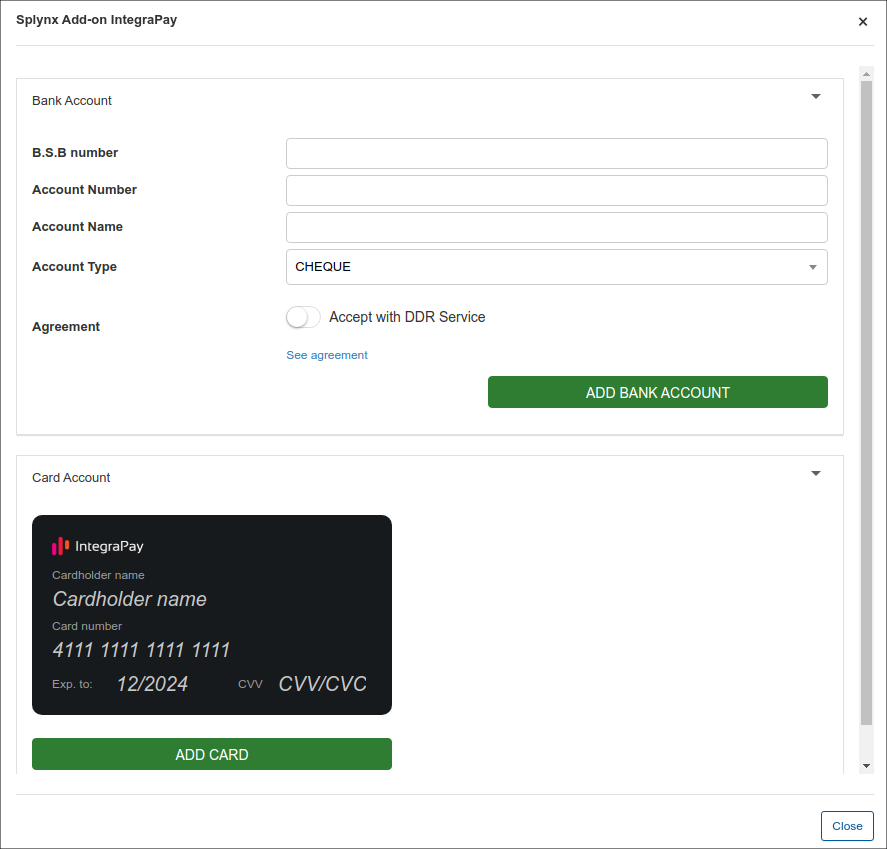
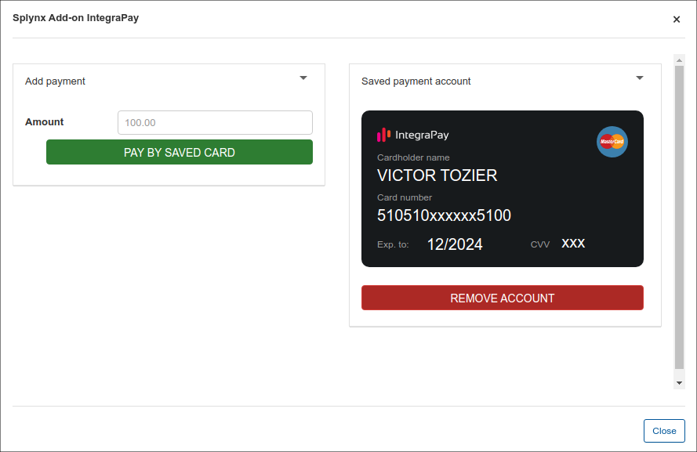
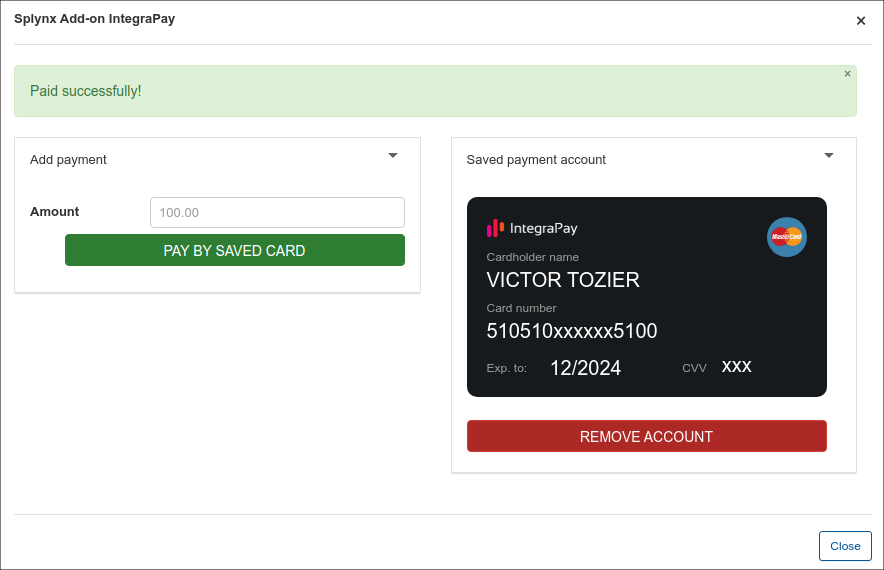
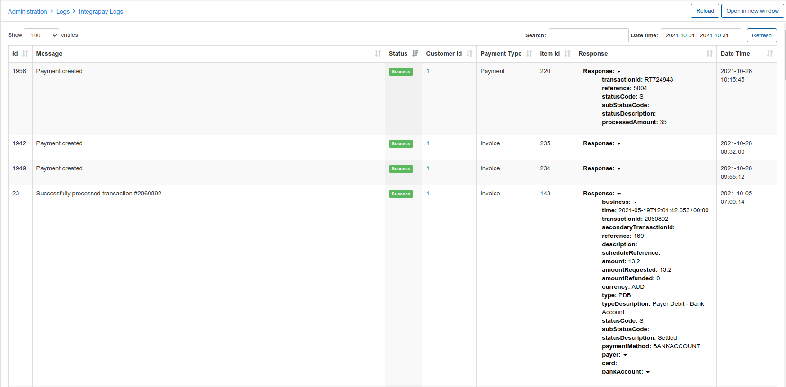

Integrapay
============

**Integrapay** is a Splynx add-on which allows customers to pay for invoices via the payment gateway - https://www.integrapay.com.au/. Customers using *Integrapay* can pay for their invoices through bank and credit card or you can charge your customers bank accounts by debit orders.

### Add-on installation

The add-on can be installed in two methods, via the CLI or Web UI of you server.

To install the *Splynx-Integrapay* add-on via CLI, the following commands can be used:

```
apt-get update
apt-get install splynx-integrapay
```
To install it via the Web UI:

Navigate to `Config → Integrations → Add-ons`:


Locate or search for the `splynx-integrapay` add-on and click on the *Install* icon in the *Actions* column, you will be presented with a window to confirm or cancel the installation, click on the **OK, confirm** button to begin the installation process.


### Add-on settings

The first step is to register an account on https://www.integrapay.com.au/. After registering, *Integrapay* will send you an email with your credentials, where  _**Bussines ID** is your **Username** and  **Api User Key** is your **Password**_ :


Then, you need to set your **Username**, **Business ID** and **Password** in `IntegraPay API settings` section of add-on config page, navigate to `Config → Integrations → Modules list → Splynx Add-on IntegraPay` and locate or search for the `splynx_addon_integrapay` add-on module and click on the <icon class="image-icon"></icon> (*Edit*) icon in the *Actions* column, enter your credentials in the related fields.


**Main information and API settings:**



* **API domain** - api domain should be the same as Splynx URL. The forward slash `/` is required at the end;

* **API key, API secret** - auto generated default values. Don't change it unless it is absolutely necessary.


**IntegraPay billing settings:**


* **Ignore Fee** - ignore IntegraPay fee;
* **Fee VAT** - service [fee VAT](configuration/finance/taxes/taxes.md) percent;
* **Add fee to request** - add fee (position) to request;
* **Fee message** - if `Add fee to request` option is enabled, the current message will be added as description for fee item in invoice;
* **Payment method for Credit Card / Bank Account** - when a customer pays using this add-on, the payment will be allocated as this payment type;
* **Transaction fee category** - transaction [category](configuration/finance/transaction_categories/transaction_categories.md) of the fee transactions;
* **Bank statements group** - choose how to group bank statements (`Finance → Bank Statements → History`) monthly or daily;
* **Available Payment Methods** - choose a payment method that the customer can add on Portal. Pay attention, IntegraPay service does not support using two payment methods at the same time. If 'Bank account or Card' option is selected, a customer can add either their bank account or a credit card and use only one method at a time;
* **Mask card's number and CVV** - hide card number and CVV code when adding on the Portal;
* **Customers identifier** - select what to use as identifier of customer on IntegraPay service side;
* **Sending email with terms** - enable/disable the email sending with terms and conditions of the service to customers;
* **Subject of email with terms** - subject of the email with terms and conditions of the service;
* **Message of email with terms** - message of the email with terms and conditions of the service;
* **Top-up for admins** - enable/disable the form to refill customer account balance from their billing configuration page (see the example below).

<details style="font-size: 15px; margin-bottom: 5px;">
<summary><b>Example</b></summary>
<div markdown="1">


If the payment credentials are not added, the administrator can add it from this form. Pay attention, only one payment method can be used.



If the payment credentials are added by customer, e.g. credit card but `Top-up for admins` option is disabled on add-on configuration page, the administrator will see the next message


If the option `Top-up for admins` is enabled on add-on configuration page, the administrator can top up the customer's balance, the saved payment method will be used.





</div>
</details>


<br>


**IntegraPay API settings:**


The configuration of add-on **Entry points** can be found in `Config → Integrations → Modules list`, near the `splynx_addon_integrapay` module item in *Actions* column, click on the <icon class="image-icon"></icon> (*Edit entry points*) icon. More information about *Modules list* can be found [here](configuration/integrations/modules_list/modules_list.md).

### Invoice payment

Before making any payment it's required to set up the bank account or the credit card, depends on what option customers would like to use to pay.

Navigate to `Finance → IntegraPay payment credentials` and type the required credentials.


Once the configuration has been completed, customers can pay their invoices on [Portal](customer_portal/customer_portal.md),

using the *IntegraPay* entry point in `Finance → Invoices`:


or pay directly on Portal Dashboard (the related entry points should be enabled):


If everything goes well, you will see the status of the invoice marked as `Paid` (on the customer and admin portal).


Customers can also refill their balances using **Add money via Integrapay** menu on Portal Dashboard.


Additionally, you can charge all customers using one button, navigate to `Finance → Invoices`, set the period and click on **Charge** button as depicted below:


The [Charge history](finance/invoices/invoices.md) tab contains the charge history of all charges you have made, sometimes it is very helpful when there are finance issues.

### Add-on log files

*IntegraPay* add-on logs can be found in `Administration → Logs`:


In *Integrapay Logs* the different records can be viewed and its response details etc.



### Direct payments

Using the payments links is the simplest way to accept payments made with credit card or bank account. This feature is available in the *IntegraPay* add-on to pay *Invoices* and *Proforma Invoices*. This provides convenience and simplicity for your customers, so the amount of on-time payments will increase. For example, you can add a payment link to the e-mail with the (proforma) invoice, as a result, the customer can make payment quickly by clicking onto such link instead of logging in to their *Portal* page. In case the customer has saved the payment credentials on the *Portal*, they do not need to add further details when using the direct payment link in the future. If the credit card in not linked on the *Portal*, the payment details need to be entered each time the payment link is used.

To create a direct payment link, please use the patterns below:

**To pay the Invoice:**

<details style="font-size: 15px; margin-bottom: 5px;">
<summary><b>by invoice ID</b></summary>
<div markdown="1">

```
https://<splynx_domain_address>/integrapay/direct-pay-invoice-by-id?item_id=<Invoice_id>

```
</div>
</details>

<details style="font-size: 15px; margin-bottom: 5px;">
<summary><b>by invoice number</b></summary>
<div markdown="1">

```
https://<splynx_domain_address>/integrapay/direct-pay-invoice?item_id=<Invoice_number>

```
</div>
</details>

<br>

**To pay the Proforma Invoice:**

<details style="font-size: 15px; margin-bottom: 5px;">
<summary><b>by proforma invoice ID</b></summary>
<div markdown="1">

```
https://<splynx_domain_address>/integrapay/direct-pay-proforma-by-id?item_id=<proforma_id>

```
</div>
</details>

<details style="font-size: 15px; margin-bottom: 5px;">
<summary><b>by proforma invoice number</b></summary>
<div markdown="1">

```
https://<splynx_domain_address>/integrapay/direct-pay-proforma?item_id=<proforma_number>

```
</div>
</details>
