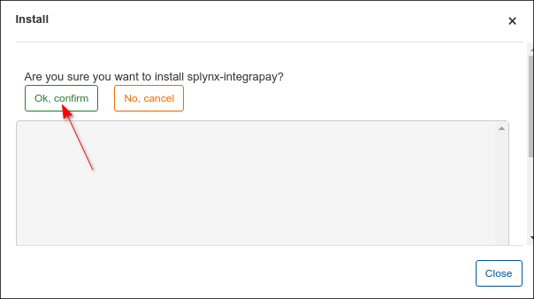

Integrapay
============

**Integrapay** is a Splynx add-on which allows customers to pay for invoices via the payment gateway - https://www.integrapay.com.au/. Customers using *Integrapay* can pay for their invoices through bank and credit card or you can charge your customers bank accounts by debit orders.

### Add-on installation

The add-on can be installed in two methods, via the CLI or Web UI of you server.

To install the *Splynx-Integrapay* add-on via CLI, the following commands can be used:

```
apt-get update
apt-get install splynx-integrapay
```
To install it via the Web UI:

Navigate to `Config → Integrations → Add-ons`:


Locate or search for the `splynx-integrapay` add-on and click on the *Install* icon in the *Actions* column, you will be presented with a window to confirm or cancel the installation, click on the **OK, confirm** button to begin the installation process.




### Add-on settings

The first step is to register an account on https://www.integrapay.com.au/. After registering, *Integrapay* will send you an email with your credentials, where  _**Bussines ID** is your **Username** and  **Api User Key** is your **Password**_ :


Then, you need to set your **Username**, **Business ID** and **Password** in Splynx under `Config → Integrations → Modules list → Splynx Add-on IntegraPay`.

Locate or search for the `splynx_addon_integrapay` add-on module and click on the
<icon class="image-icon"></icon> (*Edit*) icon in the *Actions* column


The configuration of add-on **Entry points** can be found in `Config → Integrations → Modules list`, near the `splynx_addon_integrapay` module item in *Actions* column, click on the <icon class="image-icon"></icon> (*Edit entry points*) icon. More information about *Modules list* can be found [here](configuration/integrations/modules_list/modules_list.md).

### Invoice payment

Before making any payment it's required to set up the bank account or the credit card, depends on what option customers would like to use to pay.

Navigate to `Finance → Pay via IntegraPay direct debit` and type the required credentials.


Once the configuration has been completed, customers can pay their invoices on the [Portal](customer_portal/customer_portal.md) using the *IntegraPay* system in `Finance → Invoices`


If everything goes well, you will see the status of the invoice marked as `Paid` (on the customer and admin portal).


Customers can also refill their balances using `Finance → Pay via IntegraPay direct debit` menu.


Additionally, you can charge all customers using one button, navigate to `Finance → Invoices`, set the period and click on **Charge** button as depicted below:


The [Charge history](finance/invoices/invoices.md) tab contains the charge history of all charges you have made, sometimes it is very helpful when there are finance issues.

### Add-on log files

*IntegraPay* add-on logs can be found in `Administration → Logs`:


In *Integrapay Logs* the different records can be viewed and its response details etc.


### Direct payments

Using the payments links is the simplest way to accept payments made with credit card or bank account. This feature is available in the *IntegraPay* add-on to pay *Invoices* and *Proforma Invoices*. This provides convenience and simplicity for your customers, so the amount of on-time payments will increase. For example, you can add a payment link to the e-mail with the (proforma) invoice, as a result, the customer can make payment quickly by clicking onto such link instead of logging in to their *Portal* page. In case the customer has saved the payment credentials on the *Portal*, they do not need to add further details when using the direct payment link in the future. If the credit card in not linked on the *Portal*, the payment details need to be entered each time the payment link is used.

To create a direct payment link, please use the patterns below:

**To pay the Invoice:**

<details>
<summary>by invoice ID</summary>
<div markdown="1">

```
https://<splynx_domain_address>/integrapay/direct-pay-invoice-by-id?item_id=<Invoice_id>

```
</div>
</details>

<details>
<summary>by invoice number</summary>
<div markdown="1">

```
https://<splynx_domain_address>/integrapay/direct-pay-invoice?item_id=<Invoice_number>

```
</div>
</details>


**To pay the Proforma Invoice:**

<details>
<summary>by proforma invoice ID</summary>
<div markdown="1">

```
https://<splynx_domain_address>/integrapay/direct-pay-proforma-by-id?item_id=<proforma_id>

```
</div>
</details>

<details>
<summary>by proforma invoice number</summary>
<div markdown="1">

```
https://<splynx_domain_address>/integrapay/direct-pay-proforma?item_id=<proforma_number>

```
</div>
</details>
