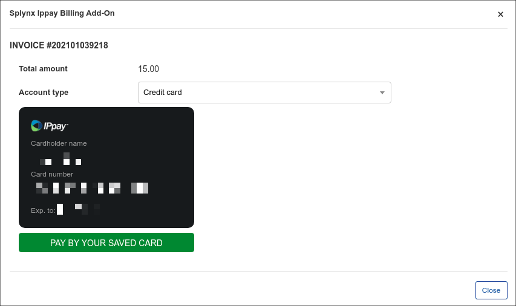
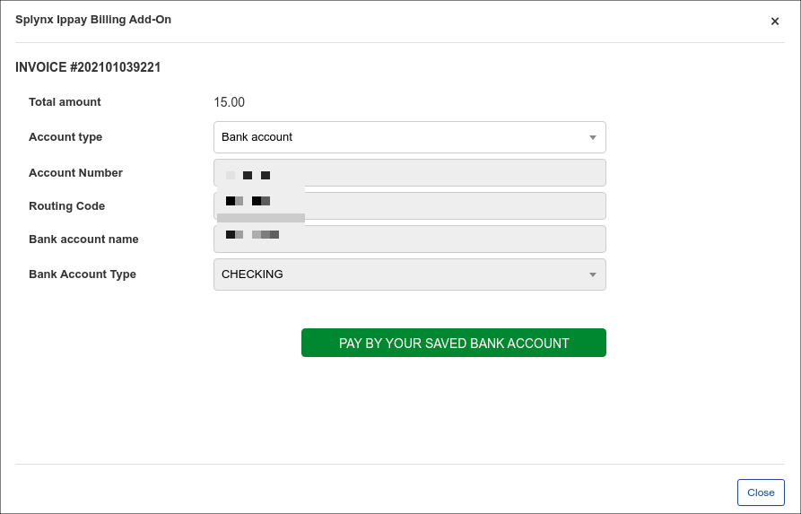
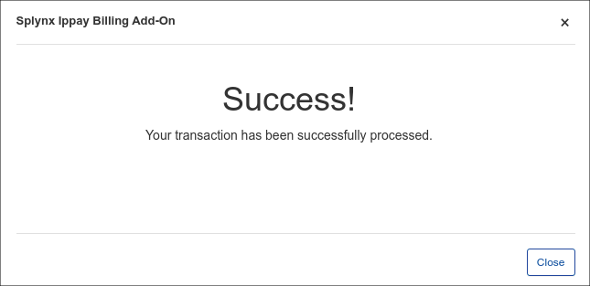
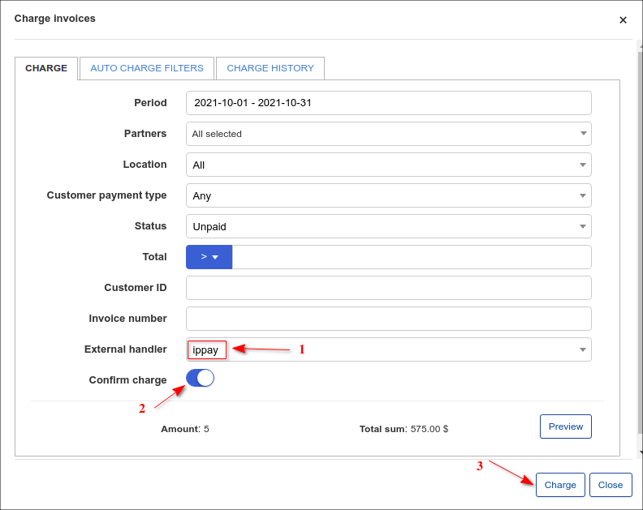

IPpay by Convergence
==================

IPpay is a Splynx add-on which allows refilling of customer balance and paying invoices via the IPpay payment gateway - https://www.ippay.com/.

The add-on can work with different credit cards and bank accounts, if cards or bank accounts are saved in customer profiles, the add-on allows you to charge all customers using *Direct debit orders*.

### Add-on installation

The add-on can be installed in two methods, via the CLI or the Web UI of your Splynx server

To install the *IPpay* add-on via CLI, the following commands can be used:


```
apt-get update
apt-get install splynx-ippay
```
To install it via the Web UI:

Navigate to `Config → Integrations → Add-ons`:


Locate or search for the `splynx-ippay` add-on and click on the *Install* icon in the *Actions* column:


Click on the **OK, confirm** button to begin the installation process:


### Add-on settings

After the installation process has completed, you have to configure add-on, navigate to `Config → Integrations → Modules list`:


Locate or search for the `splynx-ippay` add-on and click on the
<icon class="image-icon"></icon> (*Edit*) icon in the *Actions* column:


`Terminal ID` can be obtained from your *Ippay* account.


### Invoice payment

Once the configuration has been completed, customers can add a credit card or bank account on the [Portal](customer_portal/customer_portal.md) in `Finance → IpPay payment credentials`:


Now customers can pay for their invoices using the *IPpay* system in `Finance → Invoices` on the Portal:






Moreover, if one or both payment methods are added by the customer, the **administrator can pay the invoices directly from customer's profile**:


If everything goes well, you will see the status of invoice marked as `Paid` (on the customer and admin portal):




On the customer *Portal Dashboard*, customers can also see the list of non-paid invoices in *Ippay* widget (entry point) and the same-name buttons to pay such invoices.


The configuration of add-on **Entry points** can be found in `Config → Integrations → Modules list`, near the `splynx_ippay_addon` module item in *Actions* column, click on the <icon class="image-icon"></icon> (*Edit entry points*) icon. More information about *Modules list* can be found [here](configuration/integrations/modules_list/modules_list.md).

To refill balances, customers can use the following link - ```https://<splynx_domain_address>/ippay```, where they have to choose the *Account type*, enter the *Amount* of payment and click on **Add** button:


Additionally, you can charge all customers using one button, navigate to `Finance → Invoices`, set the period and click on **Charge** button as depicted below:




### Direct payments

Using the payments links is the simplest way to accept payments made with credit card or bank account. This feature is available in the *IPpay* add-on to pay *Invoices* and *Proforma Invoices*. This provides convenience and simplicity for your customers, so the amount of on-time payments will increase. For example, you can add a payment link to the e-mail with the (proforma) invoice, as a result, the customer can make payment quickly by clicking onto such link instead of logging in to their *Portal* page. In case the customer has saved the payment credentials on the *Portal*, they do not need to add further details when using the direct payment link in the future. If the credit card in not linked on the *Portal*, the payment details need to be entered each time the payment link is used.

To create a direct payment link, please use the patterns below:

**To pay the Invoice:**

<details style="font-size: 15px; margin-bottom: 5px;">
<summary><b>by invoice ID</b></summary>
<div markdown="1">

```
https://<splynx_domain_address>/ippay/direct-pay-invoice-by-id?item_id=<Invoice_id>

```
</div>
</details>

<details style="font-size: 15px; margin-bottom: 5px;">
<summary><b>by invoice number</b></summary>
<div markdown="1">

```
https://<splynx_domain_address>/ippay/direct-pay-invoice?item_id=<Invoice_number>

```
</div>
</details>

<br>

**To pay the Proforma Invoice:**

<details style="font-size: 15px; margin-bottom: 5px;">
<summary><b>by proforma invoice ID</b></summary>
<div markdown="1">

```
https://<splynx_domain_address>/ippay/direct-pay-proforma-by-id?item_id=<proforma_id>

```
</div>
</details>

<details style="font-size: 15px; margin-bottom: 5px;">
<summary><b>by proforma invoice number</b></summary>
<div markdown="1">

```
https://<splynx_domain_address>/ippay/direct-pay-proforma?item_id=<proforma_number>

```
</div>
</details>
