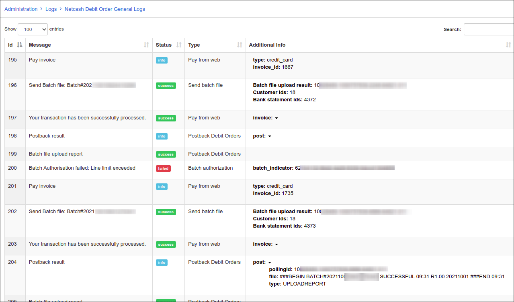
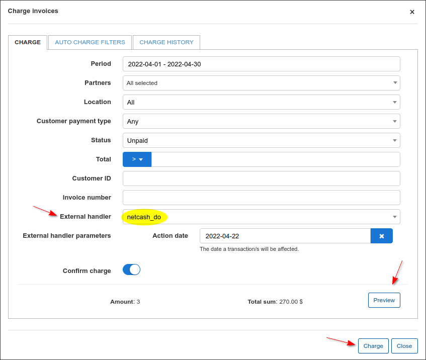
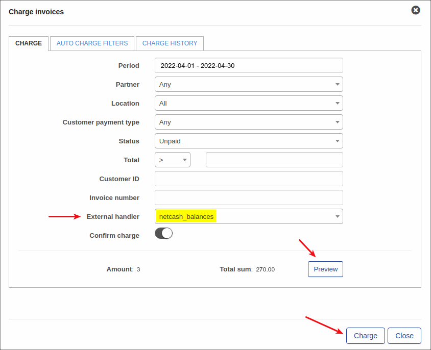
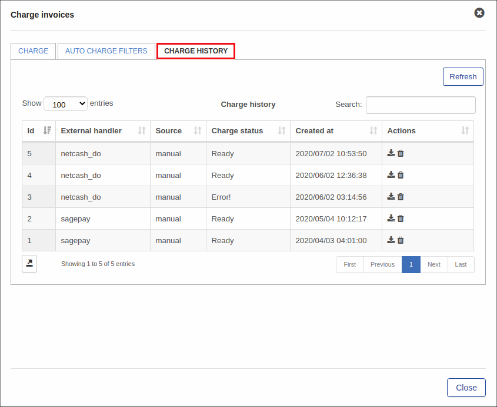
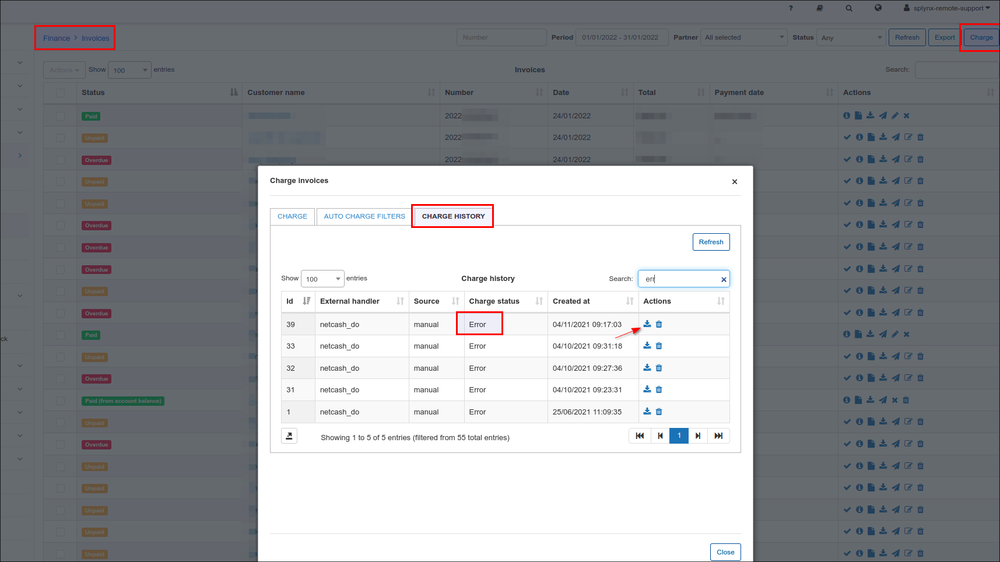
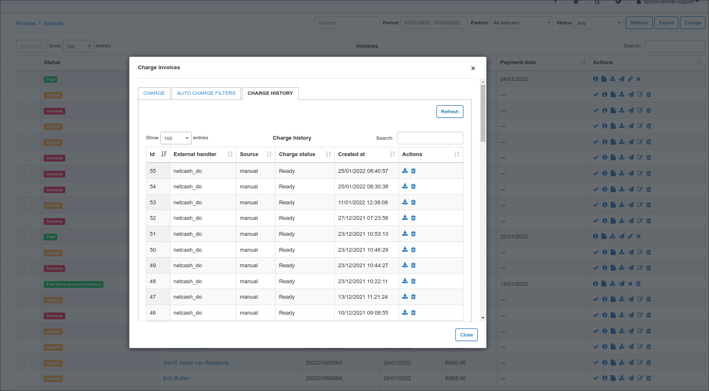
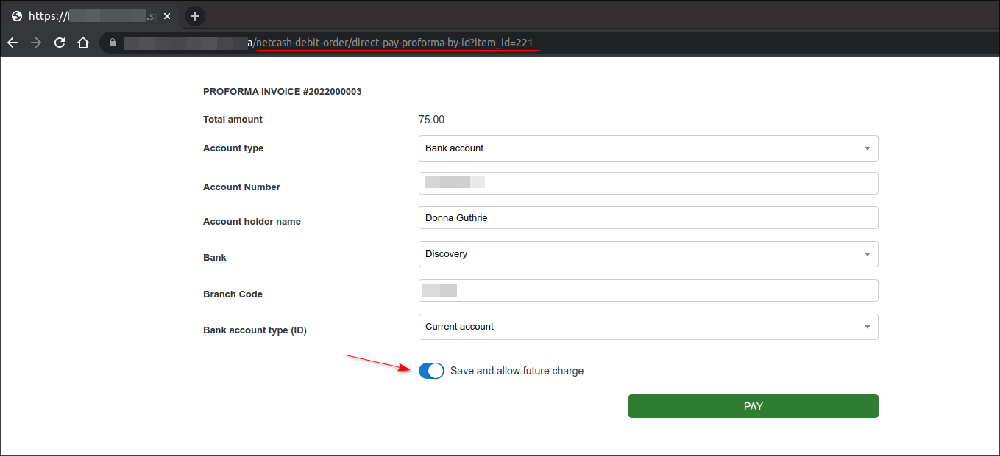
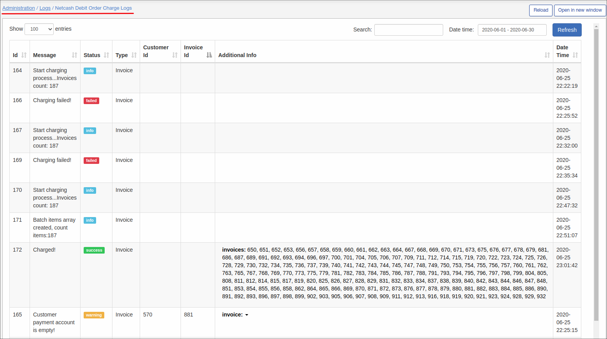
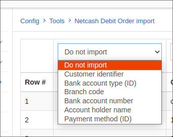
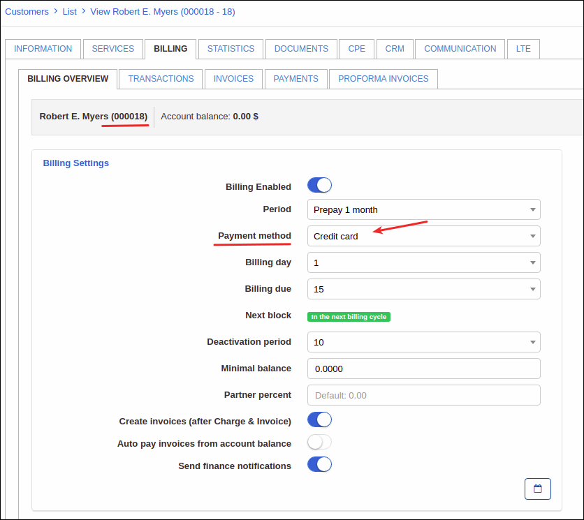

Netcash Debit Order (formerly SagePay direct debit)
====================

**Netcash Debit Order is a Splynx add-on (previously SagePay direct debit), used to generate debit orders and is processed via** https://netcash.co.za/.

<icon class="image-icon"></icon> **IMPORTANT:** If you have difficulties with a Netcash debit charge in Splynx, please follow the how-to instructions below.

To install Netcash Debit Orders, navigate to `Config → Integrations → Add-ons`:


Locate the Netcash addon and click on the install button as on the screenshot below:


Alternatively, the addon can be installed using the following commands via a terminal on your server:

```
apt update
apt install splynx-netcash-debit-order
```

**When the installation has completed, you need to register with Netcash and configure your account:**


**Account service key**:


**Debit orders service key:**


**PCI vault key:**


And your **merchant account number**.

These values have to be added to add-on configuration, located in `Config → Integrations → Modules list`:


**Note:** **PCI vault key** - this key is only needed when customers use their own credit cards to pay.

You can also set **service fee** and **unpaid fee** for customers and set which **admins roles** have access via the admin panel to `Finance → Netcash Debit Order check payments`.


The following roles can be specified in the field **admins roles**: `super-administrator`, `administrator`, `manager`, `financial-manager`, `customer-creator`, `engineer` and `technician`.

**Note**: The roles of `super-administrator`, `administrator` and `manager` are selected by default in the drop down menu after add-on installation, it means that admin account with any of these roles always has access to `Finance → Netcash Debit Order check payments` menu (account's [permissions](administration/main/admins_and_permissions/admins_and_permissions.md) to **Finance** module and **Netcash Debit Order add-on** are required as well).


In Splynx v3.1, the names of admins roles cannot be selected, you should write them into the field manually, each role should be separated by coma without spaces. For example, `administrator,super-administrator,manager,engineer`.

But if admin account has only `technician` role and this role was not selected in add-on config, the access to `Netcash Debit Order check payments` menu for such admin will be **forbidden**.


In order to disable the payments sync from `Netcash → Splynx` (e.g. you configured the payments sync from [SageOne](addons_modules/sageone/sageone.md) to Splynx), you can use **Disable payment processing by system** toggle. If toggle is `enabled` - *cron* will not sync payments to Splynx from Netcash side, if it's `disabled` - payments will be synced into Splynx.


Also, admins can be notified when a customer has created a Netcash payment account. To enable this feature, use the **Notifications settings** provided.


In case in Splynx system is used the multiple [partners](administration/main/partners/partners.md) scheme, you can divide Netcash configuration between them. Create a new partner in Splynx, in Netcash config select the necessary partner and set the required settings.


**Note:** The fields marked with `*` sign have the different values from original ones (original values are related to **Default** partner).

The *Netcash Debit Order* add-on supports the **Batch Auto Authorize** function that allows the Splynx system to authorize batches automatically (once per hour) without manual/human intervention during the invoice payment.

To turn on this functionality, please enable the `Auto-authorise batches` toggle in the add-on configuration page and press `Save` button:


**Important:** The **Batch Auto Authorize** function is available on request and access is only granted by Netcash management approval. Use this [link](https://api.netcash.co.za/autoauth/#access) to send a request.

<details style="font-size: 15px; margin-bottom: 5px;">
<summary><b>'Auto-authorise batches' explanation</b></summary>
<div markdown="1">

In case you do **not** use the **Batch Auto Authorize** function, we have the following concept: the customers pay invoices, these payments are sent to Netcash side as batch files. After that, the administrator, at some intervals, logs into the Netcash account and manually authorises all customers' payments. The Netcash, for its part, does a final check of such payments and a provides the results; Splynx checks the Netcash output results by cron and we get the final status of the payments.

If the access is granted and **Batch Auto Authorize** function in enabled in Splynx, the concept will be as follows: the administrator no longer needs to log in and authorise the batches in the Netcash account manually. Splynx will send the request to Netcash **once per hour** in order to receive a list of all currently unauthorised payments and re-send request to Netcash again to authorise them.

The log records about the batch file (-s) authorisation can be found in `Administration → Logs → Netcash Debit Order General Logs`



</div>
</details>


### Adding a Netcash Payment account

To add a Netcash payment account, navigate to the customer's "Billing" tab, and click on the card icon in the Payment accounts window.


(**It's recommended to use the card icon <icon class="image-icon"></icon>  in order to add an account with validation**)

In this section, an admin can add a Netcash payment account for the customer with the provided bank account or credit card details.

A payment account can be added by clicking on the <icon class="image-icon"></icon> button, however, this method of adding an account will **bypass the Netcash validation procedure**.

Also, a Netcash payment account can be added from customer's portal as well:


When customers have Netcash payment accounts configured, the admin can charge their invoices all at once.

|   | General information - how the add-on works  |
| ------------ | ------------ |
| 1  | An admin will charge the invoices in Splynx. Once charged successfully, bank statements + batch files will be created and sent to Netcash and the charged invoices will change to a "Pending" state  |
| 2  | Netcash can take up to two days after the action date to receive the payments as well as non-payments (bounced payments)  |
| 3 | Splynx will check Netcash twice a day for any payments and allocate them to the correct invoice in which case the invoice will become “paid”. In the case we receive non-payments, the invoice status will return to unpaid  |

To perform the charge of `Unpaid` invoices, navigate to `Finance / Invoices` on the sidebar:

**NOTE: The ability to charge balances have been removed from the features of the addon, however, it will be re-introduced in the next version of Splynx.**


Invoices can be charged by **full invoice amount** or by **customer balance**:





If you charge the invoices using the `netcash_balances` charge handler, the **customer will be charged not according to an invoice amount, but with the amount outstanding on the customer’s account**.

**Example:** *A customer has an invoice with an amount of 10, in the current month, but the balance of the account is -100 (meaning the customer didn't pay for 10 months) in this case, the customer will be charged with the amount of 100 and not 10.* That's why, **please be very attentive when using the `netcash_balances` charge handler**.

Once charged, Splynx will create and send the debit batch file with the payment details to  [*https://netcash.co.za/*](https://netcash.co.za/). When the file is received in *Netcash*, you should select the correct batch type, either `two days` or `same day` as well as the action date. The last step is to click on authorize and complete the procedure, after which *Netcash* will process the file on the selected action date.

Splynx will send two requests per day (00:15 and 12:15) to *Netcash* via a cron job to retrieve the payments from *Netcash*. This will auto allocate the payments and update the invoice statuses to `Paid`. You can also manually run the check payments for any historic date by using the **“*Netcash debit order check payments*”** in the finance module:


The charge history can be viewed under the **"Charge history"** tab:



File records with charged invoices can be downloaded or deleted in this section.


The process of invoice **charging can be automated**. To achieve this, an admin should add an **"Auto charge filter"**:


Be vigilant when creating this filter as it will process the charge without any human interaction/intervention.

<details style="font-size: 15px; margin-bottom: 5px;">
<summary><b>How to re-charge the invoices</b></summary>
<div markdown="1">

The debit order batch should be deleted in Netcash as well as the relevant [bank statement](finance/bank_statement_processing/bank_statement_processing.md) in Splynx (be very vigilant when deleting bank statements as deleting the wrong statement can cause payments not to be auto allocated back to the correct invoices), once completed, invoices can be re-charged

</div>
</details>

<br>

------------

##### How do I check if my customers have been successfully charged?

1. After the charge was made, go to `Finance → Invoices`, press the **Charge** button and click on the **Charge history** tab. Use the **Search** field or click on the column name (e.g `Id`) to sort items and find the latest `netcash_do` item you need.
Check its charge status, in case of `Error` status, please download the charge history log by clicking on <icon class="image-icon"></icon> (Download) icon.



Open and check the log file, you can easily determine the cause of the error.

**NOTE:** **If a customer doesn't have the saved payment credentials for Netcash service in Splynx, the customer id will be recorded in the charge log to easily identify their profile**.

<details style="font-size: 15px; margin-bottom: 5px;">
<summary><b>The invoice charge log example:</b></summary>
<div markdown="1">

```
ERRORS:

Error: Customer payment account is empty! - Customer id : 7322

OUTPUT:

Start Netcash Debit Order charging..
type: "invoice"
amount items: 1

Fri, 14 Jan 2022 15:16:52 +0200

Work with invoice with id 2155

Loaded invoice number "202201000151"
Customer id: 7322
Invoice amount: 100
No fee
Total amount: 100
Customer payment account is empty! - Customer id : 7322

```
</div>
</details>

<br>

2. If the latest `netcash_do` item has the charge status as `Ready` on the tab **Charge history** in Splynx, but you still cannot validate the payments in Netcash account, please double check your email box registered with Netcash service.



If there are errors in the Batch file - NetCash sends an email with errors to this email box.

------------

### Customer portal widgets (entry points)

After installing the Netcash Debit order addon, customers can pay their invoices directly from their portal page using widgets.

The first step is to enable the widgets (entry points) in the module configuration:


Once here, widgets can be enabled/disabled and updated by partner or location values to make this widget available only for specific partners or locations.


Once it's enabled let's navigate to the customer portal:


The first entry point allows customers to pay their invoices on the dashboard of the customer portal.

Another entry point allows payment for a specific invoice under  `Finance → Invoices`:


The customer can also view, update, or remove Netcash account details here:


**Note:** if the customer pays their invoices using the Netcash Debit Order addon on the portal, a new bank statement will be created on the admin portal (`Finance → Bank statements → History`). We use bank statements in Splynx to track and allocate payments to the correct invoices once retrieved.

### Direct payments

Using the direct payments links is the simplest way to accept payments made with credit card or bank account. This feature is available in the Netcash Debit Order add-on to pay *Invoices* and *Proforma Invoices*. This provides convenience and simplicity for your customer, so the amount of on-time payments will increase. For example, you can add a payment link to the e-mail with the (proforma) invoice, as a result, the customer can make payment quickly by clicking onto this link instead of logging in to their *Portal* page.
In case the customer has saved the payment credentials on the *Portal*, later they do not need to add any further details when using the direct payment link.
Otherwise (the customer payment accounts are not saved), the option `Save and allow future charge` can be used on the direct payment form page to save the customer credit card or bank account credentials on their Portal.

To create a direct payment link, please use the patterns below:

**To pay the Invoice:**

<details style="font-size: 15px; margin-bottom: 5px;">
<summary><b>by invoice ID</b></summary>
<div markdown="1">

```
https://<splynx_domain_address>/netcash-debit-order/direct-pay-invoice-by-id?item_id=<Invoice_id>
```
</div>
</details>

<details style="font-size: 15px; margin-bottom: 5px;">
<summary><b>by invoice number</b></summary>
<div markdown="1">

```
https://<splynx_domain_address>/netcash-debit-order/direct-pay-invoice?item_id=<Invoice_number>
```
</div>
</details>

<br>

**To pay the Proforma Invoice:**

<details style="font-size: 15px; margin-bottom: 5px;">
<summary><b>by proforma invoice ID</b></summary>
<div markdown="1">

```
https://<splynx_domain_address>/netcash-debit-order/direct-pay-proforma-by-id?item_id=<proforma_id>
```
</div>
</details>

<details style="font-size: 15px; margin-bottom: 5px;">
<summary><b>by proforma invoice number</b></summary>
<div markdown="1">

```
https://<splynx_domain_address>/netcash-debit-order/direct-pay-proforma?item_id=<proforma_number>
```
</div>
</details>

<br>

<details style="font-size: 15px; margin-bottom: 5px;">
<summary><b>Examples</b></summary>
<div markdown="1">





</div>
</details>


### Admin page widgets and log files

Netcash logs can be found under `Administration → Logs`:


In **general logs**, the different records can be viewed, like when a statement was created or when payments were processed, etc:


Under **charge logs** only logs regarding charges can be found:



### Netcash Debit Order import

We have created a tool that we use to import account details from the Netcash Master file or any other CSV with the relevant details. We simply require an identifier to match the payment record in the document to the customer on Splynx e.g. an account/reference number or customer name. This tool can be found under `Config -> Tools`:


In this section, a CSV file can be uploaded, a delimiter can be selected and finally, the file can be uploaded:


When the data has been uploaded, select the corresponding header:



**Note:** The file must contain the **Customer id**, **Bank account type id**, **Branch code**, **Bank account number**, **Account holder name** and **Payment method id** fields.

<details style="font-size: 15px; margin-bottom: 5px;">
<summary><b>Change customer's payment method during import</b></summary>
<div markdown="1">


In case **Payment method id** value is set in CSV file and [payment method](configuration/finance/payment_methods/payment_methods.md) exists in Splynx, the customer's `Payment method` (*Customers → List → View Customer → Billing → Billing Overview → Billing Settings section → Payment method field*) will be changed after import.

If **Payment method id** value is empty in CSV file - the customer's payment method will not be changed.

And, when **Payment method id** value is incorrect - it will be ignored during import.



</div>
</details>

-------------
