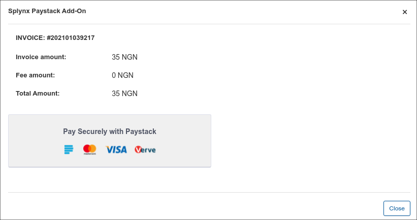
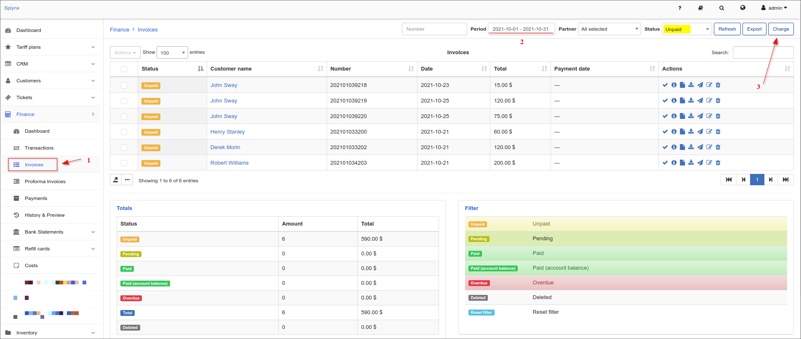

Paystack
=========

Paystack is a Splynx add-on which allows customers to pay for invoices via the payment gateway - https://paystack.com/.

The add-on can work with different credit cards and bank accounts, if cards or bank accounts are saved on customer profiles, the addon allows you to charge all customers using *Direct debit orders*.

The add-on can be installed in two methods, via the CLI or the Web UI of your Splynx server.

To install the Paystack add-on via CLI, the following commands can be used:

```
apt-get update
apt-get install splynx-paystack
```

To install it via the Web UI:

Navigate to `Config -> Integrations -> Add-ons`:


Locate or search for the `splynx-paystack` add-on and click on the install icon in the *Actions* column:


Click on the **OK, confirm** button to begin the installation process:


### Add-on settings

After the installation process has completed, you have to configure the parameters in `Config → Integrations → Modules list`. As depicted below:


Locate or search for the `splynx-paystack` add-on module and click on the <icon class="image-icon"></icon> (*Edit*) icon in the *Actions* column:


**Public** and **secret** keys can be obtained from your *Paystack account:*


### Invoice payment

Once the configuration has been completed, customers can pay their invoices on the [Portal](customer_portal/customer_portal.md) using the *Paystack* system in `Finance → Invoices`:


or directly from *Portal Dashboard* via *Paystack* widget (entry point):


The configuration of add-on **Entry points** can be found in `Config → Integrations → Modules list`, near the `splynx_paystack_addon` module item in *Actions* column, click on the <icon class="image-icon"></icon> (*Edit entry points*) icon. More information about *Modules list* can be found [here](configuration/integrations/modules_list/modules_list.md).




If everything went well, you will see the status of the invoice marked as "Paid" (in the customer and admin portal):


Additionally, you can charge all customers using one button! Navigate to *Finance → Invoices*, set the period and click on "Charge" as depicted below:




### Direct payments

Using the payments links is the simplest way to accept payments made with credit card or bank account. This feature is available in the *Paystack* addon to pay *Invoices* and *Proforma Invoices*. This provides convenience and simplicity for your customers, so the amount of on-time payments will increase. For example, you can add a payment link to the e-mail with the (proforma) invoice, as a result, the customer can make payment quickly by clicking onto such link instead of logging in to their *Portal* page. In case the customer has saved the payment credentials on the *Portal*, they do not need to add further details when using the direct payment link in the future. If the credit card in not linked on the Portal, the payment details need to be entered each time the payment link is used.

To create a direct payment link, please use the patterns below:

**To pay the Invoice:**

<details>
<summary>by invoice ID</summary>
<div markdown="1">

```
https://<splynx_domain_address>/paystack/direct-pay-invoice-by-id?item_id=<Invoice_id>

```
</div>
</details>

<details>
<summary>by invoice number</summary>
<div markdown="1">

```
https://<splynx_domain_address>/paystack/direct-pay-invoice?item_id=<Invoice_number>

```
</div>
</details>


**To pay the Proforma Invoice:**

<details>
<summary>by proforma invoice ID</summary>
<div markdown="1">

```
https://<splynx_domain_address>/paystack/direct-pay-proforma-by-id?item_id=<proforma_id>

```
</div>
</details>

<details>
<summary>by proforma invoice number</summary>
<div markdown="1">

```
https://<splynx_domain_address>/paystack/direct-pay-proforma?item_id=<proforma_number>

```
</div>
</details>
