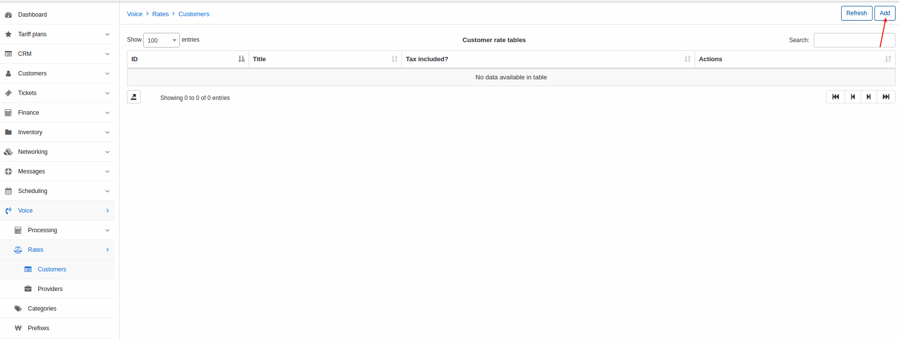
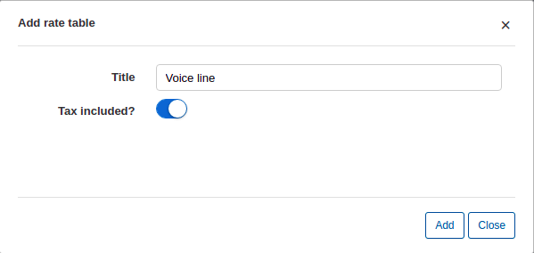
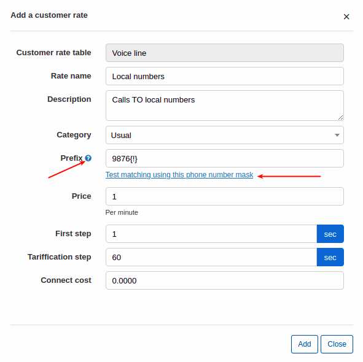
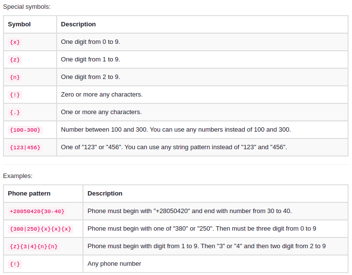
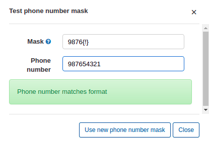
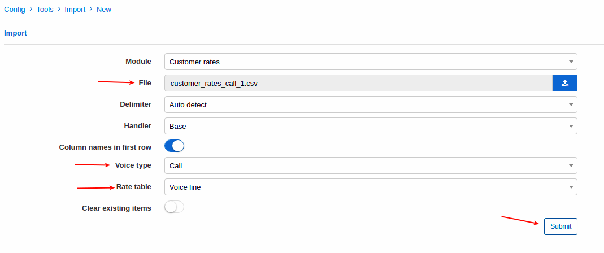
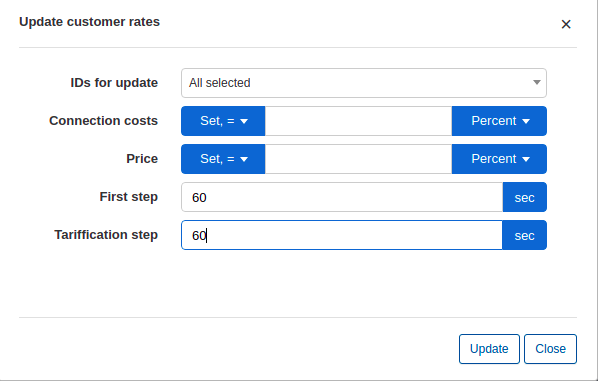

Rates
=====

Under the Rates table we associate prices with prefixes and categories. It's divided into `Customers` and `Providers` rates. Customers rates will be configured with sell prices and provider rates with buy prices. To simplify things, we can describe customers rates like "price of a call to number like +9876* is 0.1$ per minute" and providers rates like "we pay for voice provider 0.1$ per minute for call to number like +9876* so later in configs we can add some markup let's say 20% to have a profit".

* Customers rates - define final tariffication for end customers;

* Providers rates - define an initial tariffication.

To configure rates navigate to `Voice → Rates → Customers/Providers` and click on the *Add* button located at the top right of the table. You need to add a rate table first:

Here select name of a rate table and define if tax is included or excluded:

Once this done click on rates button under specific rate table:

Here we can see a lot of buttons to click. On the left you can switch between rates for calls, messages or data and on the right side you can find buttons to add some rate manually (`Add`), `Load rates from another plan` (in case you have another rate table you can use it and just copy rates to a current table), `Import` (import a file with rates into this table), `Export` (Export rate table), `Mass update` (apply some massive update for range of rates in current table):

Let's add some customers rate:

Here is a description of all available fields:

* **Customer rate table** - predefined rate table;

* **Rate name** - name of this rate;

* **Description** - description of this rate;

* **Category** - category to associate with this prefix;

* **Prefix** - define a pattern to match phone numbers. Use these 2 marked tips to define a prefix correctly. In this case prefix `9876{!}` will match all phone numbers starts with 9876:

* **Price** - Price per minute;

* **First step** - Duration of the first step;

* **Tariffication step** - Duration of the tariffication step;

* **Connect cost** - Price for connecting the call.

### Rates import

If you have tons of rates you don't have to import them all manually, it can be also imported from a .csv file:

Select a file here, select voice type and rate table:

In next step you need to define fields but we recommend to have files with next structure to allow Splynx select fields automatically:

### Rates mass update

It is possible to update specific range or all the rates.

* **IDs for update** - select the IDs we want to update;

* **Connection costs** - Update the connection cost, by the specified Increase / Decrease , a percentage or a fixed price;

* **Price** - Update the price, by the specified Increase / Decrease , a percentage or a fixed price;

* **First step** - Duration of first step;

* **Tariffication step** - Duration of tariffication step.

Now when rate table is configured in can be assigned to some [voice plan](../tariff_settings/tariff_settings.md)
